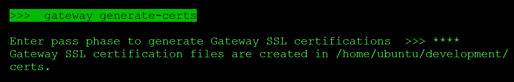
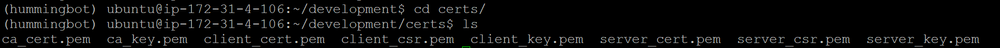

The official Github repository for Gateway is https://github.com/hummingbot/gateway. Gateway is released monthly  with the same cadence as the [Hummingbot client](https://github.com/hummingbot/hummingbot), and it follows the same conventions for releases, contributions, etc.

## Install with Docker

For most users, we recommend installing Hummingbot and Gateway using [Docker](/installation/docker/).

In particular, we recommend following the [Hummingbot Gateway Compose](https://github.com/hummingbot/deploy-examples/tree/development/hummingbot_gateway_compose) deployment path.

## Install from Source

You can also install Gateway on a standalone basis and then link it to Hummingbot manually. These instructions assumes that you have already installed Hummingbot on the machine where you are installing Gateway, either from source or via Docker.

### Prerequisites

Install the following dependencies:

- [NodeJS](https://nodejs.org/) (use 16.0.0 or higher)
- [Yarn](https://yarnpkg.com/): run `npm install -g yarn` after installing NodeJS

### Installation

Clone the Gateway repo and navigate into the folder:
```
git clone https://github.com/hummingbot/gateway.git
cd gateway
```

Install Javascript dependencies:
```
yarn
```

Compile Typescript into Javascript:
```
yarn build
```

### Generate certs

Next, generate self-signed certificates from the Hummingbot client. These certificates let your bots securely communicate with Gateway.

Start Hummingbot. After entering your password, run `gateway generate-certs`:

[](./generate-certs.png)

Enter a secure **passphrase**, and write it down. Hummingbot will generate self-signed certificates that a server can use to authenticate its connection with this client.

Take note of the **certs_path** where they are stored. This is also stored as `certs_path` in the Hummingbot's `conf_client.yml`, the global configuration file in the `/conf/` directory.

[](./certs-path.png)

Note that you will be prompted to enter both **passphrase** and **certs_path** later to complete the installation process.

### Run setup script

The `gateway-setup` script, located in the root Gateway directory, performs the following actions:

* Copies the default Gateway configuration files from `/src/templates` to `/conf/` folder
* Copies the Hummingbot certificates into the `/certs/` folder.

Enable permissions on setup script:
```
chmod a+x gateway-setup.sh
```

Run setup script:
```
./gateway-setup.sh
```

When prompted, enter **certs_path** from the prior step:

```
ℹ️ Confirm if this is correct:

            Copy configs FROM: [/folder]/gateway/src/templates
              Copy configs TO: [/folder]/gateway/conf

              Copy certs FROM: [/folder]/hummingbot/certs
                Copy certs TO: [/folder]/gateway/certs

Do you want to proceed? [Y/N] >>> 
```


!!! note "Alternative to copying certs files"
    The `gateway-setup.sh` script creates a copy of the Hummingbot certificates in the Gateway folder. Alternatively, you can override the **certs_path** parameter in `conf/server.yml` and enter the path to the Hummingbot certificates.


### Start Gateway

Afterwards, start Gateway using the same **passphrase** that you used to generate the certs:

```
$ yarn start --passphrase=<passphrase>
```

You should see Gateway running on the default port 15888:
```
2023-02-09 12:56:50 | info | 	⚡️ Starting Gateway API on port 15888...
2023-02-09 12:56:50 | info | 	The gateway server is secured behind HTTPS.
2023-02-09 12:56:50 | info | 	⚡️ Swagger listening on port 8080. Read the Gateway API documentation at 127.0.0.1:8080
```

Go back to your Hummingbot client or restart it if you have exited. In the upper right corner, you should see **GATEWAY: ONLINE** if your Hummingbot client is connected to Gateway.

[](./gateway-status.png)

After Gateway is running, see [Testing](testing.md) to understand how to test the endpoints on a standalone basis before using it with Hummingbot.