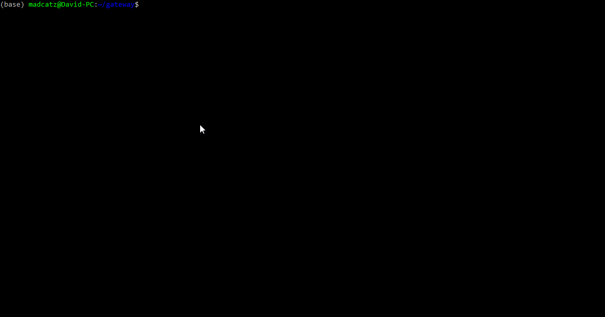

## New vs Legacy

In the v2.3 release, Gateway started to undergo a large refactor, as approved in proposal [NCP-22](https://snapshot.box/#/s:hbot-ncp.eth/proposal/0x5cc3540ee219787d5c842bc1ccdb11aab46203bb7f0be658b6b40858501a8e4c). During this process, only certain reference connectors will be upgraded to the new architecture, while bounties funded by available Connector Pots will fund developer bounties to migrate other connectors.

To enable users to use legacy connectors during the refactor, the Hummingbot `fix/gateway-2.2` branch is compatible with Gateway v2.2.0, the last version that contains all the legacy connectors. This branch will be kept updated with the Hummingbot `development` while the refactor is in progress.

Hummingbot `fix/gateway-2.2` branch:

* Github: <https://github.com/hummingbot/hummingbot/tree/fix/gateway-2.2>
* DockerHub: <https://hub.docker.com/r/hummingbot/hummingbot/tags?name=gateway-2.2>

Gateway `v2.2.0` branch:

* Github: <https://github.com/hummingbot/gateway/tree/v2.2.0/src>
* DockerHub: <https://hub.docker.com/r/hummingbot/gateway/tags?name=version-2.2.0>

The instructions below use these versions.

## Install with Docker 

For most users, this is the recommended install method for Hummingbot and Gateway

[](./gateway.gif)

Navigate to the Hummingbot root folder in your terminal or if you haven't cloned the Hummingbot repo yet run the command below

```bash
git clone -b fix/gateway-2.2 https://github.com/hummingbot/hummingbot.git
cd hummingbot
```

Next, modify the [`docker-compose.yml`](https://github.com/hummingbot/hummingbot/blob/master/docker-compose.yml) file in the hummingbot root folder using a text editor or IDE like [VSCode](https://code.visualstudio.com/).

Make the following edits:
- Update the Docker image tags for `hummingbot` and `gateway`.
- Uncomment the Gateway section.

```yaml
  hummingbot:
    image: hummingbot/hummingbot:gateway-2.2

    gateway:
    container_name: "gateway"
    image: hummingbot/gateway:latest    
    ports:
      - "15888:15888"
      - "8080:8080"
    volumes:
      - "./gateway_files/conf:/usr/src/app/conf"
      - "./gateway_files/logs:/usr/src/app/logs"
      - "./hummingbot_files/certs:/home/gateway/certs"
    environment:
      - GATEWAY_PASSPHRASE=a  
 
```

### Start Hummingbot & Gateway

```bash
docker compose up -d
docker attach hummingbot
```

 
!!! note
    It's normal for the Gateway container to stop immediately after the initial launch. You will need to generate certificates and set a passphrase in the following steps to complete the setup.


### Generate Gateway certificates

In the attached Hummingbot terminal, enter your desired password then run the following command to generate Gateway certificates. You’ll be prompted for a passphrase (it can match your Hummingbot password - or not).

```bash
gateway generate-certs
```


Exit Hummingbot:

```bash
exit
```

Then stop the Docker containers:

```bash
docker compose down
```

### Add passphrase to YAML file

Edit `docker-compose.yml` again to ensure the passphrase matches your previously set `GATEWAY_PASSPHRASE`:

```yaml
environment:
  - GATEWAY_PASSPHRASE=<your_passphrase>
```

Save your changes.

### Restart Hummingbot and Gateway

Restart Docker containers:

```bash
docker compose up -d
docker attach hummingbot
```

You should now see `GATEWAY:ONLINE` at the top-right corner.


### Check Gateway logs

View Gateway logs:

```bash
docker logs gateway
```

Once Gateway is running, proceed to [Testing Gateway](testing/index.md) to confirm functionality 


---

## Install from Source

You can also install Gateway on a standalone basis and then link it to Hummingbot manually. These instructions assume that you have already installed Hummingbot on the machine where you are installing Gateway, either from source or via Docker.

!!! warning "Hummingbot Client Version"
    * Make sure that you download the `2.2` branch for the **Hummingbot Client**.
    * Hummingbot Docker image - `hummingbot/hummingbot:gateway-2.2`
    * Source - `git clone -b fix/gateway-2.2 https://github.com/hummingbot/hummingbot.git`

### Prerequisites

Install the following dependencies:

- [NodeJS](https://nodejs.org/) (use 20.0.0 or higher)
- [Yarn](https://yarnpkg.com/): run `npm install -g yarn` after installing NodeJS

### Installation

Clone the Gateway repo and navigate into the folder:
```
git clone https://github.com/hummingbot/gateway.git
cd gateway
```

### Switch to the legacy 2.2.0 branch

```
git checkout v2.2.0
```

### Install Dependencies

Install Javascript dependencies:
```
yarn install
```

Compile Typescript into Javascript:
```
yarn build
```

Run Gateway

```
yarn start --passphrase=[PASSPHRASE]
```

See below to generate certifications using the passphrase above.

### Generate certs

Next, generate self-signed certificates from the Hummingbot client. These certificates let your bots securely communicate with Gateway.

Start Hummingbot. After entering your password, run `gateway generate-certs`:

[](./generate-certs.png)

Enter a secure **passphrase**, and write it down. Hummingbot will generate self-signed certificates that a server can use to authenticate its connection with this client.

Take note of the **certs_path** where they are stored. This is also stored as `certs_path` in the Hummingbot's `conf_client.yml`, the global configuration file in the `/conf/` directory.

[](./certs-path.png)

Note that you will be prompted to enter both **passphrase** and **certs_path** later to complete the installation process.

### Run setup script

The `gateway-setup` script, located in the root Gateway directory, performs the following actions:

* Copies the default Gateway configuration files from `/src/templates` to `/conf/` folder
* Copies the Hummingbot certificates into the `/certs/` folder.

Enable permissions and run setup script:

```
chmod a+x gateway-setup.sh
./gateway-setup.sh

```

When prompted, enter **certs_path** from the prior step:

```
ℹ️ Confirm if this is correct:

            Copy configs FROM: [/folder]/gateway/src/templates
              Copy configs TO: [/folder]/gateway/conf

              Copy certs FROM: [/folder]/hummingbot/certs
                Copy certs TO: [/folder]/gateway/certs

Do you want to proceed? [Y/N] >>> 
```


!!! note "Alternative to copying certs files"
    The `gateway-setup.sh` script creates a copy of the Hummingbot certificates in the Gateway folder. Alternatively, you can override the **certs_path** parameter in `conf/server.yml` and enter the path to the Hummingbot certificates.


### Start Gateway

Afterwards, start Gateway using the same **passphrase** that you used to generate the certs:

```
$ yarn start --passphrase=<passphrase>
```

You should see Gateway running on the default port 15888:
```bash
2023-02-09 12:56:50 | info | 	⚡️ Starting Gateway API on port 15888...
2023-02-09 12:56:50 | info | 	The gateway server is secured behind HTTPS.
2023-02-09 12:56:50 | info | 	⚡️ Swagger listening on port 8080. Read the Gateway API documentation at 127.0.0.1:8080
```

Go back to your Hummingbot client or restart it if you have exited. In the upper right corner, you should see **GATEWAY: ONLINE** if your Hummingbot client is connected to Gateway.

[](./gateway-status.png)

After Gateway is running, see [Testing](testing/index.md) to understand how to test the endpoints on a standalone basis before using it with Hummingbot.
