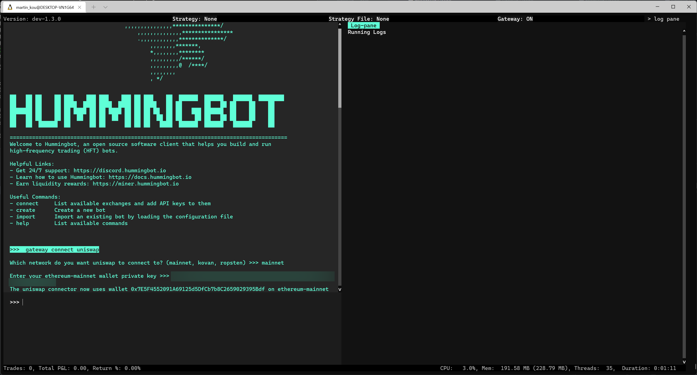
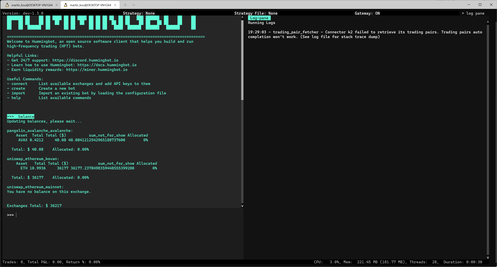
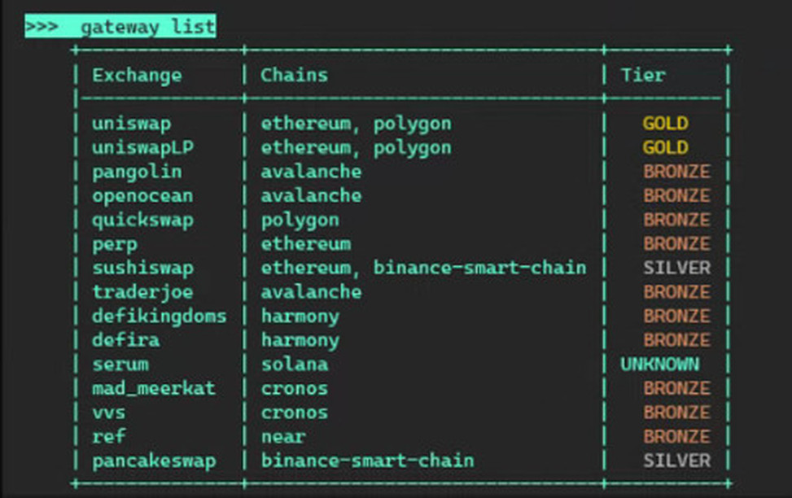

Once you "GATEWAY: ONLINE" in the status bar, your Gateway is ready to use with Hummingbot.

[](./gateway-status.png)

## Connecting to DEX

Use `gateway connect [exchange-code]` to add connections to DEXs. See [Exchanges](/exchanges/) for all available connectors.

```python
>>> gateway connect uniswap
```

You will then be asked about which instance of Uniswap you want to connect. You'll be asked to specify `chain` (a Layer 1 blockchain architecture like `ethereum` or `polygon`), `network` (mainnet or testnet networks available for the chain like `mainnet`, `arbitrum_one`, `optimism`), and the private key of your wallet. 

See the [Uniswap documentation page](/gateway/exchanges/uniswap) for which chains and network it supports.

[](./gateway-connect.png)

### Fetching wallet balances

Once your wallet has been connected to the gateway, you can the test the connection by running `balance`. You should see your wallet balance on the native blockchain asset (i.e. ETH for Uniswap / Ethereum, AVAX for Pangolin / Avalanche) for your connected networks related to the decentralized exchanges. 

[](./gateway-balance.png)

Use the `gateway connector-tokens` command to display additional tokens in `balance`

```python
>>> gateway connector-tokens [chain-network-wallet] [token1],[token2],[etc]

# format: gateway connector-tokens [connector_chain_network] [symbol1] [sybbol2]
>>> gateway connector-tokens uniswap_ethereum_mainnet UNI

The 'balance' command will now report token balances UNI for 'uniswap_ethereum_mainnet'.
```

## Listing Gateway connectors

Running the `gateway list` command will list all available Gateway connectors and their current tiers.

[](./gateway-list.jpg)

## Updating configs

Gateway supports a robust configuration management system for each supported chain, network and exchange. You can see all the current configuration by running:

```python
>>> gateway config
```

Afterwards, change a setting by running:

```python
>>> gateway config <chain>.networks.<network>.<setting>
```

For example, to change the `nodeURL` for Ethereum mainnet, you can run `gateway config ethereum.networks.mainnet.nodeURL`. To change the `nodeURL` for the Ethereum testnets, run `gateway config ethereum.networks.kovan.nodeURL` and `gateway config ethereum.networks.ropsten.nodeURL`.

!!! warning "Why does Gateway continually emit disconnection messages?"
    Any time you change a Gateway config, it restarts in order to propagate that setting across other related settings. Therefore, you may see log messages about Gateway losing and re-establishing connection. If Gateway doesn't restart, you can force it to start by running `gateway start`.

Click [here](/operation/commands-shortcuts/#gateway-commands) to see the different gateway commands.

## Connecting to node provider

Connecting to a node provider is necessary for Hummingbot to receive and send data to a blockchain network. Alternatively, you can also run your own node client and connect to its RPC URL. This is set by the `nodeURL` configuration parameter for each network.

To help new users use Gateway, Hummingbot assumes a default `nodeURL` for each supported chain/network and automatically connects to it when users connect to a DEX. The default `nodeURL` for each chain/network uses [Ankr RPC endpoints](https://www.ankr.com/rpc/) where available, since they do not require users to sign up for an account.

For certain testnet or other networks that Ankr doesn't support, the default `nodeURL` may be an alternate public endpoint, or in certain cases, an [Infura](https://infura.io/) endpoint, which users need to configure with their Infura key to use (see **Changing Gateway configuration**).

For a list of the default parameters including `nodeURL` for each chain/network, see [Ethereum and EVM-Based Chains](/gateway/chains/ethereum/).

## Working with tokens

When trading across different blockchains, it's very important to understand how symbols map to addresses for each chain/network. In Hummingbot, each chain/network defines a `tokenListType` (`FILE` or `URL`) and `tokenListSource` (path to the designated file or URL), which uses the [Token Lists](https://tokenlists.org/) standard to define a token dictionary for each network.

You can edit the `tokenListType` and `tokenListSource` parameters for each network by running `gateway config` (see **Changing Gateway configuration**)

For a list of the default parameters including `tokenListType` and `tokenListSource` for each chain/network, see [Ethereum and EVM-Based Chains](/gateway/chains/ethereum/).

## No auto-wrapping

Certain DEXs like Uniswap and TraderJoe automatically wrap native tokens that are not ERC-20, so that users can trade tokens such as `ETH` and `AVAX` through the interface. Behind the scenes, these exchanges automatically wrap these tokens into ERC-20 compliant `WETH` and `WAVAX` tokens.

Gateway does not auto-wrap tokens by default, so users need to wrap native tokens into ERC-20 tokens before using them with Gateway. As of the `v1.4.0` release, there is no error message that lets you know if the token can't be used when it's not wrapped and instead will just display ``"Markets are not ready"`` but we are working on adding more informative messages within the next few releases.

## Approving tokens

On Ethereum and EVM-compatible chains, wallets need to [approve](https://help.matcha.xyz/en/articles/4285134-why-do-i-need-to-approve-my-tokens-before-i-can-trade-them) other addresses such as DEXs before they can send tokens to them, creating an allowance.

To approve the tokens for spending on gateway, there are multiple ways outlined below. 

### Use `approve-token` command 

Hummingbot has a command that allows you to approve tokens for spending on gateway one token at a time. 

Here is an example of the approve-tokens command:
```python
# gateway approve-tokens [connector_chain_network] [symbol]
>>> gateway approve-tokens uniswap_ethereum_mainnet WETH
```

[](/assets/img/approve-tokens-command.png)

### Approve manually using DEX interface

You can use the Dex interface directly for approval. Once you approve a token, you will not have to to approve that token again on the Dex. Each token from a specific wallet you wish to trade requires a one-time approval.

Please note that you don't have to do a full swap to approve a token or multiple tokens, however you will need to pay for transaction fee for approving the token. Here is an example of the approval on Uniswap.

[](/assets/img/dex-interface-approve.png)
