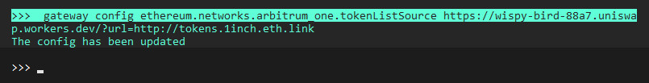

## Working with Token Lists

When trading across different blockchains, it's very important to understand how symbols map to addresses for each chain/network. In Hummingbot, each chain/network defines a `tokenListType` (`FILE` or `URL`) and `tokenListSource` (path to the designated file or URL), which uses the [Token Lists](https://tokenlists.org/) standard to define a token dictionary for each network.

You can edit the `tokenListType` and `tokenListSource` parameters for each network by running `gateway config` (see **Changing Gateway configuration**)

For a list of the default parameters including `tokenListType` and `tokenListSource` for each chain/network, see [Ethereum and EVM-Based Chains](/gateway/chains/ethereum/).


Starting with the [v1.11.0 release](../release-notes/1.11.0.md) the `tokenlistType` by default is now currently set to `FILE` instead of `URL` where the list of tokens are now stored instead within a JSON file which users can now easily edit to add tokens they are currently trading but users can still switch between `URL` or `FILE` if needed.

You can edit the `tokenListType` and `tokenListSource` parameters for each network by running `gateway config`. Below are the instructions for adding tokens either through `FILE` or through `URL`

### `FILE`

Create a local JSON file and save it under ../gateway/src/chains/`[chain_folder]`/... and add the missing token you want to use by adding their token address.

Open the Hummingbot client (make sure its connected to Gateway) and run `gateway config [chain].networks.[network].tokenListSource src/chains/[chain_folder]/name-of-file.json`

For example if you created a JSON file named `arbitrum.json` for Arbitrum One you would run `gateway config ethereum.networks.arbitrum_one.tokenlistSource src/chains/ethereum/arbitrum.json` and press Enter. You should get a message below that the config has been updated and Gateway will automatically restart to update the config.

You could also edit the existing JSON file directly. For example for the Ethereum Kovan testnet the existing JSON token list would be stored under [/chains/ethereum/erc20_tokens_kovan.json](https://github.com/hummingbot/hummingbot/blob/master/gateway/src/chains/ethereum/erc20_tokens_kovan.json).

Locate the file in Explorer and open the file in a notepad or your preferred text editor. See below for how the JSON file should look like in a text editor. From here, just modify the file and add the token address of the tokens you are trading.


### `URL`

Go to [Token Lists](https://tokenlists.org/) and look for a list that contains the tokens you wish to trade and take note of that list URL

Once you have the token list URL, open Hummingbot and make sure Gateway is running and then enter `gateway config [chain].networks.[network].tokenlistType URL`  

For example to change the token list for Arbitrum One you would run `gateway config ethereum.networks.arbitrum_one.tokenlistType URL` and press Enter. You should get a message below that the config has been updated and Gateway will automatically restart to update the config.


Next you'll need to specify the tokenlist URL that you took note of in step 1 by running `gateway config [chain].networks.[network].tokenlistSource [tokenlist URL]` (replace [tokenlistURL] with the actual URL)

For example, to use the [1inch list](https://wispy-bird-88a7.uniswap.workers.dev/?url=http://tokens.1inch.eth.link) with Arbitrum one then the command would be `gateway config ethereum.networks.arbitrum_one.tokenlistSource https://wispy-bird-88a7.uniswap.workers.dev/?url=http://tokens.1inch.eth.link`



!!! note

    CTRL + V doesn't work from within Hummingbot. To paste, try `Shift + Insert` or `CTRL + Shift + V` or `CTRL + Shift + Right Click`


Alternatively if you installed through Source you can also edit the `JSON` file directly under the `/gateway/src/templates/` folder

For a list of the default parameters including `tokenListType` and `tokenListSource` for each chain/network, see [Ethereum and EVM-Based Chains](/gateway/chains/ethereum/).

## Approving tokens

On Ethereum and EVM-compatible chains, wallets need to [approve](https://help.matcha.xyz/en/articles/4285134-why-do-i-need-to-approve-my-tokens-before-i-can-trade-them) other addresses such as DEXs before they can send tokens to them, creating an allowance.

To approve the tokens for spending on gateway, there are multiple ways outlined below. 

### Use `approve-token` command 

Hummingbot has a command that allows you to approve tokens for spending on gateway one token at a time. 

Here is an example of the approve-tokens command:
```python
# gateway approve-tokens [connector_chain_network] [symbol]
>>> gateway approve-tokens uniswap_ethereum_mainnet WETH
```

[](/assets/img/approve-tokens-command.png)

### Approve manually using DEX interface

You can use the Dex interface directly for approval. Once you approve a token, you will not have to to approve that token again on the Dex. Each token from a specific wallet you wish to trade requires a one-time approval.

Please note that you don't have to do a full swap to approve a token or multiple tokens, however you will need to pay for transaction fee for approving the token. Here is an example of the approval on Uniswap.

[](/assets/img/dex-interface-approve.png)

## Obtaining Testnet Tokens

If you’re testing on Kovan, go to [https://faucet.paradigm.xyz/](https://faucet.paradigm.xyz/). You’ll be provided with the following testnet tokens:

- 1 ETH
- 1 WETH
- 500 DAI

If you’re testing on Avalanche, go to [https://faucet.avax-test.network/](https://faucet.avax-test.network/). You’ll be provided with 2 testnet AVAX.

## Wrapped tokens

Certain DEXs like Uniswap and TraderJoe automatically wrap native tokens that are not ERC-20, so that users can trade tokens such as `ETH` and `AVAX` through the interface. Behind the scenes, these exchanges automatically wrap these tokens into ERC-20 compliant `WETH` and `WAVAX` tokens.

Gateway does not auto-wrap tokens by default, so users need to wrap native tokens into ERC-20 tokens before using them with Gateway. As of the `v1.4.0` release, there is no error message that lets you know if the token can't be used when it's not wrapped and instead will just display ``"Markets are not ready"`` but we are working on adding more informative messages within the next few releases.
