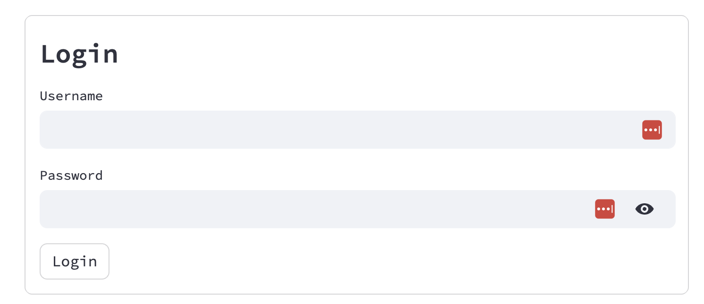

## Introduction

In this section, we'll dive into the importance of securely managing credentials in the Hummingbot Dashboard, ensuring that your information remains private and under your control.

<iframe style="width:100%; min-height:400px;" src="https://www.youtube.com/embed/VmlD_WQVe4M?si=esn1bc-d2Up-wase" frameborder="0" allow="accelerometer; autoplay; encrypted-media; gyroscope; picture-in-picture" allowfullscreen></iframe>


## Enabling Credential Management

If you plan to expose Dashboard externally or enable multiple users, managing credentials securely is paramount.

To add authentication layer to Dashboard, modify the `AUTH_SYSTEM_ENABLED` variable in the [CONFIG.py](https://github.com/hummingbot/dashboard/blob/main/CONFIG.py) file. By default, it is set to `False`. 

Change it to `True` and save the file:
```
AUTH_SYSTEM_ENABLED = True
```

Afterwards, stop Dashboard and restart it with `make run`. Users will now be asked to log in when accessing Dashboard at <https://localhost:8501>.



## Setting User Credentials

We present two methods for setting user credentials for Dashboard:

### 1. Manual Password Hashing

In this method, we manually declare the users and their corresponding passwords in the [`credentials.yml`](https://github.com/hummingbot/dashboard/blob/main/credentials.yml) file.

```yaml
credentials:
  usernames:
    admin:
      email: admin@gmail.com
      name: Admin User
      password: abc # To be replaced with hashed password: hashed_passwords = stauth.Hasher(['abc', 'def']).generate()
```
In the default file above, the template password `abc` is a placeholder for the hashed password.

To generate a hashed password for a given string, follow these instructions:

1. Run `conda activate dashboard` to ensure that you're in the Dashboard environment is active.
2. Afterwards, enter the Python console with:
  ```
  python
  ```
3. Import the auth library and hash the password:
  ```python
  import streamlit_authenticator as st_auth
  hashed_password = st_auth.hasher_generate("YOUR_PASSWORD")
  hashed_password
  ```
4. In the `credentials.yml` file, Replace the `admin` user's password with this `hashed_password`.
3. Run `exit()` to exit the Python console.
4. Access the dashboard at <https://localhost:8501> and enter the username(`admin`) and string(`YOUR_PASSWORD`) used to generated the hashed password.


### 2. Whitelisted Email Registration

While the method works for 1-2 users, it might be cumbersome if numerous users interact with Dashboard. 

Instead, you can edit the `preauthorized` section in `credentials.yml`. This method below allows you to whitelist a list of emails and allow users to set their own passwords. Each user is added to the credentials file.

1. Define a whitelist of emails authorized to access the dashboard.
2. In the `pre_authorized:` section of `credentials.yml``, add the emails of users who will be pre-authorized to register and create their credentials.
    ```
    pre_authorized:
      emails:
        - user1@example.com
        - user2@example.com
    ```
3. Users with whitelisted emails can fill out a registration form upon their first login.
4. Upon registration, Dashboard will hash and store their credentials automatically in this file.


## Logging Out

Once logged in, you have the freedom to navigate through the various sections of the dashboard. However, to log out securely, ensure you return to the main Hummingbot Dashboard page and click the logout button. This ensures optimal security for your credentials and the dashboard's functionality.

---
Next, learn how to use the master bot profile to manage the keys you store in Dashboard.

[Using the Master Bot Profile](3-master-bot-profile.md){ .md-button .md-button--primary }
