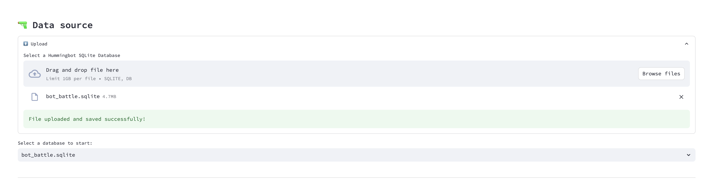
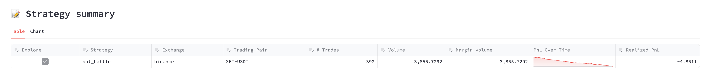
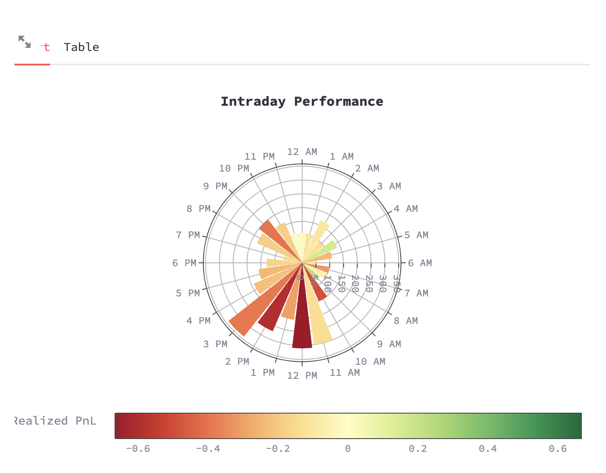
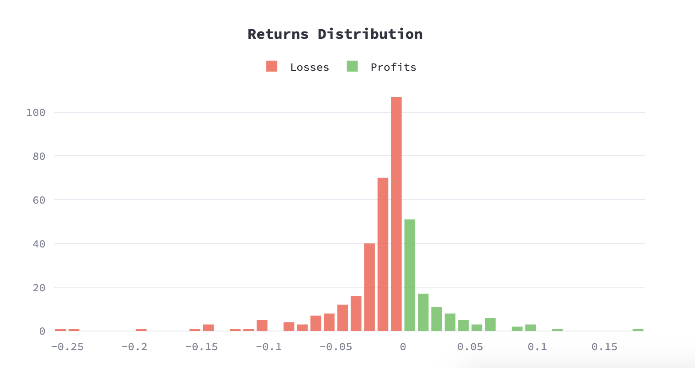

## Introduction

You can use the Strategy Performance page in Dashboard to analyze the performance of your Hummingbot strategies and scripts.

The images below utilize this SQLite database file (as described in [this video](https://www.youtube.com/watch?v=3cWoS3Yk6EE)): [`bot_battle.sqlite`](https://github.com/fengtality/hummingbot/blob/master/scripts/bot_battle/bot_battle.sqlite).

## Upload Data

First, import your trading data by uploading the SQLite database file associated with your trading strategy.

1. **Locate the SQLite Database File**: Navigate to the `/data` folder of your Hummingbot instance. Here, you'll find the SQLite database file named after your trading strategy. For instance, in the provided screenshot, the strategy's name appears to be `bot_battle`, hence the file `bot_battle.sqlite`.

2. **Upload the Database File**: Drag and drop the SQLite database file into the designated area in the Hummingbot Dashboard. Alternatively, click on "Browse files" to manually search for and select the SQLite database file from your computer.

3. **File Confirmation**: After successfully uploading, you'll see a confirmation message stating "File uploaded and saved successfully!".

4. **Select Database**: Once uploaded, select the database file from the dropdown menu (e.g., `bot_battle.sqlite`) to begin analyzing the performance of your trading strategy.

!!! note
    Ensure the database file size does not exceed 1GB.

Continue with the next steps in the Hummingbot Dashboard to dive deeper into your strategy's performance metrics and insights.

## Select Pairs to Analyze

With Dashboard's auto-identification feature, the pairs and exchanges in the database file are recognized automatically. Users can then effortlessly select the desired trading pairs for in-depth analysis, streamlining the decision-making process.

Check the trading pairs that you want to explore:

## Dashboard Widgets

Dashboard uses the trades data to construct various widgets that the users can interactive with:

### Explore Trading Pair

This widget provides an overview of a specific trading pair's performance over a selected time range. 

**Usage**:

- **Select a Time Range**: Use the date and time selectors at the top to analyze a specific trading period.

- **Overview Cards**: These cards give quick insights on the Net Profit/Loss, Total Trades, Accuracy, Profit Factor, Duration, Price Change,

### Market Activity Widget

The Market Activity Widget provides a detailed visualization of the market's activity over a specific time interval. It allows users to get an in-depth understanding of various metrics including buy/sell orders, profit/loss, and inventory changes.

**Usage**:

- **Candles Interval**: Use the dropdown to select the desired interval for the candlestick data. Options might include timeframes like 1m, 5m, 15m, etc. This selection determines the granularity of the candlesticks shown in the chart.

- **Candles per Page**: Adjust the number of candlesticks displayed on a single page by changing this value. This can help in narrowing or expanding the time frame viewed at once.

- **Show Panel Metrics**: Click on this button to toggle additional metrics on or off, providing a cleaner or more detailed view based on your needs.

- **Price Chart**: Visualizes the price movement, buy/sell orders, and other metrics over the selected time range. Drag your mouse to get detailed information over a window.

- **PnL Chart**: This chart displays Profit and Loss over time, giving a clear indication of market performance. Positive values show profit, while negative values indicate a loss.

- **Quote Inventory Change**: Provides a bar graph representation of how your the value of your quote assets as a percentage of the overall value of your base and quote assets percentage changes over time, assisting users in identifying significant inventory shifts.

### Intraday Performance Widget

**Description:**

- This widget presents a radial or polar chart showcasing intraday performance.
- Each spoke of the wheel represents an hour of the day, starting from 12 PM and continuing clockwise.
- The chart's segments represent the realized profit and loss (PnL) for each hour, where color intensity and segment length indicate the magnitude.
- Drag and drop over a segment to zoom in.

### Returns Distribution Widget

**Description:**

- This widget displays a histogram showing the distribution of returns, classified into losses (in red) and profits (in green).
- The x-axis represents the range of return values, with negative values indicating losses and positive values indicating profits.
- The y-axis indicates the frequency or count of occurrences for each return value.
- Peak bars in the histogram show the most common return values for the dataset, allowing users to quickly grasp where the majority of returns lie.

## Next Steps

Next, learn how you can also use Dashboard to backtest and optimize Hummingbot V2 strategies:

[Backtesting and Optimization](6-backtesting-and-optimization.md){ .md-button .md-button--primary }
