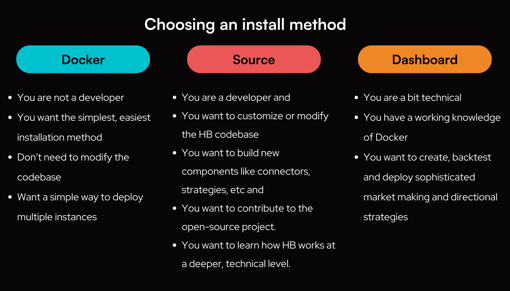

##  Quickstart Guides

New to Hummingbot? Start here with step-by-step guides for various use cases:

## 🐋 [Docker](../installation/docker.md)

- [Quickstart Guide to Deploy-Examples](../academy-content/posts/quickstart-deploy-examples/0-index.md): Guide on how to use the `deploy-examples` repo
- [Deploy Examples](https://github.com/hummingbot/deploy-examples): Github repo with Docker Compose examples and bash scripts for deployment
- [Liquidity Mining](../academy-content/posts/quickstart-liquidity-mining/0-index.md): Earn liquidity mining rewards by running Hummingbot on the Miner platform

## 💻 [Source](../installation/source/index.md)

- [Quickstart - Custom Script](../academy-content/posts/quickstart-custom-script/custom-pmm-0.md): Develop a custom market making script using Hummingbot
- [Building CEX Connectors](../developers/connectors/index.md): Guide on how to create CEX connectors for Hummingbot
- [Building DEX Connectors](../gateway/adding-dex-connectors.md): Guide on how to create DEX connectors for Hummingbot 
- [Bounties](../bounties/index.md): Get paid for building and maintaining Hummingbot components
connector middleware
- [Contribution Guidelines](../developers/contributions.md): Read this before submitting a pull request

## 📓 Dashboard

- [Using Dashboard](../academy-content/posts/quickstart-dashboard/0-index.md): Learn how to use Dashboard to create, backtest and deploy sophisticated market making and directional strategies
- [Youtube Playlist](https://youtube.com/playlist?list=PLDwlNkL_4MMf0Ifvj-HLuQ_Jtf7OV6uzW&si=i-V1oBvCYy8a1025): Youtube playlist of Dashboard videos
- [Github Repo](https://github.com/hummingbot/dashboard): Dashboard Github repo
- [Discord Channel](https://discord.gg/hummingbot): If you are interested in contributing to the Dashboard project, please join the #dashboard channel in Discord

## Additional Resources

### 🎓 Hummingbot Academy

- See [Academy](../academy/index.md) for a collection of free resources that help you understand the basics of algo trading and market making.

### 🙋‍♂️ Getting help

Hummingbot features an active, friendly community of users globally! Here are some ways to get help if you're encountering issues:

- Check out the [FAQ](../faq.md), [Troubleshooting](../troubleshooting.md), and [Glossary](../glossary.md) pages for answers to common questions about Hummingbot
- To report a bug or request a new feature, post a [Github issue](https://github.com/hummingbot/hummingbot/issues/new/choose).
- Join the official [Discord](https://discord.gg/hummingbot) and post your question on **#support**
- Take [Botcamp](/botcamp) to learn professional-grade market making and algo trading!

We pledge that we will not use the information/data your provide us for trading purposes nor share them with third parties.

