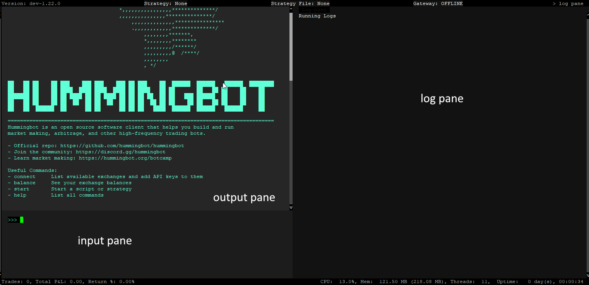

Hummingbot is a local software client that helps you run trading strategies that automate the execution of orders and trades on various cryptocurrency exchanges and protocols.

We recommend installing Hummingbot using Docker if you want the simplest, easiest installation method and don't need to modify the Hummingbot codebase.

!!! note
    If you're a developer looking to customize the software, consider installing Hummingbot from Source. You can find detailed instructions for various operating systems here: [Linux](../installation/linux.md) | [Windows](../installation/windows.md) | [MacOS](../installation/mac.md) | [Raspberry Pi](../installation/raspberry-pi.md)   
    

## Prerequisites:

* MacOS 10.12.6+ / Linux (Ubuntu 20.04+, Debian 10+) / Windows 10+
* Memory: 4 GB RAM per instance + 250 MB for additional instance on same machine
* Storage: 5 GB HDD space per instance
* Install [Docker Compose](https://docs.docker.com/compose/)

## Install Commands

```
git clone https://github.com/hummingbot/hummingbot
cd hummingbot
docker compose up -d
docker attach hummingbot
```

## Setting Up Your Password


When you run Hummingbot for the first time, you will be prompted to create a password. This password secures your sensitive data like API keys and wallet information. For your security, choose a strong password. The password will be stored locally and encrypted for safety

After you set a password you should now be in the main Hummingbot screen

## Navigating the User Interface

Hummingbot features a command-line interface (CLI) organized into several sections:



- **Input Pane (Lower Left)**: Where you type commands.

- **Output Pane (Upper Left)**: Displays command results.

- **Log Pane (Right)**: Shows log messages.

- **Top Navigation Bar**: Indicates the Hummingbot version, current strategy, and strategy file.

- **Bottom Navigation Bar**: Shows trading statistics, CPU usage, memory, threads, and runtime duration.

For more details, check our [User Interface Guide](../client/user-interface.md).

## Useful shortcuts    
      
- **Exit (Keep Running)**: <kbd>CTRL</kbd> + <kbd>P</kbd>, <kbd>CTRL</kbd> + <kbd>Q</kbd>

- **Exit Config Mode**: <kbd>CTRL</kbd> + <kbd>X</kbd>

- **Shutdown Bot**: Double <kbd>CTRL</kbd> + <kbd>C</kbd>

**Paste Command**: Use one of the following:

   - <kbd>CTRL</kbd> + <kbd>SHIFT</kbd> + <kbd>V</kbd>

   - <kbd>SHIFT</kbd> + Right Mouse Button

   - <kbd>SHIFT</kbd> + <kbd>INS</kbd>


## Configure and Run V2 Strategies

[Basic Strategy V2](../v2-strategies/walkthrough.md/#simple-strategy-v2)

[Advanced Strategy V2 (with Controllers)](../v2-strategies/walkthrough.md/#strategies-v2-with-controller)

## Getting Help

If you encounter issues or have questions, here’s how you can get assistance:

- Consult our [FAQ](../faq.md), [Troubleshooting Guide](../troubleshooting.md), or [Glossary](../glossary.md).

- Explore our [Academy](../academy/index.md) for free resources on algorithmic trading and market making.

- To report bugs or suggest features, submit a [Github issue](https://github.com/hummingbot/hummingbot/issues/new/choose).

- Join our [Discord community](https://discord.gg/hummingbot) and ask questions in the **#support** channel.

We pledge that we will not use the information/data your provide us for trading purposes nor share them with third parties.

## Advanced Learning

Enhance your trading skills with [Botcamp](https://www.botcamp.xyz/), where you can learn professional-grade market making and algorithmic trading strategies.
