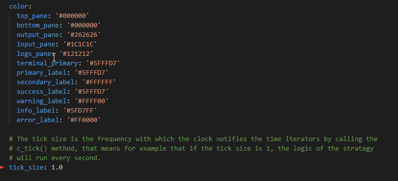

# Clock tick size

Starting with version [**1.8.0**](/release-notes/1.8.0), the `tick_size` is now added as a variable in the ClientConfigMap, this means that you will be able to change the value of the tick size in the `conf_client.yml` file or by running `config tick_size` from within Hummingbot

## How it works

All the major components of Hummingbot are Time Iterators like the connectors and the strategies. The Clock notifies all the components involved in the strategy by calling the method `c_tick()` of the time iterators every `tick_size`. By default the `tick_size` (or how long it takes Hummingbot to loop through a strategy iteration) is currently set to 1 second.

## How to configure Tick Size

There are two ways to configure the tick size

- From within Hummingbot, run the command `config tick_size` and enter the desired tick size in decimal form.

- Stop and exit Hummingbot then edit the `conf_client.yml` file located inside the `hummingbot_conf` folder using a text editor. Look for `tick_size: 1.0` and change `1.0` to whatever tick size you want. Save the changes to the yml file then run Hummingbot again for the changes to take effect.

!!! Note
    Due to connector limitations, the tick size cannot be set lower than `0.1` seconds

To check what the current `tick_size` is, you can run the `config` command and check the tick_size value under the **Global Configurations** section

## More Resources

Here's a short video where **Foundation** developer Federico shows how the tick_size works: <https://www.loom.com/share/138d49d3ceb34da9943f114d848dbe77>
