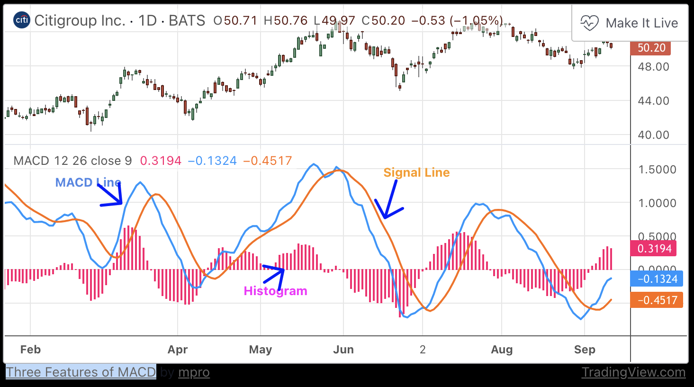

# Glossary

When you start diving into the Hummingbot ecosystem, you'll probably encounter some unfamiliar terms and phrases along the way. To help you on your journey, we've defined some of the most common trading vocabularies here in this handy cheat sheet.

## Base asset

The asset in a trading pair whose quantity is fixed as a single unit in a price quote. For example, in a price quotation of ETH/DAI 100, ETH is the **base asset** and 100 is the amount of DAI exchangeable for each unit of ETH.  In Hummingbot, the first token in a trading pair is always the base asset. See **quote asset** for more info.

## Bollinger Bands

Bollinger Bands (BB) are a widely popular technical analysis instrument created by John Bollinger in the early 1980’s. Bollinger Bands consist of a band of three lines which are plotted in relation to security prices. The line in the middle is usually a Simple Moving Average (SMA) based on a certain historical window length.

The SMA then serves as a base for the Upper and Lower Bands, which are used as a way to measure volatility by observing the relationship between the Bands and price. Typically the Upper and Lower Bands are set a number of standard deviations away from the SMA (The Middle Line).

**Parameters used in V2 Strategies:**

* `bb_std`: Number of standard deviations used to set the upper and lower Bollinger Bands.
* `bb_length`: Number of candle intervals used to calculate the SMA.

## Centralized exchange (“CEX”)

An exchange which is operated by a central authority. In addition to order matching and broadcasting, the centralized exchange keeps custody of users’ assets.

## Decentralized exchange (“DEX”)

An exchange which operates in a decentralized way, using smart contracts to facilitate the transacting in and settling of assets. Generally, one distinguishing feature of a decentralized exchange is that participants keep custody of their own assets in their own wallets; the DEX facilitates the direct wallet-to-wallet settlement between counterparties in a transaction.

## MACD

MACD (Mean Average Convergence Divergence) is an extremely popular indicator used in technical analysis. MACD can be used to identify aspects of a security's overall trend. Most notably these aspects are momentum, as well as trend direction and duration. What makes MACD so informative is that it is actually the combination of two different types of indicators. First, MACD employs two Moving Averages of varying lengths (which are lagging indicators) to identify trend direction and duration. Then, MACD takes the difference in values between those two Moving Averages (MACD Line) and an EMA of those Moving Averages (Signal Line) and plots that difference between the two lines as a histogram which oscillates above and below a center Zero Line. The histogram is used as a good indication of a security's momentum.

To fully understand the MACD indicator, it is first necessary to break down each of the indicator's components.

**The three major components of MACD**

1. **The MACD Line**: The MACD Line is a result of taking a longer term EMA and subtracting it from a shorter term EMA.The most commonly used values are 26 days for the longer term EMA and 12 days for the shorter term EMA, but it is the trader's choice.
2. **The Signal Line**: The Signal Line is an EMA of the MACD Line described in Component 1. The trader can choose what period length EMA to use for the Signal Line however 9 is the most common.
3. **The MACD Histogram**: As time advances, the difference between the MACD Line and Signal Line will continually differ. The MACD histogram takes that difference and plots it into an easily readable histogram. The difference between the two lines oscillates around a Zero Line.

**Parameters used in V2 Strategies:**

* `macd_fast`: number of candle intervals used to calculate the shorter-term EMA
* `macd_slow`: number of candle intervals used to calculate the longer-term EMA
* `macd_signal`: EMA of the MACD signal line

## Maker

A party that places _maker orders_, and in doing so, provides liquidity to the market.

## Maker order

A “limit order”; which is an order to buy or sell an asset at a specified price and quantity. Executing this order is not guaranteed; the order is only filled if there is a taker that accepts the price and quantity and transacts.

## Order book

A list of currently available (maker) orders on an exchange, showing all of the current buyer and seller interest in an asset.

## Quote asset

The asset in a asset pair whose quantity varies and whose quantity is denoted by the numerical figure of the price quote. For example, in a price quotation of ETH/DAI 100, DAI is the quote currency and 100 units of DAI are referenced in this exchange.  In Hummingbot, the second token in a trading pair is always the quote asset. See **base asset** for more info.

## Taker

A party that places _taker orders_, which execute immediately and fill a maker order.

## Taker order

A “market order”; an order to buy or sell a specified quantity of an asset which is filled immediately at the best available price(s) available on the exchange.

## Mid price

The average of best bid and best ask price in the orderbook.

## Hedging price

In cross exchange strategy, is the net cost of the other side of your limit order i.e., the cost of you making a taker order.  _For example on your taker market, if you can buy 25 tokens for say a net price of $100 (other market makers have limit sell orders at a net price of 100 for all 25, e.g. 7.5 @ $99, 10 @ $100, 7.5 @ $101), then on your maker side, you would place a limit sell order for 25 @ $101 (assume 1% min profitability). If someone fills your sell order (you sell at $101), you immediately try to hedge by buying on the taker side at $100._
