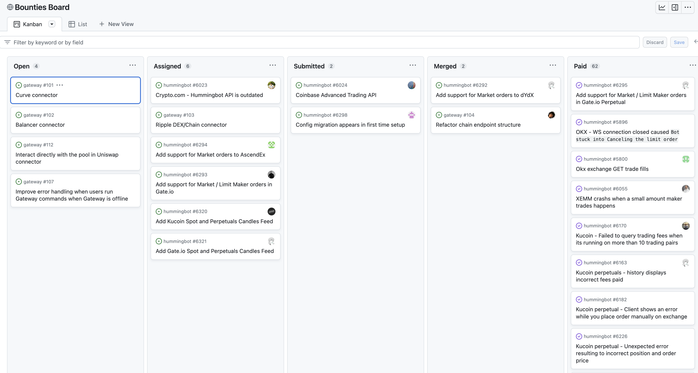

Bounties are rewards (denominated in HBOT or other tokens) given out to community member for work that improves Hummingbot. They offer a platform for **Sponsors** seeking development work on exchange connectors, trading strategies, bug fixes, and related content/guides to connect with **Contributors**, experienced Hummingbot developers and traders capable of creating these solutions or content.

Bounties may be either **Open Source** (merged into the official Hummingbot codebase) or **Private** (delivered as a private fork to the Sponsor for their own exclusive use).

Hummingbot Foundation oversees the entire Bounties process, from working with Sponsors to scope the bounty, finding and assigning the bounty to a qualified developer, performing engineering/QA review, and paying the developer. Since Bounties sprung out of an internal program that has rewarded 30+ unique contributors and fixed 70+ issues, the Foundation itself will continue to be an active Sponsor of bounties.

See below for step-by-step guides for Contributors and Sponsors:

* [Contributors](./contributors.md)
* [Sponsors](./sponsors.md)

## Bounties Board

[Bounties Board](https://github.com/orgs/hummingbot/projects/7/views/1), a Kanban-style public Github project, is the source of truth for the status of all Hummingbot bounties, including both Foundation and community-created bounties.

The columns in the board include:

- **Open**: Open bounties that contributors can apply to work on
- **Assigned**: Issue has been assigned to a contributor, who is expected to submit a pull request resolving it
- **Submitted**: A pull request resolving the issue has been submitted by the assigned contributor
- **Merged**: Pull request has been merged to the `development` branch (or published publicly in the case of content)
- **Paid**: Contributor has been paid and the bounty is considered done

In addition, see the **Bounties** tab in the [HBOT Tracker](https://docs.google.com/spreadsheets/d/1UNAumPMnXfsghAAXrfKkPGRH9QlC8k7Cu1FGQVL1t0M/edit?usp=sharing) Google Sheet for a record of past bounty distributions.

## Bounty Types

Bounties can be classified into one of the following types:

* 🐞 **Bug Fix**: Fix to a bug in the Hummingbot codebase
* 🚀 **Enhancement**: Update or improvement to a component in the Hummingbot codebase
* 📺 **Content**: Documentation, videos, guides, and other content that explains how to use an aspect of Hummingbot
* 📜 **New Script**: A new [script](/scripts/) in the Hummingbot codebase
* 🏦 **New Connector**: A new [exchange](/exchanges/) or [blockchain](/gateway/chains/) connector in Hummingbot or Hummingbot Gateway
* 📈 **New Strategy**: A new [strategy](/strategies/) in the Hummingbot codebase.

In addition, bounties may be:

* **Open Source**: merged into the official Hummingbot codebase, or 
* **Private**: delivered as a private fork to the Sponsor

## Community Voting

Open Source bounties with the **New Connector** and **New Strategy** types require community voting, since they are included into the official Hummingbot codebase and actively maintained.

Connectors and strategies require maintenance, testing and documentation, so adding new ones to the codebase imposes a cost by everyone who uses Hummingbot. Therefore, prospective sponsors of these bounties should get a [proposal](/governance/proposals) approved before the Foundation can assign a bounty. 

Sponsors should also be aware of the quarterly [Polls](/governance/polls) process that applies a minimum voting power threshold to determine inclusion of connectors and strategies in the codebase.

Private bounties and other types of Open source bounties do not need to go through the proposal process.

## Bounties Process

The Bounties process consists of four key stages: **(1) Bounty Creation**, **(2) Bounty Assignment**, **(3) Pull Request Review**, and **(4) Code Merge and Payment**.

### 1. Bounty Creation

Sponsors may create a bounty as (1) a Github issue in a Hummingbot code repository or (2) a Discord thread in the #bounties channel of the Hummingbot Discord server.

Afterwards, we will collaborate with the Sponsor to scope the bounty in a Github issue, providing a clear description of the work required, acceptance criteria, an an appropriate schedule/bounty amount given scope of work.

After the Sponsor sends the bounty tokens to a Foundation wallet, we will post the bounty to the **Open** column on [Bounties Board](https://github.com/orgs/hummingbot/projects/7/views/1) and create an entry for it in [HBOT Tracker](https://docs.google.com/spreadsheets/d/1UNAumPMnXfsghAAXrfKkPGRH9QlC8k7Cu1FGQVL1t0M/edit?usp=sharing).

### 2. Bounty Assignment

After a bounty has been posted, anyone can apply to be assigned to the task by commenting on it with their Github handle.  Once one or more qualified contributors have applied to work on a specific issue, we will evaluate the applicants based on their past experience with Hummingbot, as well as other relevant factors.

We will then assign the issue to the most suitable candidate. To indicate the assignment, the issue will be moved to the **Assigned** column in the Bounties Board, and a comment will be added to the issue, such as "Assigned bounty to Developer X (link to Github profile)." This ensures that the community is aware of the assignment and can monitor the progress of the task.

### 3. Pull Request Review

Afterwards, the contributor is expected to deliver a pull request (PR) that fulfills the bounty. Note that we may re-assign the bounty if the assigned contributor is unresponsive or inactive for 7+ days, or if the submitted PR doesn’t address the acceptance criteria.

Once the PR is submitted, the Foundation will thoroughly assess the proposed solution to ensure it meets the established acceptance criteria. We will run a quality assurance process on the submission to evaluate whether it fixes the issue and/or meets the acceptance criteria. Additionally, we will conduct an engineering code review to ensure that the proposed changes can be safely and seamlessly integrated into the existing codebase without causing any conflicts or compromising system integrity.

The PR review process is a crucial step in maintaining the high quality and reliability of the Hummingbot ecosystem. By rigorously evaluating each submission, we can ensure that only the most effective and efficient solutions are implemented, ultimately resulting in a more robust and user-friendly platform for the entire community.

### 4. Code Merge and Payment

When PR has been successfully merged into the `development branch` of Hummingbot (or private fork), it ensures that the proposed solution has met the required standards and has been thoroughly reviewed. 

The Foundation will include the bounty payment in its weekly bounty payout process. Afterwards, we will mark the bounty as Paid in both [Bounties Board](https://github.com/orgs/hummingbot/projects/7/views/1) and [HBOT Tracker](https://docs.google.com/spreadsheets/d/1UNAumPMnXfsghAAXrfKkPGRH9QlC8k7Cu1FGQVL1t0M/edit?usp=sharing).

We believe that this payment structure ensures that both the contributors and the Foundation are fairly compensated for their work, promoting a healthy and sustainable Hummingbot ecosystem.
