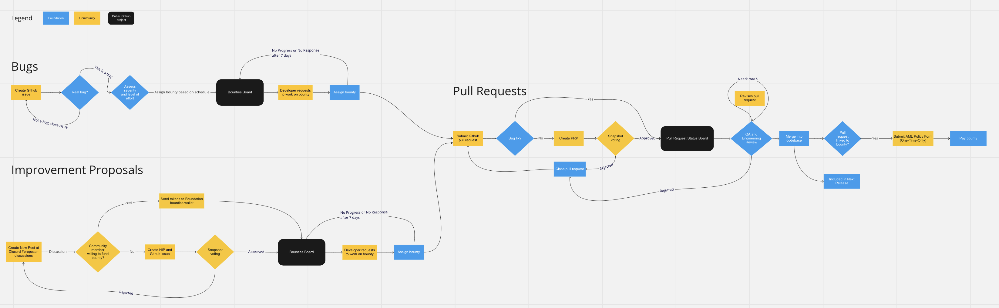

The purpose of the Hummingbot Foundation is to empower the HBOT token holders to govern many aspects of Hummingbot, such as:

* Approving all pull requests to the Hummingbot codebase
* Proposing improvements and architectural changes to the Hummingbot codebase
* Modifying parameters of the HBOT governance system
* Electing the foundation's Board of Directors
* Allocating grants and other expenditures of the community treasury

For more information, see the [Hummingbot Foundation Governance whitepaper](./whitepaper).

The Hummingbot Foundation’s primary role is to coordinate the ongoing maintenance and improvement of the open source Hummingbot codebase via a decentralized set of actors: **Exchanges**, **Contributors**, and **Users**.

* **Exchanges** are centralized or decentralized exchanges, blockchain protocols, other other organizations who enter into fee share and/or other referral agreements with Hummingbot Foundation based on user trading volume. See [Certification](./certification) for more information about the certification process.

* **Contributors** are individual developers and firms that build and maintain Hummingbot components. Contributors submit their work as pull requests to the official Github repository, and they are paid [Bounties](./bounties) when that work has been merged and included in an official release. Bounties may be funded by either Hummingbot Foundation or other community members.

* **Users** are individual and professional traders who install and use the Hummingbot open source software, released every month, to run trading bots. The volume they generate on partner exchanges sustains the operations of Hummingbot Foundation.

## Key Artifacts

Hummingbot Foundation maintains a few public artifacts that show the community the status of various bug issues, improvements, and fixes going through the maintenance process:

* [Governance Process](https://miro.com/app/board/uXjVPFc6e_U=/?share_link_id=890474764631): A public Miro whiteboard that provides a high-level overview of the governance process.

* [Bounties Board](https://github.com/orgs/hummingbot/projects/7/views/1): A public Github board for bug fixes and proposed enhancements with development bounties attached to them.

* [Pull Request Status Board](https://github.com/orgs/hummingbot/projects/1): A public Github board for active pull requests that are being voted on, reviewed, and merged.

* [HBOT Tracker](https://docs.google.com/spreadsheets/u/2/d/1UNAumPMnXfsghAAXrfKkPGRH9QlC8k7Cu1FGQVL1t0M/edit?usp=sharing): A public Google Sheet listing HBOT distributions related to approved governance and improvement proposals.

## Processes

Hummingbot employs a decentralized, community-driven maintenance process. Starting in Epoch 2, the Foundation has adopted a governance system aimed at incentivizing contributions by a decentralized network of community developers, rather than fixed component-specific maintainers.

* [Bounties](./bounties): Process of creating and assigning developer bounties for making improvements to the Hummingbot codebase
* [Releases](./releases): Process of reviewing and merging pull requests into official monthly releases

## Proposals

HBOT token holders can create and vote on various types of **Proposals** to steer the evolution of the project. Each proposal type may have different guidelines, HBOT balance requirements, and approval/quorum thresholds.

See [Proposals](./proposals) for more information.

## Epochs

In order to continually iterate and improve the governance process, we divide the next Hummingbot's future into **Epochs**.

Epochs are a series of 5-month periods that allocate target HBOT distribution budgets across various HGP categories. Basically, epochs are long "sprints" that enable the Foundation to conduct a retrospective afterwards and improve the process for the next epoch.

See [Epochs](./epochs) for more information.

## Exchange Certification

Hummingbot users around the world trade billions in volume every day using our open source software. Hummingbot Foundation partners with exchanges who enter into fee share agreements with us and attain certification.

See [Certification](./certification) for more information about the certification process and its benefits for exchanges and for users.

## How to Participate

We use a number of platforms that enable community engagement in different ways. Below, we offer guidance to help the community decide how to participate in governance.

### Discord

[Discord](http://discord.gg/hummingbot) is our **community hub**. Start here to meet the community and learn about how to participate in the Hummingbot ecosystem:

* General chat
* Developer chat
* Foundation announcements
* Hummingbot technical support
* Monthly community calls

### Forum

Use the official [Hummingbot Forum](https://forum.hummingbot.org/) for **long-form discussions** and to get feedback on exploratory ideas, proposals, and team projects. The threads you create are persistent and categorized, so that don't get lost in Discord.

* Starting point for new proposals
* Community feedback
* Exploratory research

### Snapshot

All **proposal voting** occur on the offical Hummingbot [Snapshot](https://snapshot.org/#/hbot-prp.eth), which features an off-chain, gas-less voting system that allows you to vote by signing messages using your HBOT token balance as of a certain block.

The official Hummingbot Foundation Snapshot is: <https://snapshot.org/#/hbot.eth>, which supports voting for three types of proposals, each with their own sub-Snapshot page:

* Pull Request Proposals (PRP): <https://snapshot.org/#/hbot-prp.eth>
* Hummingbot Improvement Proposals (HIP): <https://snapshot.org/#/hbot-ip.eth>
* Hummingbot Governance Proposals (HGP): <https://snapshot.org/#/hbot.eth>

### Github

For feedback or questions relating to the Hummingbot codebase, please create an issue in [Github](https://github.com/hummingbot/hummingbot) an reference specific sections of the code where applicable.

* Feedback on Pull Request Proposals
* Feature requests for new exchange connectors and strategies
* Code comments and questions
