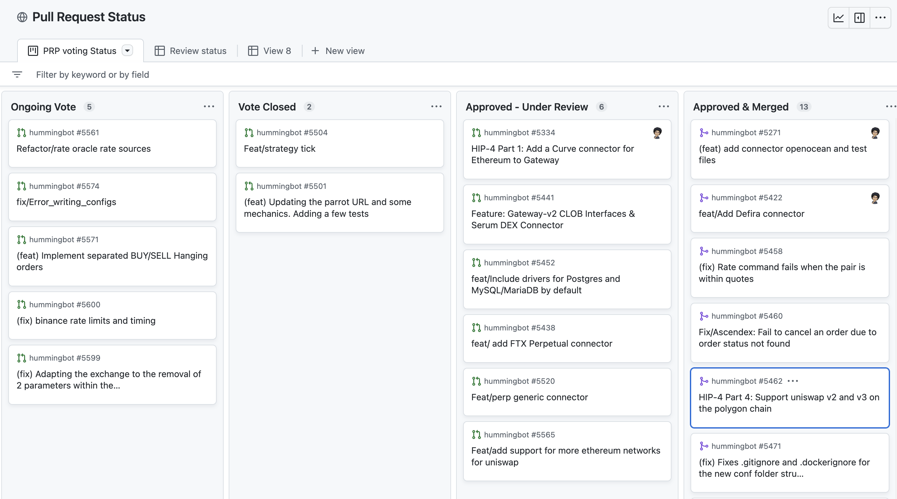

Changes to the Hummingbot and Hummingbot Gateway codebases are made through [pull requests](https://github.com/hummingbot/hummingbot/pulls), which undergo a thorough engineering and QA review before they are merged into the codebase, coordinated by the Foundation.

Only the following pull requests will be reviewed:

* [Approved proposals](/governance/proposals): Approved PRPs and pull requests to claim bounties approved by HIPs
* [Bug fixes](/maintenance/bugs): Fixes to outstanding bugs

## Pull Request Status Board

Hummingbot Foundation maintains a [Github board](https://github.com/orgs/hummingbot/projects/1/views/4) in which you can see the status of all active pull requests, including ongoing PRPs, bug fixes, in review, etc.

## Review Process

While approval via HBOT voting signals that the community wants the fix or improvement to be added into the codebase, pull requests go through a series of automated and manual checks to ensure that the new code:
* Does not conflict or cause problems with other parts of the codebase
* Does not introduce security risks
* Does not contain merge conflicts
* Contains manual tests, documentation, and meets code quality guidelines
* Passes automated testing

The Foundation Quality Assurance (QA) and Engineering team members coordinate this process, assisted by members of the community, such as [Technical Review DAO](https://snapshot.org/#/hbot.eth/proposal/0x4480a6868355b8f4ad3dfcfa5d3e8bb043175bb8b250549433e5ba3360af536f).

After a pull request has been approved, it will go through the following development cycle:

## Branches

The Hummingbot code repository has three main branches related to the development cycle of each monthly release:

### `development`

All pull requests aiming to be included on the `master` branch must be targeted to the development branch. They are then promoted from `development` to `staging` before passing to `master`. Pull requests targeting the `development` branch will only be merged into `staging` only when there is an approved PRP related to it. 

### `staging`

`staging` is used by the Foundation QA team to conduct a thorough test all code changes before adding them to the `master` or `main` branch.

### `master` or `main`

`master` is the main release branch and contains the latest stable version of the Hummingbot software client and is released once per month. 

Hummingbot Gateway's `main` branch serves the same purpose.
