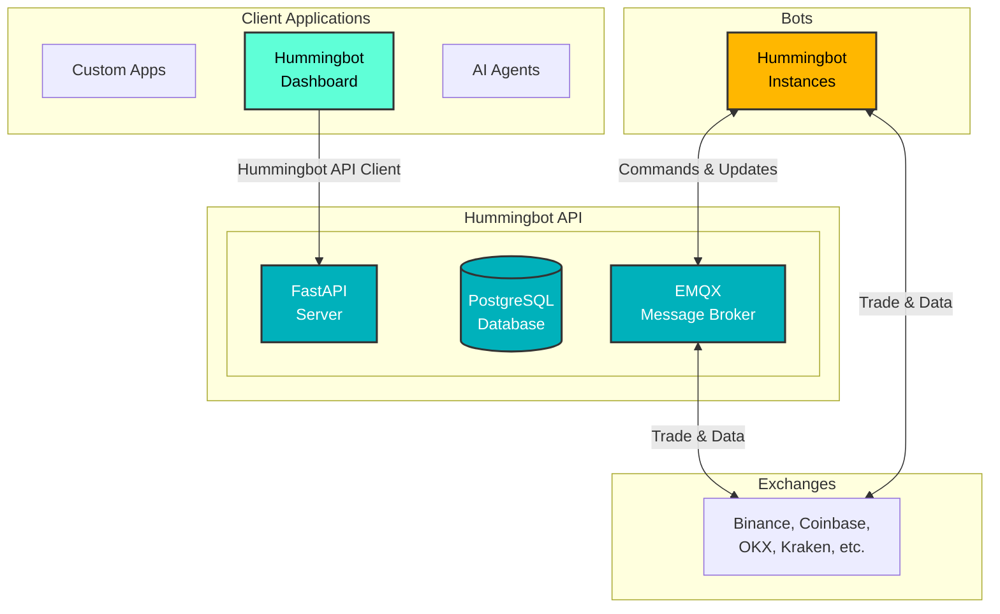

# Hummingbot API

!!! note "Repository Update"
    The `backend-api` has been **renamed to `hummingbot-api`**, marking a major revamp of the codebase with improvements in architecture, modularity, and developer experience.

## Overview

Hummingbot API is a comprehensive RESTful API framework designed for managing trading operations across multiple exchanges. It allows individual traders and teams to deploy custom, private servers for trade execution, portfolio management, and data collection, bot deployment, and other use cases.

**GitHub Repository**: [github.com/hummingbot/hummingbot-api](https://github.com/hummingbot/hummingbot-api)

## Key Features

- ⚙️ **Standardized and production-ready** API for managing bots, executing trades, and monitoring multi-exchange portfolios
- 🔄 **Expanded capabilities** including direct trading, portfolio rebalancing, and account management — all via API
- 📊 **Real-time monitoring** of portfolio performance across multiple exchanges
- 🎯 **Market data collection** for real-time and historical price feeds
- 🔧 **Comprehensive bot orchestration** for managing multiple trading instances

## Use Cases

The Hummingbot API enables various trading applications:

- **Custom OEMS**: Build your own trading order execution management system spanning multiple exchanges
- **Trading Dashboards**: Build custom chat, web, and mobile interfaces for controlling bots
- **AI-Powered Trading**: Integrate with LLMs for agentic trading workflows
- **Risk Management Tools**: Build systems for monitoring and managing trading operations
- **Market Data Feeds**: Create real-time price and historical candles feeds for use with different applications

## Architecture



### Key Components

- **Server Infrastructure**:
    - FastAPI server providing RESTful API with HTTP Basic Authentication
    - PostgreSQL database for storing trading data, account info, and historical performance
    - EMQX message broker for real-time communication with bot instances
- **Bot Instances**: Individual Hummingbot containers connected to different exchanges
- **Docker Management**: Orchestrates multiple Hummingbot container instances

## Getting Started

- **[Installation Guide](installation.md)** - Complete installation instructions for Docker and source installation
- **[Quickstart Guide](quickstart.md)** - Learn how to:
    - Add exchange credentials
    - View portfolio balances  
    - Place your first market order

The guides include Docker setup and Python API client examples to get you trading in minutes.

## API Routers

The Hummingbot API provides the following key routers:

### 🐳 Docker Management
Manage Docker containers and instances running Hummingbot

- `GET /docker/running` - Check if Docker daemon is running
- `GET /docker/available-images` - List available Docker images
- `GET /docker/active-containers` - Get all running containers
- `POST /docker/pull-image` - Pull new Docker images
- `POST /docker/start-container/{name}` - Start a container
- `POST /docker/stop-container/{name}` - Stop a container
- `POST /docker/remove-container/{name}` - Remove container and archive data

### 💼 Account Management
Handle exchange account credentials and configurations

- `GET /accounts` - List all trading accounts
- `POST /accounts` - Create new trading account
- `PUT /accounts/{id}` - Update account credentials
- `DELETE /accounts/{id}` - Delete trading account
- `GET /accounts/{id}/balances` - Get account balances

### 🔌 Connector Discovery
Discover and manage available exchange connectors

- `GET /connectors` - List all available connectors
- `GET /connectors/{name}` - Get connector details
- `GET /connectors/{name}/trading-rules` - Get trading rules and limits
- `GET /connectors/{name}/markets` - List supported trading pairs

### 📊 Portfolio Management
Monitor and analyze portfolio performance across exchanges

- `GET /portfolio/balances` - Get aggregated portfolio balances
- `GET /portfolio/performance` - Get portfolio performance metrics
- `GET /portfolio/distribution` - Get token distribution analysis
- `GET /portfolio/history` - Get historical portfolio data

### 💱 Trading Operations
Execute trades, manage orders, and monitor positions

- `POST /trading/orders` - Place new order
- `GET /trading/orders` - List active orders
- `DELETE /trading/orders/{id}` - Cancel order
- `GET /trading/positions` - Get open positions
- `GET /trading/history` - Get trade history
- `POST /trading/close-position` - Close a position

### 📈 Strategy Management
Configure and deploy trading strategies with real-time updates

- `GET /controllers` - List available strategy controllers
- `POST /controllers/{name}/deploy` - Deploy strategy controller
- `PUT /controllers/{id}/config` - Update strategy parameters
- `GET /scripts` - List available trading scripts
- `POST /scripts/run` - Execute trading script

### 📉 Market Data
Access real-time and historical market data

- `GET /market-data/ticker/{pair}` - Get current ticker data
- `GET /market-data/orderbook/{pair}` - Get order book snapshot
- `GET /market-data/candles/{pair}` - Get historical candles
- `GET /market-data/trades/{pair}` - Get recent trades
- `WS /market-data/stream` - Real-time market data stream

### 🤖 Bot Orchestration
Deploy, configure, and manage multiple bot instances

- `GET /bot-orchestration/bots` - List all bot instances
- `POST /bot-orchestration/deploy` - Deploy new bot
- `PUT /bot-orchestration/bots/{id}/config` - Update bot configuration
- `POST /bot-orchestration/bots/{id}/start` - Start bot
- `POST /bot-orchestration/bots/{id}/stop` - Stop bot
- `GET /bot-orchestration/bots/{id}/status` - Get bot status

### 🧪 Backtesting
Run strategy backtests with historical data

- `POST /backtesting/run` - Start new backtest
- `GET /backtesting/results/{id}` - Get backtest results
- `GET /backtesting/metrics/{id}` - Get performance metrics
- `POST /backtesting/optimize` - Run parameter optimization


## Authentication

The API uses HTTP Basic Authentication:

- Configure username and password during setup
- Include credentials in the Authorization header for all requests
- Example: `Authorization: Basic <base64-encoded-credentials>`

## API Client

A modern, asynchronous Python client is available for interacting with the Hummingbot API. This client is used by the [Hummingbot Dashboard](/dashboard/) as the interface layer for all API communications.

- **GitHub**: [hummingbot-api-client](https://github.com/hummingbot/hummingbot-api-client)
- **PyPI**: [pypi.org/project/hummingbot-api-client](https://pypi.org/project/hummingbot-api-client/)

### Installation
```bash
pip install hummingbot-api-client
```

### Usage Example
```python
from hummingbot_api_client import HummingbotAPIClient

# Initialize client
client = HummingbotAPIClient(
    base_url="http://localhost:8000",
    username="your-username",
    password="your-password"
)

# Get portfolio data
portfolio = await client.get_portfolio()

# Execute a trade
order = await client.create_order(
    connector="binance",
    trading_pair="BTC-USDT",
    order_type="limit",
    side="buy",
    amount=0.001,
    price=50000
)
```

## Related Resources

- [Hummingbot Dashboard](/dashboard/) - Web-based interface built on top of Hummingbot API
- [API Client Documentation](https://github.com/hummingbot/hummingbot-api-client) - Python client library
- [Hummingbot Client](/client/) - Core trading engine
