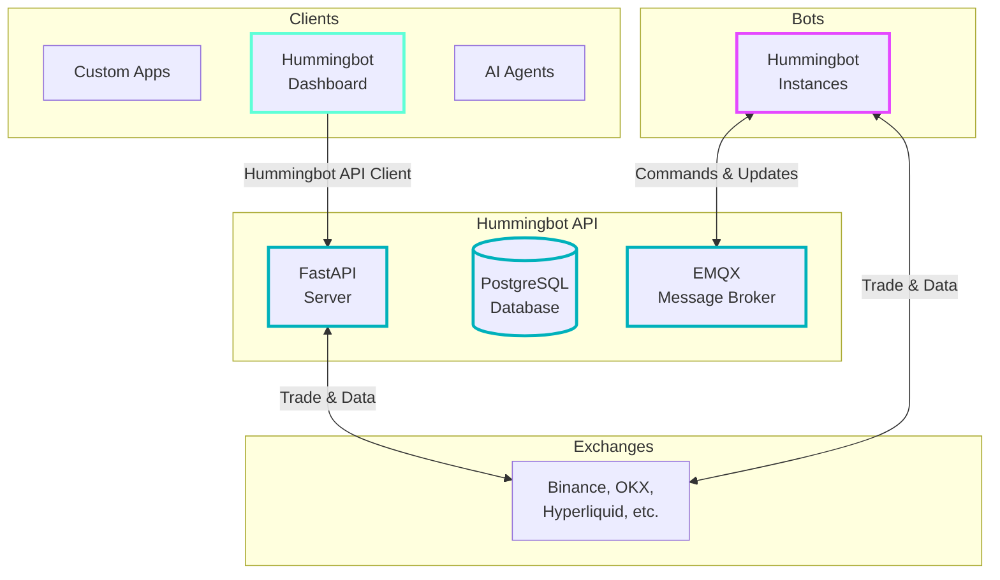

# Hummingbot API

**The central hub for running Hummingbot trading bots** - now with AI assistant integration via MCP (Model Context Protocol).

!!! note "Repository Update"
    The `backend-api` has been **renamed to `hummingbot-api`**, marking a major revamp of the codebase with improvements in architecture, modularity, and developer experience.

A comprehensive RESTful API framework for managing trading operations across multiple exchanges. The Hummingbot API provides a centralized platform to aggregate all your trading functionalities, from basic account management to sophisticated automated trading strategies.

**GitHub Repository**: [github.com/hummingbot/hummingbot-api](https://github.com/hummingbot/hummingbot-api)

## What is Hummingbot API?

The Hummingbot API is designed to be your central hub for trading operations, offering:

- **🤖 AI Assistant Integration**: Control your trading with natural language via MCP (Claude, ChatGPT, Gemini)
- **Multi-Exchange Account Management**: Create and manage multiple trading accounts across different exchanges
- **Portfolio Monitoring**: Real-time balance tracking and portfolio distribution analysis
- **Trade Execution**: Execute trades, manage orders, and monitor positions across all your accounts
- **Automated Trading**: Deploy and control Hummingbot instances with automated strategies
- **Strategy Management**: Add, configure, and manage trading strategies in real-time
- **Complete Flexibility**: Build any trading product on top of this robust API framework

Whether you're building a trading dashboard, implementing algorithmic strategies, or creating a comprehensive trading platform, the Hummingbot API provides all the tools you need.


## Architecture



### Key Components

- **Server Infrastructure**:
    - FastAPI server providing RESTful API with HTTP Basic Authentication
    - PostgreSQL database for storing trading data, account info, and historical performance
    - EMQX message broker for real-time communication with bot instances
- **Exchange Connectors**: Built-in connectors for major CEXs and DEXs - trading and data fetching is accessible directly through the Hummingbot API or via bots that it deploys
- **Bot Instances**: Individual Hummingbot containers connected to different exchanges
- **Docker Management**: Orchestrates multiple Hummingbot container instances

## 🎯 Ways to Interact with Hummingbot API

Choose the method that best fits your workflow:

### 1. 🔧 Swagger UI - API Documentation (Default)
**Interactive REST API documentation and testing**

- **Best for**: Developers and power users who want full control
- **Advantages**:
  - Complete API access - all endpoints available
  - Direct endpoint testing
  - Integration development
  - No additional setup required
- **Setup**: Automatically available after running setup
- **Access**: <http://localhost:8000/docs>

### 2. 🤖 MCP - AI Assistant (Optional)
**Natural language trading commands through Claude, ChatGPT, or Gemini**

- **Best for**: Users who prefer conversational interaction
- **Advantages**:
  - Natural language commands
  - Full access to all API features
  - Contextual help and explanations
  - Complex multi-step operations made simple
  - Progressive credential setup with `setup_connector` tool
- **Setup**: See [MCP Installation Guide](/mcp/installation/)
- **Examples**:
  - First-time: "Set up my Solana wallet" → Guides through credential setup
  - Trading: "What's the price to swap 0.01 SOL for USDC? Execute the trade"

### 3. 📊 Dashboard - Web Interface (Optional)
**Visual interface for common operations**

- **Best for**: Users who prefer graphical interfaces
- **Advantages**:
  - Intuitive visual workflows
  - Real-time charts and graphs
  - Quick access to common tasks
- **Limitations**: Not all API functions available (focused on core features)
- **Setup**: Enable during installation
- **Access**: <http://localhost:8501>

## Use Cases

The Hummingbot API enables various trading applications:

- **Custom OEMS**: Build your own trading order execution management system spanning multiple exchanges
- **Trading Dashboards**: Build custom chat, web, and mobile interfaces for controlling bots
- **AI-Powered Trading**: Integrate with LLMs for agentic trading workflows
- **Risk Management Tools**: Build systems for monitoring and managing trading operations
- **Market Data Feeds**: Create real-time price and historical candles feeds for use with different applications

## Getting Started

- **[Installation Guide](installation.md)** - Complete installation instructions for Docker and source installation
- **[Quickstart Guide](quickstart.md)** - Learn how to:
    - Add exchange credentials
    - View portfolio balances
    - Place your first market order

The guides include Docker setup and Python API client examples to get you trading in minutes.

## API Endpoints

The Hummingbot API is organized into functional routers covering:

- 🐳 **Docker Management** - Container lifecycle and orchestration
- 💳 **Account Management** - Multi-exchange account configuration
- 🔌 **Connector Discovery** - Exchange connector information
- 📊 **Portfolio Management** - Real-time portfolio tracking and analytics
- 💹 **Trading Operations** - Order execution and position management
- 🤖 **Bot Orchestration** - Deploy and manage trading bots
- 📋 **Strategy Management** - Controllers and scripts
- 📊 **Market Data** - Real-time and historical market data
- 🔄 **Backtesting** - Strategy testing with historical data
- 📈 **Archived Bot Analytics** - Historical bot performance analysis
- 🌐 **Gateway** - Gateway container and DEX infrastructure management
- 🔄 **Gateway Swaps** - DEX swap execution and monitoring
- 💧 **Gateway CLMM** - Concentrated liquidity position management

For detailed endpoint documentation, see the **[API Routers Guide](routers.md)**.


## System Dependencies

The platform includes these essential services:

### PostgreSQL Database
Stores all trading data including:

- Orders and trade history
- Account states and balances
- Positions and funding payments
- Performance metrics

**Note:** The database is automatically initialized using environment variables. The included `init-db.sql` serves as a safety net.

### EMQX Message Broker
Enables real-time communication with trading bots:

- Receives live updates from running bots
- Sends commands to control bot execution
- Handles real-time data streaming

## Configuration

### Environment Variables
Key configuration options available in `.env`:

- **CONFIG_PASSWORD**: Encrypts API keys and credentials
- **USERNAME/PASSWORD**: API authentication credentials
- **BROKER_HOST/PORT**: EMQX message broker settings
- **DATABASE_URL**: PostgreSQL connection string
- **ACCOUNT_UPDATE_INTERVAL**: Balance update frequency (minutes)
- **AWS_API_KEY/AWS_SECRET_KEY**: S3 archiving (optional)
- **BANNED_TOKENS**: Comma-separated list of tokens to exclude
- **LOGFIRE_TOKEN**: Observability and monitoring (production)

### Bot Instance Structure
Each bot maintains its own isolated environment:
```
bots/instances/hummingbot-{name}/
├── conf/           # Configuration files
├── data/           # Bot databases and state
└── logs/           # Execution logs
```

## Authentication

The API uses HTTP Basic Authentication:

- Configure username and password during setup
- Include credentials in the Authorization header for all requests
- Example: `Authorization: Basic <base64-encoded-credentials>`

## API Client

A modern, asynchronous Python client is available for interacting with the Hummingbot API. This client is used by the [Hummingbot Dashboard](/dashboard/) as the interface layer for all API communications.

- **GitHub**: [hummingbot-api-client](https://github.com/hummingbot/hummingbot-api-client)
- **PyPI**: [pypi.org/project/hummingbot-api-client](https://pypi.org/project/hummingbot-api-client/)

### Installation
```bash
pip install hummingbot-api-client
```

### Usage Example
```python
from hummingbot_api_client import HummingbotAPIClient

# Initialize client
client = HummingbotAPIClient(
    base_url="http://localhost:8000",
    username="your-username",
    password="your-password"
)

# Get portfolio data
portfolio = await client.get_portfolio()

# Execute a trade
order = await client.create_order(
    connector="binance",
    trading_pair="BTC-USDT",
    order_type="limit",
    side="buy",
    amount=0.001,
    price=50000
)
```

## Related Resources

- [Hummingbot Dashboard](/dashboard/) - Web-based interface built on top of Hummingbot API
- [API Client Documentation](https://github.com/hummingbot/hummingbot-api-client) - Python client library
- [Hummingbot Client](/client/) - Core trading engine
