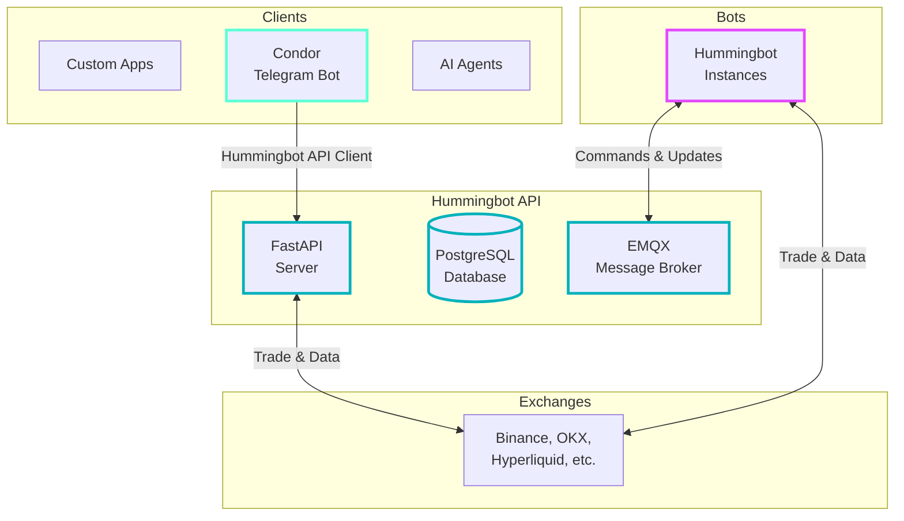

# Hummingbot API

**The central hub for running Hummingbot trading bots** - now with AI assistant integration via MCP (Model Context Protocol).

!!! note "Repository Update"
    The `backend-api` has been **renamed to `hummingbot-api`**, marking a major revamp of the codebase with improvements in architecture, modularity, and developer experience.

A comprehensive RESTful API framework for managing trading operations across multiple exchanges. The Hummingbot API provides a centralized platform to aggregate all your trading functionalities, from basic account management to sophisticated automated trading strategies.

**GitHub Repository**: [github.com/hummingbot/hummingbot-api](https://github.com/hummingbot/hummingbot-api)

## Getting Started

- **[Quickstart](../installation/hummingbot-api.md)** - One-line install to get Hummingbot API running with Condor
- **[Developer Guide](quickstart.md)** - Learn how to use the API directly with curl or Python to add credentials, view portfolios, and place orders
- **[Source Installation](installation.md)** - For developers who want to modify the codebase

## What is Hummingbot API?

The Hummingbot API is designed to be your central hub for trading operations, offering:

- **🤖 AI Assistant Integration**: Control your trading with natural language via MCP (Claude, ChatGPT, Gemini)
- **Multi-Exchange Account Management**: Create and manage multiple trading accounts across different exchanges
- **Portfolio Monitoring**: Real-time balance tracking and portfolio distribution analysis
- **Trade Execution**: Execute trades, manage orders, and monitor positions across all your accounts
- **Automated Trading**: Deploy and control Hummingbot instances with automated strategies
- **Strategy Management**: Add, configure, and manage trading strategies in real-time
- **Complete Flexibility**: Build any trading product on top of this robust API framework

Whether you're building a trading dashboard, implementing algorithmic strategies, or creating a comprehensive trading platform, the Hummingbot API provides all the tools you need.


## Architecture


```mermaid
graph TB
    subgraph "Clients"
        direction LR
        CUSTOM[Custom Apps]
        CONDOR[Condor<br/>Telegram Bot]
        AI[AI Agents]
    end

    subgraph "Hummingbot API"
        direction LR
        API["FastAPI<br/>Server<br/>"]
        PG[(PostgreSQL<br/>Database)]
        MQTT[EMQX<br/>Message Broker]
    end

    subgraph "Bots"
        BOTS[Hummingbot<br/>Instances]
    end

    subgraph "Exchanges"
        EX[Binance, OKX,<br/>Hyperliquid, etc.]
    end

    %% Client connections using API Client
    CONDOR -->|Hummingbot API Client| API

    %% Bot connections
    BOTS <-->|Commands & Updates| MQTT

    %% Exchange connections
    BOTS <-->|Trade & Data| EX
    API <-->|Trade & Data| EX

    %% Apply theme colors
    classDef clientStyle stroke:#5FFFD7,stroke-width:3px
    classDef apiStyle stroke:#00B1BB,stroke-width:3px
    classDef botsStyle stroke:#E549FF,stroke-width:3px

    class CONDOR clientStyle
    class API,PG,MQTT apiStyle
    class BOTS botsStyle
```

### Key Components

- **Server Infrastructure**:
    - FastAPI server providing RESTful API with HTTP Basic Authentication
    - PostgreSQL database for storing trading data, account info, and historical performance
    - EMQX message broker for real-time communication with bot instances
- **Exchange Connectors**: Built-in connectors for major CEXs and DEXs - trading and data fetching is accessible directly through the Hummingbot API or via bots that it deploys
- **Bot Instances**: Individual Hummingbot containers connected to different exchanges
- **Docker Management**: Orchestrates multiple Hummingbot container instances

## Ways to Interact with Hummingbot API

For new users, we strongly recommend using **Condor** for a mobile-friendly Telegram experience. For developers and advanced users, the **Swagger UI** and **MCP** provide more direct access to the API.

### Condor

Mobile and desktop control via Telegram.

- **Best for**: Users who want to monitor and control bots on the go
- **Advantages**: Access from any device with Telegram, real-time notifications, quick commands for common operations
- **Setup**: See [Hummingbot API Quickstart](../installation/hummingbot-api.md)

### Swagger UI

Interactive REST API documentation and testing.

- **Best for**: Developers and power users who want full control
- **Advantages**: Complete API access, direct endpoint testing, integration development
- **Access**: <http://localhost:8000/docs>

### MCP

Natural language trading commands through Claude, ChatGPT, or Gemini.

- **Best for**: Users who prefer conversational interaction
- **Advantages**: Natural language commands, full access to all API features, complex multi-step operations made simple
- **Setup**: See [MCP Installation Guide](../mcp/installation.md)

## Use Cases

The Hummingbot API enables various trading applications:

- **Custom OEMS**: Build your own trading order execution management system spanning multiple exchanges
- **Trading Dashboards**: Build custom chat, web, and mobile interfaces for controlling bots
- **AI-Powered Trading**: Integrate with LLMs for agentic trading workflows
- **Risk Management Tools**: Build systems for monitoring and managing trading operations
- **Market Data Feeds**: Create real-time price and historical candles feeds for use with different applications

## API Endpoints

The Hummingbot API is organized into functional routers covering:

- 🐳 **Docker Management** - Container lifecycle and orchestration
- 💳 **Account Management** - Multi-exchange account configuration
- 🔌 **Connector Discovery** - Exchange connector information
- 📊 **Portfolio Management** - Real-time portfolio tracking and analytics
- 💹 **Trading Operations** - Order execution and position management
- 🤖 **Bot Orchestration** - Deploy and manage trading bots
- 📋 **Strategy Management** - Controllers and scripts
- 📊 **Market Data** - Real-time and historical market data
- 🔄 **Backtesting** - Strategy testing with historical data
- 📈 **Archived Bot Analytics** - Historical bot performance analysis
- 🌐 **Gateway** - Gateway container and DEX infrastructure management
- 🔄 **Gateway Swaps** - DEX swap execution and monitoring
- 💧 **Gateway CLMM** - Concentrated liquidity position management

For detailed endpoint documentation, see the **[API Routers Guide](routers.md)**.


## System Dependencies

The platform includes these essential services:

### PostgreSQL Database
Stores all trading data including:

- Orders and trade history
- Account states and balances
- Positions and funding payments
- Performance metrics

**Note:** The database is automatically initialized using environment variables. The included `init-db.sql` serves as a safety net.

### EMQX Message Broker
Enables real-time communication with trading bots:

- Receives live updates from running bots
- Sends commands to control bot execution
- Handles real-time data streaming

## Configuration

### Environment Variables
Key configuration options available in `.env`:

- **CONFIG_PASSWORD**: Encrypts API keys and credentials
- **USERNAME/PASSWORD**: API authentication credentials
- **BROKER_HOST/PORT/USERNAME/PASSWORD**: EMQX message broker settings
- **DATABASE_URL**: PostgreSQL connection string
- **ACCOUNT_UPDATE_INTERVAL**: Balance update frequency (minutes)
- **MARKET_DATA_CLEANUP_INTERVAL**: Seconds between feed cleanup runs
- **MARKET_DATA_FEED_TIMEOUT**: Idle timeout before a feed is closed
- **MARKET_DATA_CANDLES_READY_TIMEOUT**: Max seconds to wait for candle feed readiness
- **GATEWAY_URL**: Gateway service URL (default: `http://localhost:15888`)
- **DEBUG_MODE**: Disable HTTP Basic Auth for local development
- **LOGFIRE_ENVIRONMENT**: Observability environment tag (default: `dev`)
- **AWS_API_KEY/AWS_SECRET_KEY**: S3 archiving (optional)

### Bot Instance Structure
Each bot maintains its own isolated environment:
```
bots/instances/hummingbot-{name}/
├── conf/           # Configuration files
├── data/           # Bot databases and state
└── logs/           # Execution logs
```

## Authentication

The API uses HTTP Basic Authentication:

- Configure username and password during setup
- Include credentials in the Authorization header for all requests
- Example: `Authorization: Basic <base64-encoded-credentials>`

## API Client

A modern, asynchronous Python client is available for interacting with the Hummingbot API. This client is used by [Condor](../condor/index.md) and other interfaces as the interface layer for all API communications.

- **GitHub**: [hummingbot-api-client](https://github.com/hummingbot/hummingbot-api-client)
- **PyPI**: [pypi.org/project/hummingbot-api-client](https://pypi.org/project/hummingbot-api-client/)

### Installation
```bash
pip install hummingbot-api-client
```

### Usage Example
```python
from hummingbot_api_client import HummingbotAPIClient

# Initialize client
client = HummingbotAPIClient(
    base_url="http://localhost:8000",
    username="your-username",
    password="your-password"
)

# Get portfolio data
portfolio = await client.get_portfolio()

# Execute a trade
order = await client.create_order(
    connector="binance",
    trading_pair="BTC-USDT",
    order_type="limit",
    side="buy",
    amount=0.001,
    price=50000
)
```

## Related Resources

- [Condor](../condor/index.md) - Telegram interface for Hummingbot API
- [API Client Documentation](https://github.com/hummingbot/hummingbot-api-client) - Python client library
- [Hummingbot Client](../client/index.md) - Core trading engine
