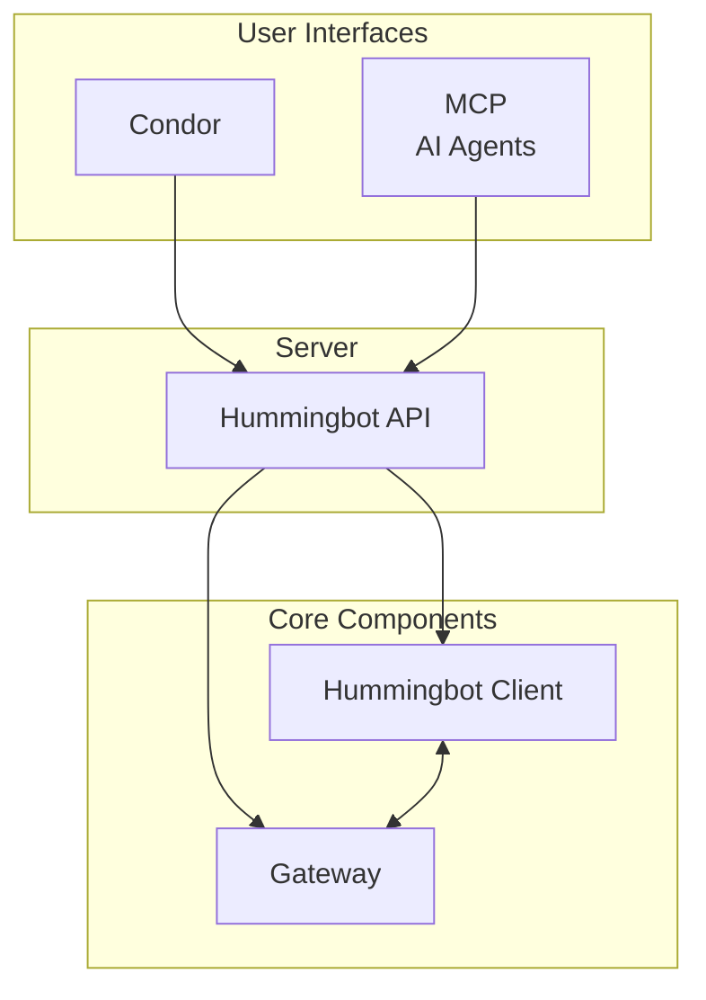
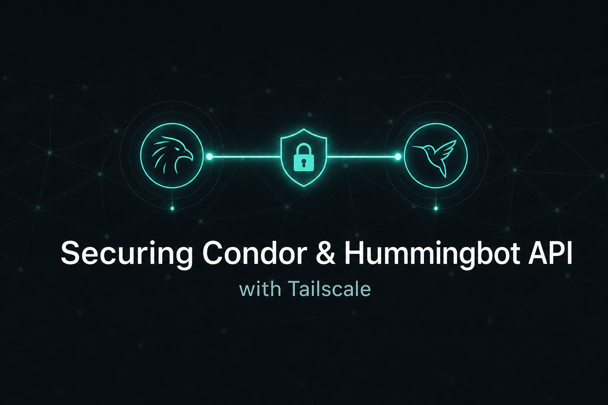
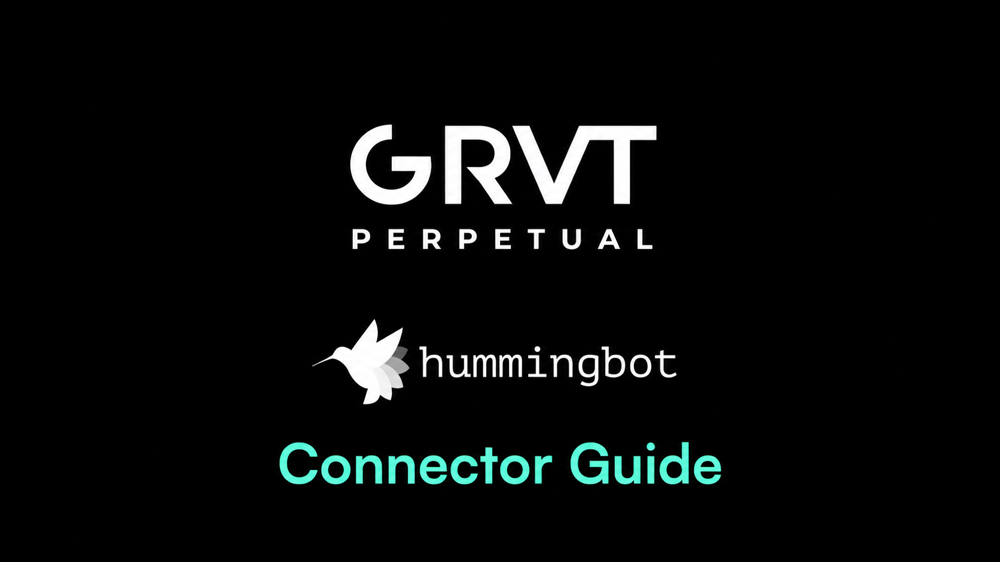

# Many Individuals and Institutions Run Hummingbot

  <a class="stat-card" href="https://reporting.hummingbot.org" target="_blank">
    $36B
    Total Trade Volume
  </a>
  <a class="stat-card" href="https://reporting.hummingbot.org" target="_blank">
    100K+
    Hummingbot Instances
  </a>
  <a class="stat-card" href="https://reporting.hummingbot.org" target="_blank">
    300+
    Connectors
  </a>

Aggregated trade volume reported by Hummingbot instances — tracked since Jan 2025.

### See [Reporting](https://reporting.hummingbot.org) for a real-time dashboard of the volume reported by all Hummingbot instances, filterable by exchange and version.

---

# Sponsored by Leading Exchanges and Protocols

  

    
    
  

  

    
    
  

  

    
    
  

  

    
    
  

  

    
    
  

  

    
    
  

### See [Exchanges](exchanges/index.md) for how Hummingbot Foundation works with these institutions.

---

# Hummingbot Github Repositories

### The Hummingbot framework contains multiple repositories that help you with various aspects of algorithmic trading. All code is open sourced under the Apache 2.0 license and supported by a vibrant global community of developers and traders.

-   :octicons-mark-github-16:{ .lg .middle } __Hummingbot Client__

    ---

    A robust trading engine featuring connectors to numerous exchanges and a wide array of strategy frameworks.

    [:octicons-arrow-right-24: Documentation](client/index.md) · [:octicons-mark-github-16: GitHub](https://github.com/hummingbot/hummingbot) :octicons-star-16: —

-   :octicons-mark-github-16:{ .lg .middle } __Gateway__

    ---

    Middleware that helps Hummingbot clients connect to DEXs and land transactions on various blockchain networks.

    [:octicons-arrow-right-24: Documentation](gateway/index.md) · [:octicons-mark-github-16: GitHub](https://github.com/hummingbot/gateway) :octicons-star-16: —

-   :octicons-mark-github-16:{ .lg .middle } __Hummingbot API__

    ---

    A comprehensive API server that provides a centralized platform for executing trades, fetching data, and deploying Hummingbot instances.

    [:octicons-arrow-right-24: Documentation](hummingbot-api/index.md) · [:octicons-mark-github-16: GitHub](https://github.com/hummingbot/hummingbot-api) :octicons-star-16: —

-   :octicons-mark-github-16:{ .lg .middle } __Condor__

    ---

    Telegram bot for monitoring and controlling Hummingbot instances from mobile and desktop.

    [:octicons-arrow-right-24: Documentation](condor/index.md) · [:octicons-mark-github-16: GitHub](https://github.com/hummingbot/condor) :octicons-star-16: —

---

# What Can You Build with Hummingbot?

### Watch Botcamp students present their custom trading strategies built with Hummingbot:

-   :material-chart-line:{ .lg .middle } __TradingView Webhook Strategy__

    ---

    <iframe style="width:100%; min-height:200px;" src="https://www.youtube.com/embed/AtNbnrZ5VFk" frameborder="0" allow="accelerometer; autoplay; encrypted-media; gyroscope; picture-in-picture" allowfullscreen></iframe>

    [:octicons-arrow-right-24: View Strategy](https://www.botcamp.xyz/strategies/cohort-12-tradingviewhummingbot-webhook-trading-strategy)

-   :material-chart-line:{ .lg .middle } __Memecoin Algorithmic Trading Strategy__

    ---

    <iframe style="width:100%; min-height:200px;" src="https://www.youtube.com/embed/QlPPU26QMYw" frameborder="0" allow="accelerometer; autoplay; encrypted-media; gyroscope; picture-in-picture" allowfullscreen></iframe>

    [:octicons-arrow-right-24: View Strategy](https://www.botcamp.xyz/strategies/cohort-11-leader-follower-directional-divergence)

-   :material-chart-line:{ .lg .middle } __Solana DEX Dynamic Rebalancing Strategy__

    ---

    <iframe style="width:100%; min-height:200px;" src="https://www.youtube.com/embed/s6FcUU-p7a8" frameborder="0" allow="accelerometer; autoplay; encrypted-media; gyroscope; picture-in-picture" allowfullscreen></iframe>

    [:octicons-arrow-right-24: View Strategy](https://www.botcamp.xyz/strategies/cohort-9-shamu-dynamic-clmm-strategy-on-orca)

-   :material-chart-line:{ .lg .middle } __Binance Futures Liquidation Sniper__

    ---

    <iframe style="width:100%; min-height:200px;" src="https://www.youtube.com/embed/pFERDd7OC0Y" frameborder="0" allow="accelerometer; autoplay; encrypted-media; gyroscope; picture-in-picture" allowfullscreen></iframe>

    [:octicons-arrow-right-24: View Strategy](https://www.botcamp.xyz/strategies/cohort-7-liquidation-sniper)

[:octicons-mortar-board-16: Learn More at Botcamp](https://botcamp.xyz){ .md-button .md-button--primary }

---

# Market Maker Testimonials

:material-format-quote-open:
As the company that open-sourced Hummingbot, we're incredibly proud of how the community has embraced it. Today, we run bespoke strategies for our institutional clients using many custom Hummingbot instances.
:material-format-quote-close:

  
<a href="https://www.linkedin.com/in/jason-tomlinson-88b0b78/" target="_blank" class="author centered">Jason Tomlinson</a>
Market Maker
 

{ .testimonial }

:material-format-quote-open:
We started with Hummingbot as the foundation for our market-making business. Their WebSocket connector architecture is the most accessible in the market. We still use it from time to time and enjoy their great documentation.
:material-format-quote-close:

  
<a href="https://www.linkedin.com/in/etartakovsky/" target="_blank" class="author centered">Eugene Tartakovsky</a>
Market Maker
 

{ .testimonial }

:material-format-quote-open:
Hummingbot has served as a reliable base for us to build custom tools and strategies. It has many quality connectors and all components are well thought out, allowing us to flexibly modify the open source code.
:material-format-quote-close:

  
<a href="https://www.linkedin.com/in/jelle-buth/" target="_blank" class="author centered">Jelle Buth</a>
Market Maker
 

{ .testimonial }

:material-format-quote-open:
Hummingbot allowed me to run profitable strategies and generate $2 billion in trade volume. I can't recommend Hummingbot enough for any algo trader seeking a 0 to 1 platform.
:material-format-quote-close:

  
<a href="https://summitoperations.co/" target="_blank" class="author centered">Kollan</a>
Prop Trader
{ .testimonial }

:material-format-quote-open:
Hummingbot revolutionized my crypto trading. Using advanced strategies, I developed my own trading style and consistently ranked at the top of the Miner leaderboard for months.
:material-format-quote-close:
  
<a href="https://github.com/mlguys" target="_blank" class="author centered">Wojak</a>
Prop Trader
{ .testimonial }

:material-format-quote-open:
Since 2021, I've been a dedicated user of Hummingbot, primarily utilizing the pure market making strategy. Based on my profitable strategies, I started an algo-trading startup in Saudi Arabia!
:material-format-quote-close:

  
Hyder
Prop Trader
{ .testimonial }

---

# 
Hummingbot ❤️ Academic Research

### Hummingbot Foundation collaborates with leading academic institutions like Cornell University and supports them in using the open source Hummingbot framework for data collection and research.

---

# Latest Blog Posts

-   

    ### [Securing Condor and Hummingbot API with Tailscale](blog/posts/securing-condor-and-hummingbot-api-with-tailscale/index.md)

-   

    ### [Trading on GRVT with Hummingbot](blog/posts/trading-on-grvt-with-hummingbot-complete-bot-development-guide/index.md)

-   

    ### [Introducing Condor: The Open Source Harness for Trading Agents](blog/posts/introducing-condor/index.md)

[:octicons-arrow-right-24: Read the Blog](blog/index.md){ .md-button .md-button--primary }

---

# A Global Community of Algo Traders

- :material-information-outline: __[Foundation](about/index.md)__: About the Foundation and our mission
- :material-account-group: __[Community](community/index.md)__: Join our global community of algo traders
- :material-gavel: __[Governance](about/governance.md)__: Decide how the Hummingbot framework evolves
- :material-frequently-asked-questions: __[FAQ](faq.md)__: Answers to common questions

---
# Stay Connected

### Get the official newsletter (published when a new Hummingbot release drops, about every 2 months) for upcoming events and new contributions, and join our Discord to chat with the global Hummingbot community.

 

[:octicons-download-16: Get the Newsletter](https://hummingbot.substack.com/){ .md-button .md-button--primary }
[:fontawesome-brands-discord: Join Discord](https://discord.gg/hummingbot){ .md-button }
