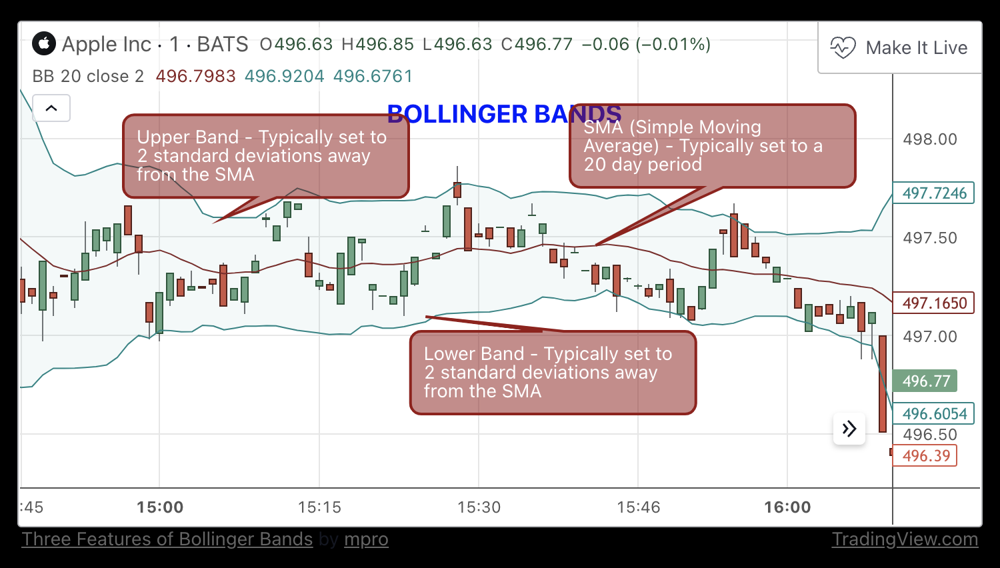

## Bollinger Bands

Bollinger Bands (BB) are a widely popular technical analysis instrument created by John Bollinger in the early 1980’s. Bollinger Bands consist of a band of three lines which are plotted in relation to security prices. The line in the middle is usually a Simple Moving Average (SMA) based on a certain historical window length.

The SMA then serves as a base for the Upper and Lower Bands, which are used as a way to measure volatility by observing the relationship between the Bands and price. Typically the Upper and Lower Bands are set a number of standard deviations away from the SMA (The Middle Line).

**Strategy parameters:**

* `bb_std`: Number of standard deviations used to set the upper and lower Bollinger Bands.
* `bb_length`: Number of candle intervals used to calculate the SMA.

## MACD

MACD (Mean Average Convergence Divergence) is an extremely popular indicator used in technical analysis. MACD can be used to identify aspects of a security's overall trend. Most notably these aspects are momentum, as well as trend direction and duration. What makes MACD so informative is that it is actually the combination of two different types of indicators. First, MACD employs two Moving Averages of varying lengths (which are lagging indicators) to identify trend direction and duration. Then, MACD takes the difference in values between those two Moving Averages (MACD Line) and an EMA of those Moving Averages (Signal Line) and plots that difference between the two lines as a histogram which oscillates above and below a center Zero Line. The histogram is used as a good indication of a security's momentum.

To fully understand the MACD indicator, it is first necessary to break down each of the indicator's components.

### The three major components

1. **The MACD Line**: The MACD Line is a result of taking a longer term EMA and subtracting it from a shorter term EMA.The most commonly used values are 26 days for the longer term EMA and 12 days for the shorter term EMA, but it is the trader's choice.
2. **The Signal Line**: The Signal Line is an EMA of the MACD Line described in Component 1. The trader can choose what period length EMA to use for the Signal Line however 9 is the most common.
3. **The MACD Histogram**: As time advances, the difference between the MACD Line and Signal Line will continually differ. The MACD histogram takes that difference and plots it into an easily readable histogram. The difference between the two lines oscillates around a Zero Line.

**Strategy parameters:**

* `macd_fast`: number of candle intervals used to calculate the shorter-term EMA
* `macd_slow`: number of candle intervals used to calculate the longer-term EMA
* `macd_signal`: EMA of the MACD signal line