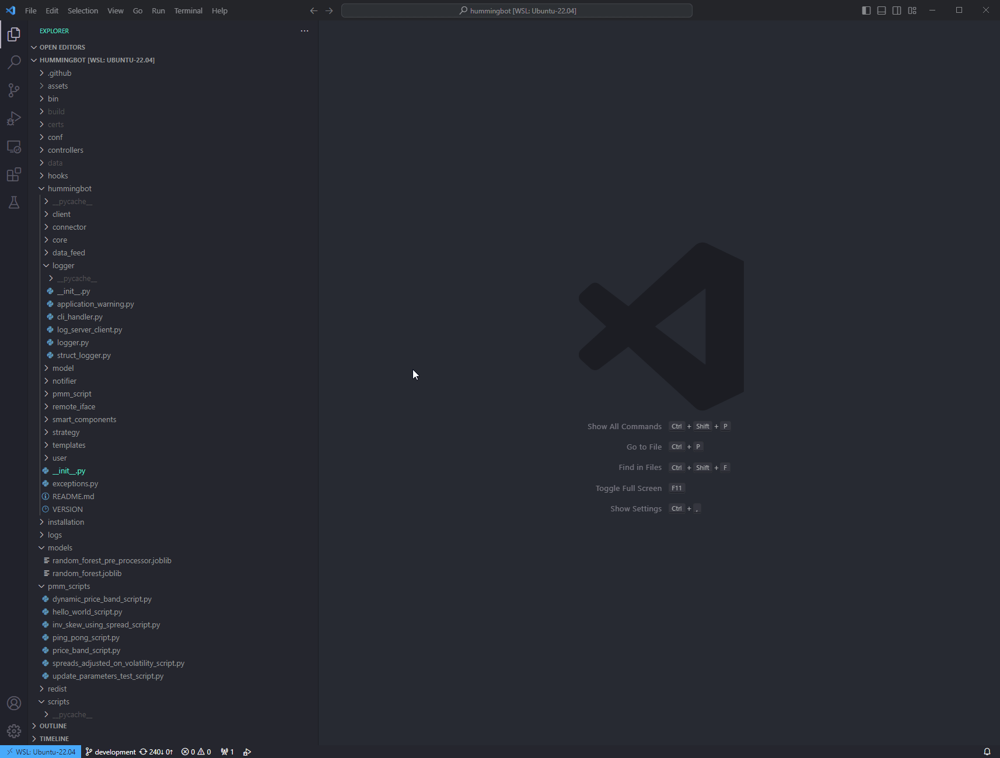
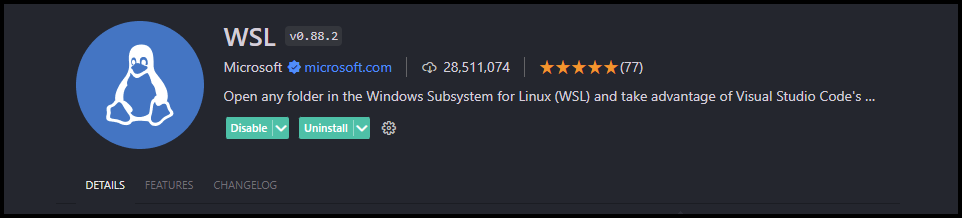

# Using Debugger Tools

This section will detail the necessary configuration / setup required to run the debugger tool from your IDE of choice.

## VS Code

[](vscode.gif)

- In VSCode, open the Hummingbot folder as your current workspace.

- Click on the **Run and Debug** icon in the left-hand pane or press <kbd>CTRL</kbd> + <kbd>Shift</kbd> + <kbd>D</kbd>.

- Click on the blue link for **create a launch.json file**

- Select "**Python Debugger**" and then "**Python File**"

- A window will open up containing the initial `launch.json` code. Replace this code with the one provided below:

    ```json
    {
      "version": "0.2.0",
      "configurations": [
        {
          "name": "Python: Hummingbot Application",
          "type": "python",
          "request": "launch",
          "program": "${workspaceRoot}/bin/hummingbot.py",
          "console": "integratedTerminal"
        }
      ]
    }
    ```

- Save the changes.

- Press <kbd>CTRL</kbd> + <kbd>Shift</kbd> + <kbd>P</kbd> and select "Python Interpreter."

- Make sure to select the Hummingbot conda environment.

By executing the **Start Debugging** command which can be found under the **Run** menu at the top or pressing the <kbd>F5</kbd> key, the debugger will automatically attach itself to the Hummingbot process. The Hummingbot app will appear in the `integratedTerminal`. You may change this as desired.

### Using VSCode with WSL2 (Windows)

- Make sure you have [Visual Studio Code](https://code.visualstudio.com/) on the Windows side (not in WSL).

!!! note 
    When prompted to **Select Additional Tasks** during installation, be sure to check the **Add to PATH** option so you can easily open a folder in WSL using the `code` command.

- Install the [WSL extension](https://marketplace.visualstudio.com/items?itemName=ms-vscode-remote.remote-wsl)

[](wsl.png)


**There are two ways you can open a remote folder / workspace**

From the WSL Terminal:

- Open a WSL terminal window (using the start menu item). For example, if you installed the `Ubuntu` distro then you can search for "Ubuntu" in the start menu. Or you can also type in `wsl` from the command prompt / PowerShell.

- Navigate to the folder you want to open in VS Code, for example the `hummingbot` repo folder. 

- Type `code .`  in the terminal. When doing this for the first time, you should see VS Code fetching components needed to run in WSL. This should only take a short while, and is only needed once.


From VS Code:

- Press <kbd>F1</kbd> then select **WSL: Connect to WSL** for the default distro or if you have multiple distros installed then select **WSL: Connect to WSL using Distro** to choose between your installed distros. 

- Use the `File` menu to open your folder, for example the `hummingbot` folder if you already cloned the repo in the terminal. 


## PyCharm

In the video below, Abel of CoinAlpha has shown how to debug a Script using Pycharm IDE.


<iframe style="width:100%; min-height:400px;" src="https://www.youtube.com/embed/2O6Ge25rsLk?si=ZNuo16EysuRB-jIx" frameborder="0" allow="accelerometer; autoplay; encrypted-media; gyroscope; picture-in-picture" allowfullscreen></iframe>


Additionally, for PyCharm, you want to set up the debug configurations, as seen in the screenshot below.


For debugging it is neccessary that `Gevent compatible` in `Python Debugger` settings is enabled. See
[Stackoverflow Q&A](https://stackoverflow.com/questions/39371676/debugger-times-out-at-collecting-data).

!!! note
    As of this writing, there is no way to add breakpoints/log points to any of the Cython code in VSCode or PyCharm.
