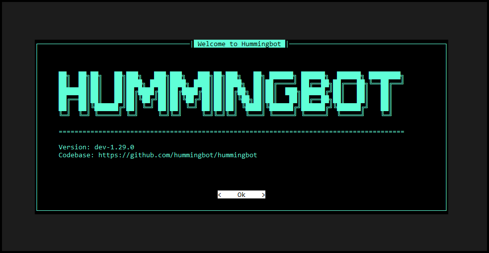

# Hummingbot Client Quickstart

This guide walks you through installing the Hummingbot Client using Docker, the simplest method for most users.

For source installation or detailed configuration options, see [Client Installation](../client/installation.md).

## What You'll Set Up

By the end of this guide, you'll have:

- **Hummingbot Client** - CLI-based trading bot for centralized exchanges (CEX)
- **Gateway** (optional) - Middleware for trading on decentralized exchanges (DEX) like Uniswap, PancakeSwap, and Raydium

This setup is best for running a single bot instance on your local machine or learning how Hummingbot works.

## Prerequisites

Install Docker on your system:

=== "macOS"
    Install Docker Desktop from the [official Docker website](https://docs.docker.com/desktop/install/mac-install/)

=== "Linux"
    **Desktop Users:**
    Install Docker Desktop from [official site](https://docs.docker.com/desktop/install/linux-install/)

    **Headless Servers** (VPS like AWS EC2 or Digital Ocean):
    ```bash
    curl -fsSL https://get.docker.com -o get-docker.sh
    sh get-docker.sh
    ```

=== "Windows"
    !!! note "Prerequisites"
        - Docker Desktop installed
        - WSL2 enabled
        - Ubuntu distribution installed

    **Always run commands in:** Ubuntu Terminal (Start Menu → Ubuntu)

## Step 1: Clone the Repository

```bash
git clone https://github.com/hummingbot/hummingbot.git
cd hummingbot
```

## Step 2: Setup and Deploy

```bash
make setup
make deploy
```

The `make setup` command configures your environment (and optionally enables Gateway for DEX trading). The `make deploy` command downloads the latest Hummingbot image and starts it in the background.

## Step 3: Attach to Hummingbot

```bash
docker attach hummingbot
```

You should see the Hummingbot welcome screen:



## Step 4: Set Your Password

On first launch, you'll be prompted to create a password. This password encrypts your exchange API keys and other sensitive data.

## Step 5: Connect an Exchange

Use the `connect` command to add your exchange API keys:

```
connect binance
```

Follow the prompts to enter your API key and secret.

## Common Commands

| Command | Description |
|---------|-------------|
| `connect [exchange]` | Add exchange API keys |
| `balance` | View your balances |
| `create` | Create a new strategy |
| `start` | Start a strategy |
| `stop` | Stop the current strategy |
| `exit` | Exit Hummingbot |

## Managing Your Instance

### Detach Without Stopping

Press <kbd>Ctrl</kbd> + <kbd>P</kbd> then <kbd>Ctrl</kbd> + <kbd>Q</kbd> to return to your terminal while keeping Hummingbot running.

### Re-attach

```bash
docker attach hummingbot
```

### Stop Hummingbot

```bash
docker compose down
```

### Update to Latest Version

```bash
docker compose down
docker pull hummingbot/hummingbot:latest
docker compose up -d
```

## Gateway for DEX Trading

To trade on decentralized exchanges like Uniswap, PancakeSwap, or Raydium, you can enable Gateway alongside Hummingbot. The Docker Compose file includes Gateway configuration that's commented out by default.

### Enable Gateway

Edit `docker-compose.yml` and uncomment the Gateway-related lines:

```yaml
  gateway:
    restart: always
    container_name: gateway
    image: hummingbot/gateway:latest
    ports:
      - "15888:15888"
    volumes:
      - "./gateway_files/conf:/home/gateway/conf"
      - "./gateway_files/logs:/home/gateway/logs"
      - "./certs:/home/gateway/certs"
    environment:
      - GATEWAY_PASSPHRASE=admin
      - DEV=true
```

The `GATEWAY_PASSPHRASE` is used to encrypt your wallet private keys. Change `admin` to a secure passphrase.

### Start Both Services

```bash
docker compose up -d
```

```
[+] Running 3/3
 ✔ Network hummingbot_default  Created
 ✔ Container hummingbot        Started
 ✔ Container gateway           Started
```

### Verify Gateway Connection

Attach to Hummingbot:

```bash
docker attach hummingbot
```

After setting your password, you should see **Gateway: ONLINE** in the upper right corner.

!!! note "Development Mode"
    By default, Gateway runs in development mode (`DEV=true`) which uses HTTP for easier setup. For production environments requiring HTTPS, set `DEV=false` and ensure certificates are properly configured. See [Gateway Installation](../gateway/installation.md) for details.

## Next Steps

- [Basic Features](../client/index.md) - Learn the Hummingbot CLI commands
- [Connect to Exchanges](../client/connect.md) - Add your exchange credentials
- [Create a Strategy](../strategies/index.md) - Start trading
- [Updating to New Versions](./update.md) - Keep your installation current

## Source Installation

For developers or users who prefer running from source, use the refactored Makefile commands:

```bash
git clone https://github.com/hummingbot/hummingbot.git
cd hummingbot
make install
make run
```

* `make install` creates and configures the conda environment
* `make run` starts the Hummingbot client (supports same arguments as the old `./start` script, e.g., `make run -p -f strategy.yml`)

For detailed source installation options, see [Client Installation](../client/installation.md).

## Need More Options?

For development setup or advanced configuration, see the detailed [Client Installation](../client/installation.md) page.
