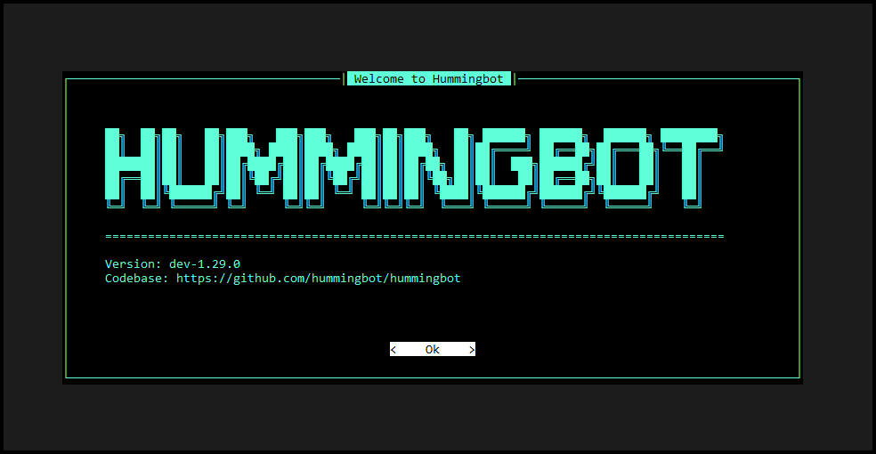

# Hummingbot Client Quickstart

This guide walks you through installing the Hummingbot Client using Docker, the simplest method for most users.

For source installation or detailed configuration options, see [Client Installation](../client/installation.md). For the full `hbot` reference, see [`hbot` CLI](../client/hbot-cli.md).

## What You'll Set Up

By the end of this guide, you'll have:

- **Hummingbot Client + `hbot` CLI** — algorithmic trading bot for centralized exchanges (CEX), with `hbot` as the recommended non-interactive command line for running bots
- **Gateway** (optional) — middleware for trading on decentralized exchanges (DEX) like Uniswap, PancakeSwap, and Raydium

This setup is best for running a single bot instance on your local machine or learning how Hummingbot works.

!!! tip "`hbot`: a new entry point into the Hummingbot engine"
    Introduced in v2.16.0, `hbot` drives the same Hummingbot engine as the classic interactive client, but through a non-interactive command line — making it suitable for scripts, CI, and agent-driven workflows. See the [`hbot` CLI](../client/hbot-cli.md) reference for all commands.

## Prerequisites

Install Docker on your system:

=== "macOS"
    Install Docker Desktop from the [official Docker website](https://docs.docker.com/desktop/install/mac-install/)

=== "Linux"
    **Desktop Users:**
    Install Docker Desktop from [official site](https://docs.docker.com/desktop/install/linux-install/)

    **Headless Servers** (VPS like AWS EC2 or Digital Ocean):
    ```bash
    curl -fsSL https://get.docker.com -o get-docker.sh
    sh get-docker.sh
    ```

=== "Windows"
    !!! note "Prerequisites"
        - Docker Desktop installed
        - WSL2 enabled
        - Ubuntu distribution installed

    **Always run commands in:** Ubuntu Terminal (Start Menu → Ubuntu)

## Step 1: Clone the Repository

```bash
git clone https://github.com/hummingbot/hummingbot.git
cd hummingbot
```

## Step 2: Setup and Deploy

```bash
make setup
make deploy
make link-cli
```

The `make setup` command configures your environment (and optionally enables Gateway for DEX trading). `make deploy` downloads the latest Hummingbot image and starts it. `make link-cli` installs the `hbot` command on your host, which runs commands inside the container.

Verify the install:

```bash
hbot --version
```

## Step 3: Set Your Password

On first use, `hbot` prompts for a keystore password (or read it from `HBOT_PASSWORD` / `--password-stdin`). This password encrypts your exchange API keys — the same password used by the interactive client.

```bash
export HBOT_PASSWORD='your-secure-password'   # optional: avoid prompts in scripts
```

## Step 4: Run a Paper Trading Strategy

Run your first bot with the `simple_pmm` market making script on a **paper trade** connector — it simulates trading against live Binance market data, so **no API keys are required**:

```bash
# Create a config for the simple_pmm script
hbot create simple_pmm --name conf_btc.yml \
  --set exchange=binance_paper_trade --set trading_pair=BTC-USDT

# Start and monitor
hbot start
hbot status
hbot logs -f
```

`hbot status` shows your simulated balances and the live bid/ask maker orders the bot maintains.

## Step 5: Connect a Live Exchange

When you're ready to trade with real funds, add your exchange API keys and re-create the config with a live connector:

```bash
hbot connect binance --fields    # see required key fields
hbot connect binance             # add API keys
hbot balance                     # confirm balances

hbot create simple_pmm --name conf_btc_live.yml \
  --set exchange=binance --set trading_pair=BTC-USDT
hbot start --replace
```

## Step 6: Run a Strategy Controller

[Controllers](../strategies/v2-strategies/controllers/index.md) are reusable V2 strategies whose settings can be tuned **live** while the bot runs. Create and run the `pmm_mister` controller on your connected exchange:

```bash
# Create a V2 controller config
hbot create pmm_mister --name conf_btc_controller.yml \
  --set connector_name=binance --set trading_pair=BTC-USDT

# Start and monitor
hbot start --replace
hbot status

# Tune settings live (applies in ~10 seconds)
hbot config buy_spreads 0.002
```

Or create the config and start the bot in one step with `hbot deploy`:

```bash
hbot deploy pmm_mister --set connector_name=binance --set trading_pair=BTC-USDT
```

!!! note
    Controllers require a live exchange connection — paper trade connectors are not currently supported by the V2 controller framework.

Common commands: `hbot stop`, `hbot history`, `hbot config`. See the [`hbot` CLI guide](../client/hbot-cli.md) for the full command reference.

## Interactive Client (alternative)

If you prefer the classic full-screen UI, attach to the running container:

```bash
docker attach hummingbot
```

You should see the Hummingbot welcome screen:



On first launch, create a password and use familiar commands like `connect`, `create`, and `start`. The interactive client includes **Gateway commands** for DEX workflows that are not yet available in `hbot`.

Press <kbd>Ctrl</kbd> + <kbd>P</kbd> then <kbd>Ctrl</kbd> + <kbd>Q</kbd> to detach without stopping the bot.

See [Commands and Shortcuts](../client/commands-shortcuts.md) for the interactive command list.

## Managing Your Instance

### Stop Hummingbot

```bash
docker compose down
```

### Update to Latest Version

```bash
docker compose down
docker pull hummingbot/hummingbot:latest
docker compose up -d
make link-cli    # re-link if needed
hbot update --check
```

For Docker updates, `hbot update` prints the `docker compose pull && docker compose up -d` commands to run on the host.

## Gateway for DEX Trading

To trade on decentralized exchanges like Uniswap, PancakeSwap, or Raydium, you can enable Gateway alongside Hummingbot. The Docker Compose file includes Gateway configuration that's commented out by default.

### Enable Gateway

Edit `docker-compose.yml` and uncomment the Gateway-related lines:

```yaml
  gateway:
    restart: always
    container_name: gateway
    image: hummingbot/gateway:latest
    ports:
      - "15888:15888"
    volumes:
      - "./gateway_files/conf:/home/gateway/conf"
      - "./gateway_files/logs:/home/gateway/logs"
      - "./certs:/home/gateway/certs"
    environment:
      - GATEWAY_PASSPHRASE=admin
      - DEV=true
```

The `GATEWAY_PASSPHRASE` is used to encrypt your wallet private keys. Change `admin` to a secure passphrase.

### Start Both Services

```bash
docker compose up -d
```

```
[+] Running 3/3
 ✔ Network hummingbot_default  Created
 ✔ Container hummingbot        Started
 ✔ Container gateway           Started
```

### Verify Gateway Connection

Attach to Hummingbot:

```bash
docker attach hummingbot
```

After setting your password, you should see **Gateway: ONLINE** in the upper right corner.

!!! note "Development Mode"
    By default, Gateway runs in development mode (`DEV=true`) which uses HTTP for easier setup. For production environments requiring HTTPS, set `DEV=false` and ensure certificates are properly configured. See [Gateway Installation](../gateway/installation.md) for details.

## Next Steps

- [`hbot` CLI](../client/hbot-cli.md) — full command reference
- [Basic Features](../client/index.md) — client documentation hub
- [Connect to Exchanges](../client/connect.md) — adding credentials
- [Create a Strategy](../strategies/index.md) — start trading
- [Updating to New Versions](update.md) — keep your installation current

## Source Installation

For developers or users who prefer running from source, use the refactored Makefile commands:

```bash
git clone https://github.com/hummingbot/hummingbot.git
cd hummingbot
make install
conda activate hummingbot
hbot --version
```

* `make install` creates and configures the conda environment
* `hbot` is available directly in the conda env for non-interactive use
* `make run` starts the **interactive** client (e.g. `make run -p -f strategy.yml`)

For detailed source installation options, see [Client Installation](../client/installation.md).

## Need More Options?

For development setup or advanced configuration, see the detailed [Client Installation](../client/installation.md) page.
