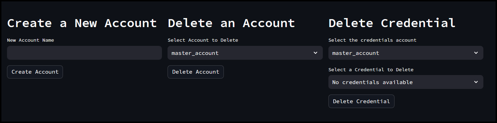
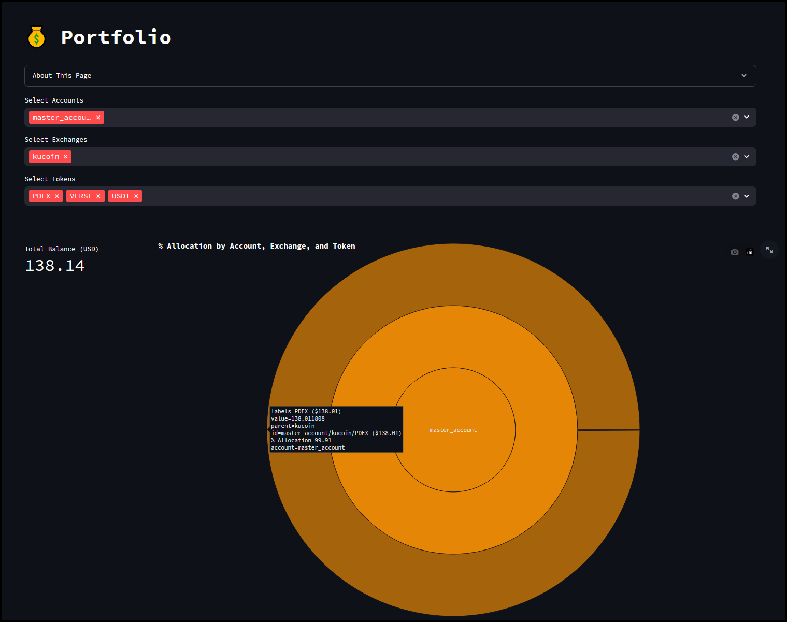
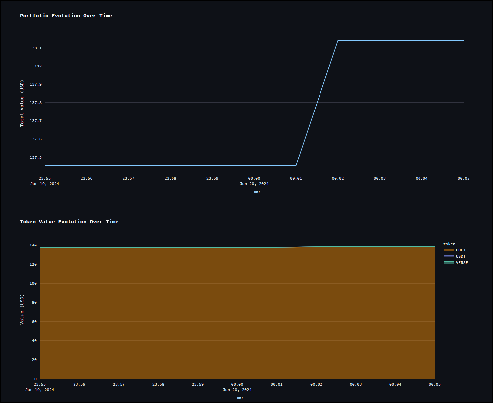
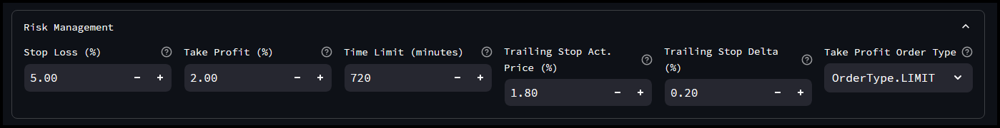
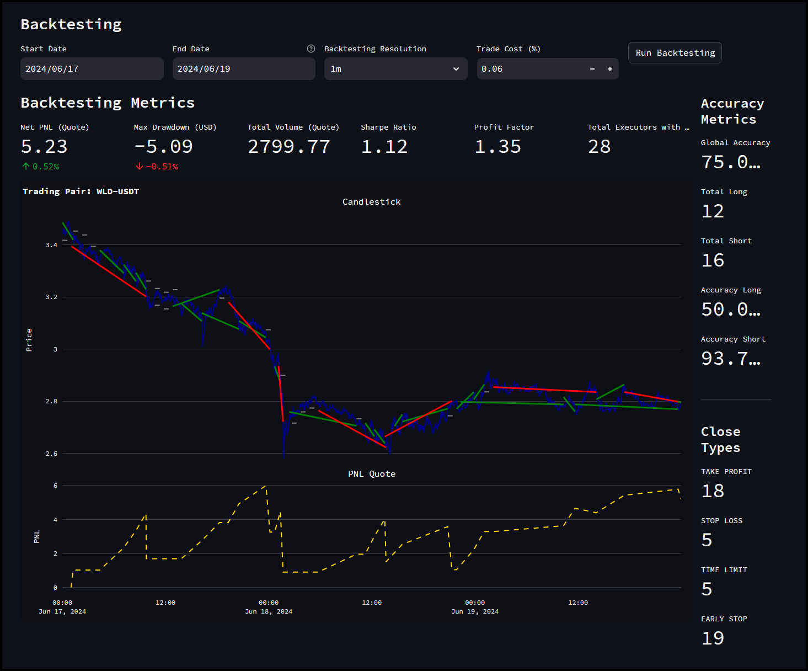

# Dashboard Quickstart using Hummingbot Deploy

## Introduction

Welcome to the Hummingbot Dashboard quickstart guide. In this tutorial, we'll guide you through installing the Dashboard, connecting your API keys, creating a strategy config and doing a quick backtest before deploying the bots using Hummingbot Deploy.

<iframe style="width:100%; min-height:400px;" src="https://www.youtube.com/embed/AbezIhb6iJg" frameborder="0" allow="accelerometer; autoplay; encrypted-media; gyroscope; picture-in-picture" allowfullscreen></iframe>

<!-- more -->

## Prerequisites

### Docker Compose

Before we can proceed, we need to make sure Docker is installed first. We recommend installing [Docker Desktop](https://www.docker.com/products/docker-desktop/) as this already includes `Docker Compose` along with `Docker Engine` and `Docker CLI` all of which is needed for Dashboard to work.

## Installation

To install Dashboard, we need to clone the `Hummingbot Deploy` repository which already contains the Compose file as well as the bash script which will automatically pull the latest images and start the necessary services / containers. Open a terminal and run the following commands:

```
git clone https://github.com/hummingbot/hummingbot-deploy
cd hummingbot-deploy
bash setup.sh
```

It might take a while to load the dashboard for the first time. Once the dashboard is up, open a web browser and navigate to <https://localhost:8501> to view it.

!!! note "Cloud Servers"
    If you are using a cloud server or VPS just replace `localhost` with the IP of your server. You may need to edit the firewall rules to allow connections to the necessary ports.  

## Add Credentials

Credentials are your API keys which are needed for Hummingbot to be able to trade on an exchange. The Dashboard allows you to create and manage API keys under multiple accounts which are useful if you use multiple sub-accounts on an exchange - for example Kucoin. 

Let's say you have 3 Kucoin accounts and want the ability to switch between them when creating bots. The credentials page will allow you to do this since you have the option to select what account to use when deploying bots. 

On the menu on the left click `Credentials` to get to the Credentials page

[](./credentials.png)

Let's go over the different sections below: 


[](./credentials-1.png)

In this section, we will see the list of `accounts` and any API keys already registered to that account. In the screenshot above, we only have one `master_account` created and no credentials added yet. 

[](./credentials-2.png)

To **create** a new `account`, just enter the name of the account and then click `Create Account`. If you want to delete an account (this includes all API keys associated with it), select the account from the drop down list and click `Delete Account`. If you want to delete a  specific API key connected to an existing account, select the account from the list and then select the API credential and then click `Delete Credential`

[](./credentials-3.png)

To add API keys to our account, we add them in this section. Select the account we want the API keys to be associated with, select the `Connector` or `Exchange` and then enter the corresponding API keys and then click `Submit Credentials`


## Portfolio

Once API keys are added you can view the tokens available and their allocation under the Portfolio page. You can filter out per account, exchange or token to give you more detail. 

[](./portfolio.png)

[](./portfolio-1.png)

The table above shows the list of available tokens for the `Kucoin` exchange. The graphs below will show your `Portfoliio Evolution over Time` as well as `Token Value Evolution over time`

[](./portfolio-2.png)

## Generate Configs + Backtest

Before we can deploy bots, we'll have to configure a controller. Under the Config Generator section we have the following available controllers:

- PMM Simple 
- PMM Dynamic
- D-Man Maker V2
- Bollinger V1
- MACD BB V1
- SuperTrend V1
- XEMM Controller

Let's use the `PMM Simple` controller for now, 

[](./config.png)

[](./config-1.png)

[](./config-2.png)

[](./config-3.png)

[](./config-4.png)

[](./config-5.png)

[](./config-6.png)

[](./config-7.png)

[](./config-8.png)


## Deploying Bots

[](./deploy.png)

[](./deploy-1.png)

## Manage Instances

[](./instances.png)


[](./instances-1.png)

## Community Pages

## Conclusion and Next Steps


