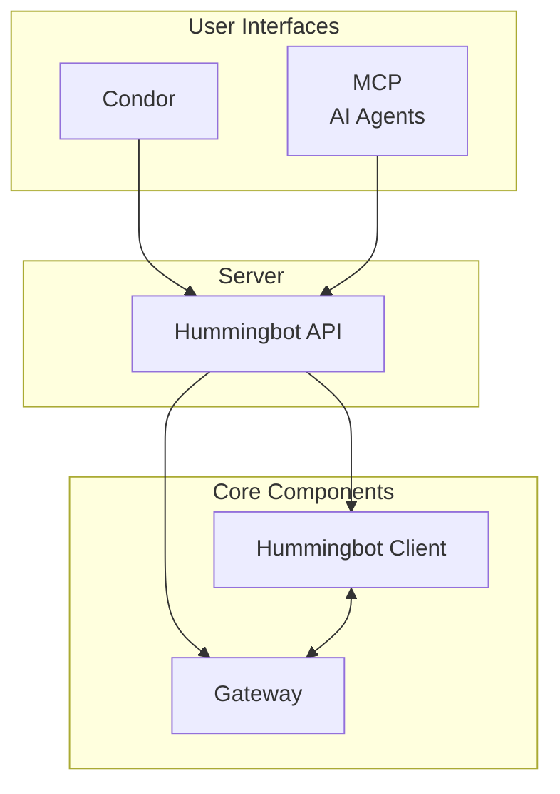

# Installation Overview

The Hummingbot ecosystem consists of several repositories that work together to provide a complete algorithmic trading platform. This page provides an overview of each component and links to their installation guides.

## Hummingbot Ecosystem

## Repository Overview

| Repository | Description | Quickstart | Source Install |
|------------|-------------|------------|----------------|
| [**Hummingbot API**](https://github.com/hummingbot/hummingbot-api) | REST API backend for managing bots, portfolios, and trading | [via Condor](./condor.md) | [Source](../hummingbot-api/installation.md) |
| [**Hummingbot Client**](https://github.com/hummingbot/hummingbot) | Core trading client with CLI interface for CEX trading | [Quickstart](./hummingbot-client.md) | [Source](../client/installation.md) |
| [**Gateway**](https://github.com/hummingbot/gateway) | DEX middleware for Uniswap, PancakeSwap, Raydium, and 30+ DEXs | - | [Installation](../gateway/installation.md) |
| [**Condor**](https://github.com/hummingbot/condor) | Telegram bot for monitoring and controlling Hummingbot instances | [Quickstart](./condor.md) | [Docs](https://condor.hummingbot.org) |
| [**MCP Server**](https://github.com/hummingbot/mcp) | Connects AI assistants (Claude, Gemini, ChatGPT) to Hummingbot | - | [Installation](../mcp/installation.md) |
| [**Skills**](https://github.com/hummingbot/skills) | Agent skills for AI assistants to manage strategies, executors, and infrastructure | - | [GitHub](https://github.com/hummingbot/skills) |
| [**Dashboard**](https://github.com/hummingbot/dashboard) | Web-based UI for bot management (deprecated, use Condor) | - | [GitHub](https://github.com/hummingbot/dashboard) |
| [**Quants Lab**](https://github.com/hummingbot/quants-lab) | Research environment for backtesting and strategy analysis | - | [GitHub](https://github.com/hummingbot/quants-lab) |

## Recommended Paths

### Hummingbot Client

The legacy CLI-based trading client. Best for:

- **Getting started** - Most users begin here to learn Hummingbot
- **Local usage** - Running on your local machine
- **V1 strategies** - Pure Market Making, Cross-Exchange Market Making, etc.
- **Single instance** - Running one bot at a time

[**Hummingbot Client Quickstart →**](./hummingbot-client.md)

### Condor

The modern Telegram-based interface for Trading Agents. Best for:

- **Trading Agents** - Build and run autonomous trading agents
- **Multiple instances** - Deploy and manage many bots simultaneously
- **Production environments** - Running on cloud servers (AWS, Digital Ocean, etc.)
- **Modern interfaces** - Control via Telegram or AI agents via MCP

[**Condor Quickstart →**](./condor.md)

For full documentation, see [condor.hummingbot.org](https://condor.hummingbot.org).

### Developers

For developers who want to add/customize exchange connectors, extend strategies, or otherwise modify the Hummingbot codebase:

**Source Installation**

- [Hummingbot Client from Source](../client/installation.md#source-installation) - Install the core trading client for development
- [Gateway from Source](../gateway/installation.md#source-installation) - Install the DEX connector middleware for development

**Building Connectors**

- [Building CLOB Connectors](../connectors/connectors/index.md) - Add new CEX/DEX order book connectors to Hummingbot Client
- [Building Gateway Connectors](../connectors/gateway-connectors/index.md) - Add new AMM DEX connectors to Gateway

**API Development**

- [Hummingbot API Developer Guide](../hummingbot-api/quickstart.md) - Use the REST API with curl or Python client
