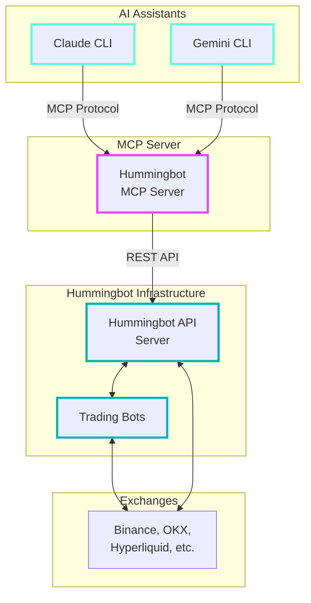

# Hummingbot MCP Server

The Hummingbot Model Context Protocol (MCP) Server enables AI assistants like Claude and Gemini to interact with Hummingbot for automated cryptocurrency trading across multiple exchanges.

**GitHub Repository**: [github.com/hummingbot/mcp](https://github.com/hummingbot/mcp)

## Overview

The MCP Server acts as a bridge between AI language models and the Hummingbot trading platform, enabling programmatic interaction with cryptocurrency trading infrastructure. This allows AI assistants to manage trading operations, analyze portfolios, and execute strategies on behalf of users.

## What is Model Context Protocol (MCP)?

Model Context Protocol is an open standard that enables AI assistants to securely interact with external systems and data sources. In the context of Hummingbot, MCP allows AI models to:

- Access real-time trading data
- Execute trading operations
- Manage portfolios across multiple exchanges
- Analyze market conditions
- Monitor trading performance

## Key Features

The Hummingbot MCP Server provides the following capabilities:

### 🏦 Account Management
- Connect and manage multiple exchange accounts
- Retrieve account information and credentials
- Monitor account status across exchanges

### 💰 Portfolio Tracking  
- View real-time balance across all connected exchanges
- Track portfolio performance and P&L
- Analyze asset distribution and allocation

### 📊 Order Management
- Place buy and sell orders on any supported exchange
- Cancel existing orders
- Monitor order status and execution
- View order history and fills

### 📈 Position Management
- Track open positions for derivatives trading
- Monitor position sizes and unrealized P&L
- Close positions programmatically

### 🔍 Market Data Access
- Retrieve real-time price data
- Access order book information
- Get historical pricing data
- Monitor funding rates for perpetual contracts

### 📉 Funding Rates Monitoring
- Track funding rates across perpetual exchanges
- Identify arbitrage opportunities
- Monitor funding rate changes over time

### 🌐 Gateway & DEX Trading
- Manage Gateway container lifecycle (start, stop, restart)
- Configure chains, networks, tokens, and wallets
- Execute swaps on DEX routers (Jupiter, 0x)
- Discover and analyze CLMM (concentrated liquidity) pools
- Open and manage liquidity positions
- Collect fees from active positions

### 🔄 Multiple Server Support
- Connect to multiple Hummingbot API instances simultaneously
- Manage trading across different environments (production, staging, dev)
- Switch between servers seamlessly in conversation
- Unified interface for multi-instance portfolio management


## Architecture



## Getting Started

Ready to build AI trading agents with Hummingbot? Follow these steps:

1. **[Install the MCP Server](/mcp/installation/)** - Set up development or production environment
2. **[Explore Available Tools](/mcp/tools/)** - Learn about trading and portfolio management capabilities  
3. **Configure your AI assistant** - Connect Claude, Gemini, or other MCP-compatible AI
4. **Start trading conversations** - Let AI manage your portfolio automatically

## Quick Overview

The MCP server provides comprehensive trading capabilities through these tool categories:

### 🏦 **Account & Portfolio Management**
Monitor balances, track performance, and analyze portfolio allocation across all connected exchanges.

### 📊 **Order & Position Management** 
Execute trades, manage orders, and control positions programmatically with AI oversight.

### 📈 **Market Data & Analysis**
Access real-time prices, funding rates, and order book data for informed decision making.

## Usage with AI Assistants

The Hummingbot MCP Server works with various AI assistants. See the **[Installation Guide](/mcp/installation/)** for detailed setup instructions for:

- **Claude Code** (CLI) - Recommended for developers
- **Claude Desktop** - GUI application
- **Gemini CLI** - Google's AI assistant
- **Codex CLI** - OpenAI's coding assistant

### Example Trading Conversation

Once configured, you can interact naturally with your AI assistant:

```
You: Show me my portfolio balances across all exchanges
AI Assistant: I'll check your portfolio balances using the Hummingbot MCP server...
```

## Example Workflows

### Portfolio Analysis
```
AI: "What's my current portfolio worth and how is it distributed?"
MCP: Retrieves balances across all exchanges and calculates total value
AI: Provides detailed breakdown with recommendations
```

### Automated Trading
```
AI: "Buy 0.1 BTC when the price drops below $45,000"
MCP: Monitors prices and executes order when conditions are met
AI: Confirms execution and provides trade summary
```

### Risk Management
```
AI: "Close all positions with unrealized losses over 5%"
MCP: Analyzes open positions and closes those meeting criteria
AI: Reports actions taken and updated portfolio status
```

## Related Videos

### Building AI Crypto Trading Agents with Claude Code & Hummingbot

<iframe style="width:100%; min-height:400px;" src="https://www.youtube.com/embed/eq8EfiOEcFM" frameborder="0" allow="accelerometer; autoplay; encrypted-media; gyroscope; picture-in-picture" allowfullscreen></iframe>

### AMA: Hummingbot API + MCP

<iframe style="width:100%; min-height:400px;" src="https://www.youtube.com/embed/jpRJQgj7V9E" frameborder="0" allow="accelerometer; autoplay; encrypted-media; gyroscope; picture-in-picture" allowfullscreen></iframe>

### Introduction to Hummingbot MCP Server

<iframe style="width:100%; min-height:400px;" src="https://www.youtube.com/embed/OSmCkA6BdyE" frameborder="0" allow="accelerometer; autoplay; encrypted-media; gyroscope; picture-in-picture" allowfullscreen></iframe>

<iframe style="width:100%; min-height:400px;" src="https://www.youtube.com/embed/Q-wSWxx_zIk" frameborder="0" allow="accelerometer; autoplay; encrypted-media; gyroscope; picture-in-picture" allowfullscreen></iframe>

## Security Considerations

- **API Credentials**: Store credentials securely and never commit them to version control
- **Network Access**: Ensure MCP server can only be accessed by authorized AI assistants
- **Trading Limits**: Set appropriate position sizes and risk limits in your strategies
- **Monitoring**: Regularly monitor AI trading activity and set up alerts for unusual behavior

## Development

### Contributing

The Hummingbot MCP Server is open source. Contributions are welcome!

1. Fork the repository
2. Create a feature branch
3. Make your changes
4. Add tests for new functionality
5. Submit a pull request

### Custom Tools

You can extend the MCP server by adding custom tools:

```python
@mcp.tool()
async def my_custom_tool(parameter: str) -> str:
    """Custom tool description"""
    # Your implementation here
    return result
```