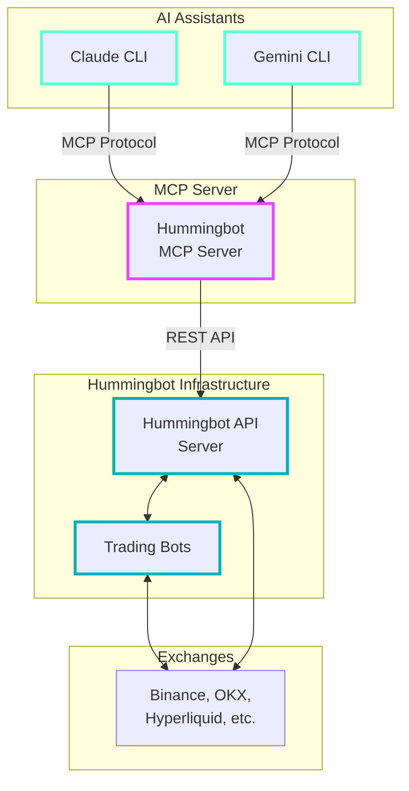

# Hummingbot MCP Server

The Hummingbot Model Context Protocol (MCP) Server enables AI assistants like Claude and Gemini to interact with Hummingbot for automated cryptocurrency trading across multiple exchanges.

**GitHub Repository**: [github.com/hummingbot/mcp](https://github.com/hummingbot/mcp)

## Overview

The MCP Server acts as a bridge between AI language models and the Hummingbot trading platform, enabling programmatic interaction with cryptocurrency trading infrastructure. This allows AI assistants to manage trading operations, analyze portfolios, and execute strategies on behalf of users.

## Tutorial Videos

### Part 1: Introduction to Hummingbot MCP Server

<iframe style="width:100%; min-height:400px;" src="https://www.youtube.com/embed/OSmCkA6BdyE" frameborder="0" allow="accelerometer; autoplay; encrypted-media; gyroscope; picture-in-picture" allowfullscreen></iframe>

### Part 2: Building AI Trading Agents 

<iframe style="width:100%; min-height:400px;" src="https://www.youtube.com/embed/Q-wSWxx_zIk" frameborder="0" allow="accelerometer; autoplay; encrypted-media; gyroscope; picture-in-picture" allowfullscreen></iframe>

## What is Model Context Protocol (MCP)?

Model Context Protocol is an open standard that enables AI assistants to securely interact with external systems and data sources. In the context of Hummingbot, MCP allows AI models to:

- Access real-time trading data
- Execute trading operations
- Manage portfolios across multiple exchanges
- Analyze market conditions
- Monitor trading performance

## Key Features

The Hummingbot MCP Server provides the following capabilities:

### 🏦 Account Management
- Connect and manage multiple exchange accounts
- Retrieve account information and credentials
- Monitor account status across exchanges

### 💰 Portfolio Tracking  
- View real-time balance across all connected exchanges
- Track portfolio performance and P&L
- Analyze asset distribution and allocation

### 📊 Order Management
- Place buy and sell orders on any supported exchange
- Cancel existing orders
- Monitor order status and execution
- View order history and fills

### 📈 Position Management
- Track open positions for derivatives trading
- Monitor position sizes and unrealized P&L
- Close positions programmatically

### 🔍 Market Data Access
- Retrieve real-time price data
- Access order book information
- Get historical pricing data
- Monitor funding rates for perpetual contracts

### 📉 Funding Rates Monitoring
- Track funding rates across perpetual exchanges
- Identify arbitrage opportunities
- Monitor funding rate changes over time

## Architecture



## Prerequisites

Before using the Hummingbot MCP Server, you need:

1. **Python 3.11+** installed on your system
2. **Running Hummingbot API Server** - See [Hummingbot API Installation](/hummingbot-api/installation/)
3. **Valid API credentials** for the Hummingbot API server
4. **AI Assistant** supporting MCP (Claude CLI, Gemini CLI, etc.)

## Installation

### Development Setup (using uv)

1. **Clone the repository**:
```bash
git clone https://github.com/hummingbot/mcp.git
cd mcp
```

2. **Install dependencies**:
```bash
uv sync
```

3. **Configure environment**:
```bash
cp .env.example .env
# Edit .env with your Hummingbot API credentials
```

4. **Run the server**:
```bash
uv run mcp
```

### Production Setup (using Docker)

1. **Pull the official Docker image**:
```bash
docker pull hummingbot/mcp-server:latest
```

2. **Create environment configuration**:
```bash
# Create .env file with your configuration
cat > .env << EOF
HUMMINGBOT_API_URL=http://your-api-server:8000
HUMMINGBOT_API_USERNAME=your-username
HUMMINGBOT_API_PASSWORD=your-password
EOF
```

3. **Run the container**:
```bash
docker run --env-file .env -p 3000:3000 hummingbot/mcp-server:latest
```

## Configuration

Configure the MCP server by setting the following environment variables:

| Variable | Description | Default |
|----------|-------------|---------|
| `HUMMINGBOT_API_URL` | URL of your Hummingbot API server | `http://localhost:8000` |
| `HUMMINGBOT_API_USERNAME` | API username | Required |
| `HUMMINGBOT_API_PASSWORD` | API password | Required |
| `MCP_SERVER_PORT` | Port for MCP server | `3000` |
| `LOG_LEVEL` | Logging level | `INFO` |

## Available Tools

The MCP server exposes the following tools to AI assistants:

### Account Tools
- `get_accounts` - List all connected exchange accounts
- `get_account_balance` - Get balance for specific account

### Portfolio Tools  
- `get_portfolio_balances` - View aggregated portfolio across all exchanges
- `get_portfolio_performance` - Analyze portfolio performance metrics

### Trading Tools
- `place_order` - Execute buy/sell orders
- `cancel_order` - Cancel existing orders
- `get_open_orders` - View active orders
- `get_order_history` - Review past orders

### Position Tools
- `get_positions` - View open positions
- `close_position` - Close specific position
- `get_position_history` - Review position history

### Market Data Tools
- `get_ticker` - Get current price data
- `get_orderbook` - Access order book depth
- `get_funding_rates` - Monitor perpetual funding rates

## Usage with AI Assistants

### Claude CLI

1. **Install Claude CLI** following [Anthropic's guide](https://github.com/anthropics/claude-cli)

2. **Configure MCP server** in your Claude configuration:
```json
{
  "mcpServers": {
    "hummingbot": {
      "command": "uv",
      "args": ["run", "mcp"],
      "cwd": "/path/to/hummingbot-mcp"
    }
  }
}
```

3. **Start trading conversation**:
```
You: Show me my portfolio balances across all exchanges
Claude: I'll check your portfolio balances using the Hummingbot MCP server...
```

### Gemini CLI

Similar configuration process for Gemini CLI - refer to Google's documentation for MCP setup.

## Example Workflows

### Portfolio Analysis
```
AI: "What's my current portfolio worth and how is it distributed?"
MCP: Retrieves balances across all exchanges and calculates total value
AI: Provides detailed breakdown with recommendations
```

### Automated Trading
```
AI: "Buy 0.1 BTC when the price drops below $45,000"
MCP: Monitors prices and executes order when conditions are met
AI: Confirms execution and provides trade summary
```

### Risk Management
```
AI: "Close all positions with unrealized losses over 5%"
MCP: Analyzes open positions and closes those meeting criteria  
AI: Reports actions taken and updated portfolio status
```

## Security Considerations

- **API Credentials**: Store credentials securely and never commit them to version control
- **Network Access**: Ensure MCP server can only be accessed by authorized AI assistants
- **Trading Limits**: Set appropriate position sizes and risk limits in your strategies
- **Monitoring**: Regularly monitor AI trading activity and set up alerts for unusual behavior

## Troubleshooting

### Common Issues

1. **Connection Failed**
   - Verify Hummingbot API server is running
   - Check API credentials in .env file
   - Confirm network connectivity

2. **Authentication Error** 
   - Verify username/password in configuration
   - Check API server authentication settings

3. **Tool Not Found**
   - Ensure MCP server is properly configured in AI assistant
   - Verify server is running and accessible

### Debugging

Enable debug logging by setting `LOG_LEVEL=DEBUG` in your environment configuration.

## Development

### Contributing

The Hummingbot MCP Server is open source. Contributions are welcome!

1. Fork the repository
2. Create a feature branch
3. Make your changes
4. Add tests for new functionality
5. Submit a pull request

### Custom Tools

You can extend the MCP server by adding custom tools:

```python
@mcp.tool()
async def my_custom_tool(parameter: str) -> str:
    """Custom tool description"""
    # Your implementation here
    return result
```

## Related Resources

- [Hummingbot API Documentation](/hummingbot-api/) - Core API server
- [MCP Specification](https://spec.modelcontextprotocol.io/) - Official MCP documentation  
- [Claude CLI](https://github.com/anthropics/claude-cli) - AI assistant supporting MCP
- [YouTube Tutorial](https://www.youtube.com/watch?v=Q-wSWxx_zIk) - Build AI Trading Agents tutorial

---

*The Hummingbot MCP Server represents the next evolution in AI-powered trading, enabling seamless integration between advanced language models and professional trading infrastructure.*