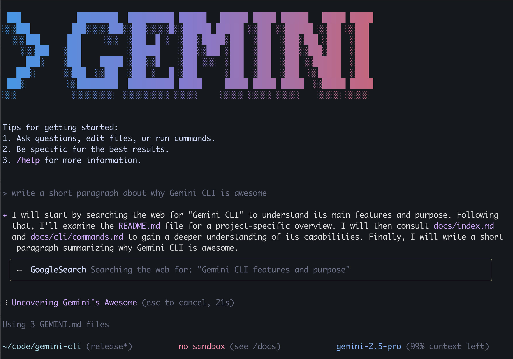
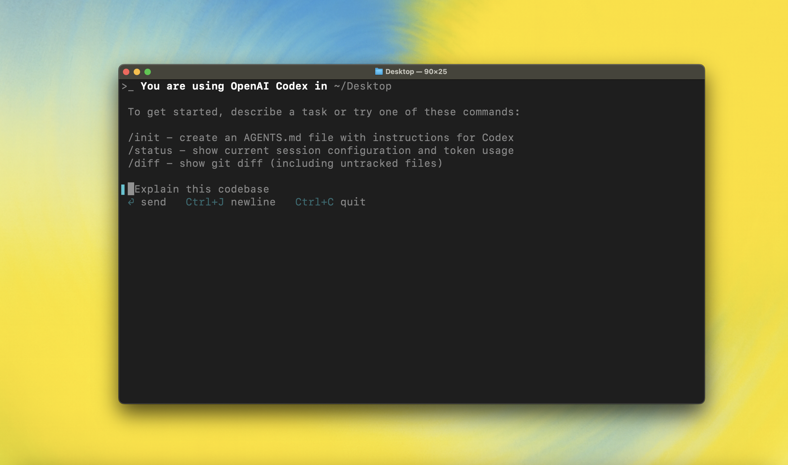
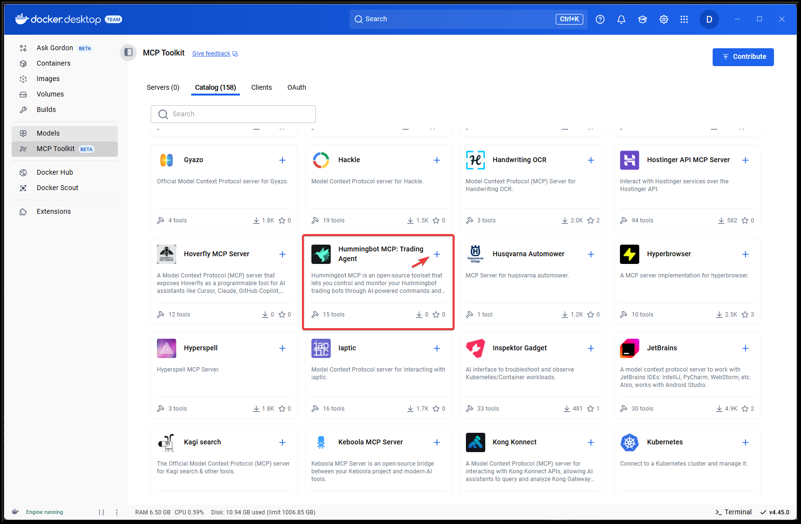
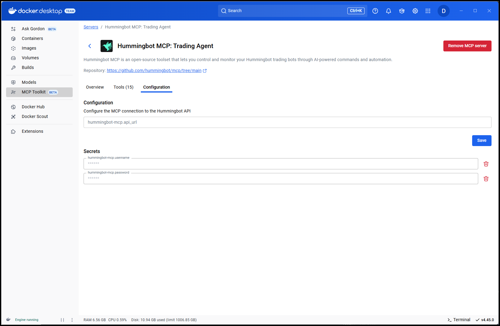
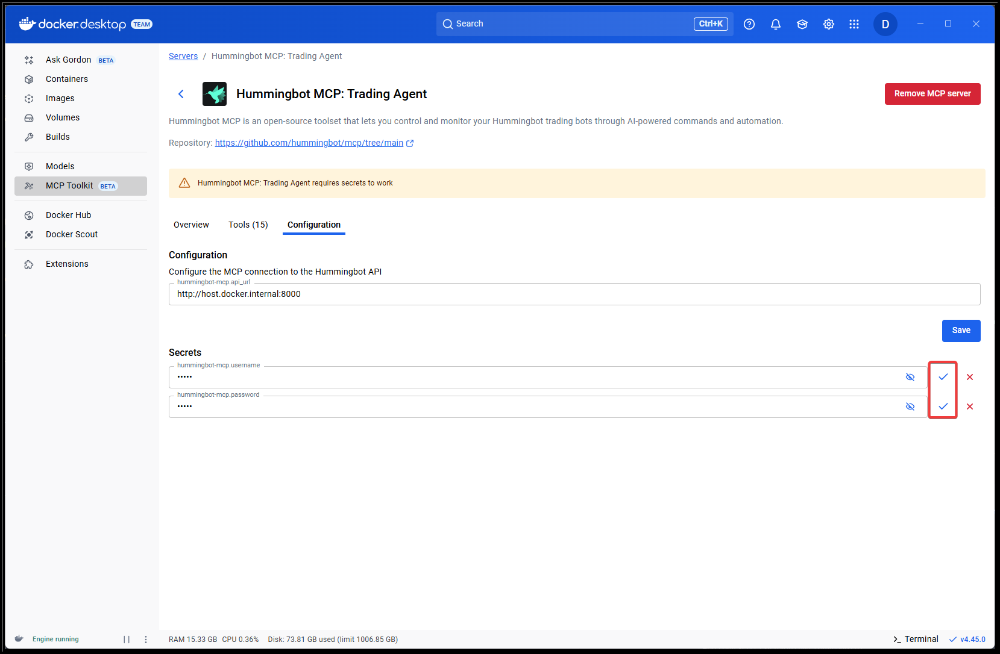
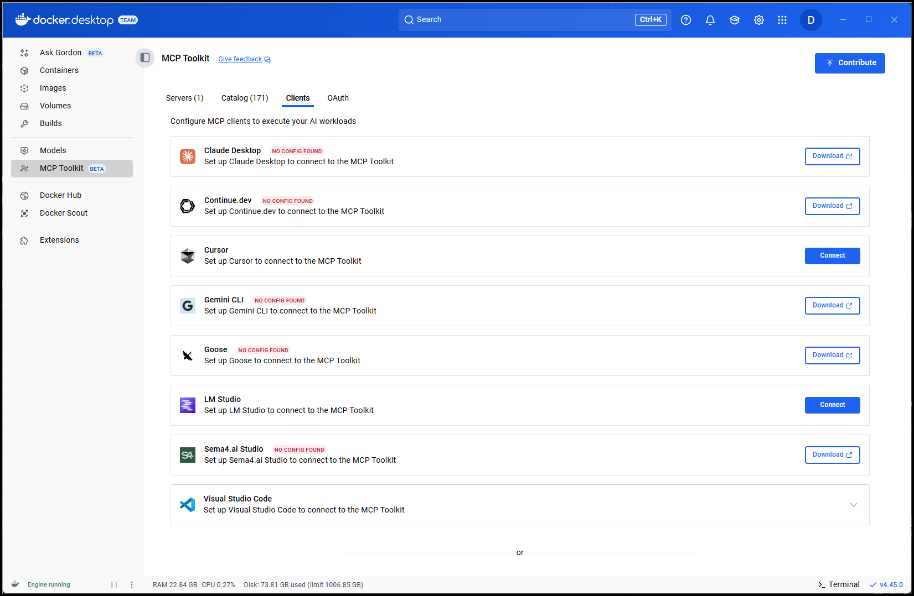

# Hummingbot MCP Server Installation Guide

This guide shows you how to connect AI assistants to the Hummingbot API using the MCP (Model Context Protocol) server.

## 📋 Prerequisites

Before starting, ensure you have:

1. **Hummingbot API Server** running ([Installation Guide](/installation/docker/#installation-recommended-hummingbot-api))
2. **Docker** installed and running
3. **API credentials** (username/password from setup)
4. **An AI Assistant** - Claude Code, Gemini CLI, Codex CLI, or Claude Desktop

---

## 🚀 Install via CLI (Recommended)

The simplest way to connect AI assistants using command-line tools.

### Claude Code

**Claude Code** is Anthropic's official CLI tool for using Claude in your terminal.

#### Quick Setup

Add the MCP server with one command:

```bash
claude mcp add --transport stdio hummingbot -- docker run --rm -i -e HUMMINGBOT_API_URL=http://host.docker.internal:8000 -v hummingbot_mcp:/root/.hummingbot_mcp hummingbot/hummingbot-mcp:latest
```

!!! note "Local Hummingbot API URL"
    If you installed Hummingbot API from source and it's running locally outside of Docker, use `http://localhost:8000` instead of `http://host.docker.internal:8000`

#### Start Trading

Use natural language in your terminal:

```
"Show me my portfolio balances"
"Create a market making strategy for ETH-USDT on Binance"
"What are my open positions?"
"Start Gateway in development mode for DEX trading"
```

### Gemini CLI



**Gemini CLI** is Google's AI agent for your terminal.

#### Installation

Install Gemini CLI: [Official Guide](https://github.com/google-gemini/gemini-cli#-installation)

#### Configuration

1. Navigate to config folder:
   ```bash
   cd ~/.gemini
   ```

2. Edit `settings.json`:
   ```bash
   nano settings.json
   ```

3. Add MCP server:
   ```json
   {
     "mcpServers": {
       "hummingbot": {
         "command": "docker",
         "args": [
           "run",
           "--rm",
           "-i",
           "-e", "HUMMINGBOT_API_URL=http://host.docker.internal:8000",
           "-v", "hummingbot_mcp:/root/.hummingbot_mcp",
           "hummingbot/hummingbot-mcp:latest"
         ]
       }
     }
   }
   ```

4. Verify connection:
   ```bash
   gemini
   /mcp list
   ```

   ✅ You should see `hummingbot` in the output.

### Codex CLI



**Codex CLI** is OpenAI's coding agent for developers.

#### Installation

Install Codex CLI: [Official Guide](https://github.com/openai/codex)

!!! note "IDE Support"
    These instructions also work with Codex for VS Code and Cursor. See the [IDE installation guide](https://developers.openai.com/codex/ide).

#### Configuration

1. Navigate to config folder:
   ```bash
   cd ~/.codex
   ```

2. Edit `config.toml`:
   ```bash
   nano config.toml
   ```

3. Add MCP server:
   ```toml
   [mcp_servers.hummingbot]
   command = "docker"
   args = [
     "run",
     "--rm",
     "-i",
     "-e", "HUMMINGBOT_API_URL=http://host.docker.internal:8000",
     "-v", "hummingbot_mcp:/root/.hummingbot_mcp",
     "hummingbot/hummingbot-mcp:latest"
   ]
   ```

4. Verify connection:
   ```bash
   codex
   /mcp
   ```

   ✅ Codex should detect the Hummingbot MCP server.

---

## 🖥️ Install via Docker MCP Catalog

**For users who prefer a graphical interface**, Docker Desktop provides a built-in MCP catalog.

### Setup Steps

1. Open **Docker Desktop** → **MCP Toolkit** → **Catalog**

2. Search for **Hummingbot MCP Server** and click **➕ Install**
   

3. Go to the **Configuration** tab
   

4. Set environment variables:

   | Variable | Value |
   |----------|-------|
   | `HUMMINGBOT_API_URL` | `http://host.docker.internal:8000` |
   | `HUMMINGBOT_API_USERNAME` | `admin` (or your username) |
   | `HUMMINGBOT_API_PASSWORD` | `admin` (or your password) |

5. Click the **checkbox** to save
   

### Connect a Client

1. Go to **MCP Toolkit** → **Clients**
   

2. Choose your AI client (Claude Desktop, Cursor, VS Code)

3. Click **Connect**

### Manual Connection (Alternative)

For clients not listed, add manually to your client config:

```json
{
  "mcp": {
    "servers": {
      "hummingbot": {
        "command": "docker",
        "args": ["mcp", "gateway", "run"],
        "type": "stdio"
      }
    }
  }
}
```

---

## ✅ Testing Your Setup

Once configured, test with these commands:

- "Show me my portfolio balances"
- "List all active trading bots"
- "Get the current BTC-USDT price on Binance"
- "What's my total portfolio value?"

---

## 🐛 Troubleshooting

### Connection Issues

**Problem**: MCP server won't connect

**Solutions**:

- Ensure Hummingbot API is running: `docker ps | grep hummingbot-api`
- Use `http://host.docker.internal:8000` not `http://localhost:8000` for local setups
- Verify Docker is running

### Authentication Errors

**Problem**: "Invalid credentials" or similar errors

**Solutions**:

- Check username/password in `.env` file
- Ensure credentials match what you configured during setup
- Verify API is accessible: `curl -u admin:admin http://localhost:8000/`

### Docker Issues

**Problem**: Docker-related errors

**Solutions**:

- Restart Docker Desktop
- Check Docker has network access
- On Linux, ensure user is in `docker` group

---

## 🚀 Next Steps

After successful installation:

1. **Explore Tools**: See [MCP Tools](/mcp/tools/) for available capabilities
2. **Try Examples**: Review [Example Workflows](/mcp/#example-workflows)
3. **Security**: Read [Security Guidelines](/mcp/#security-considerations)
