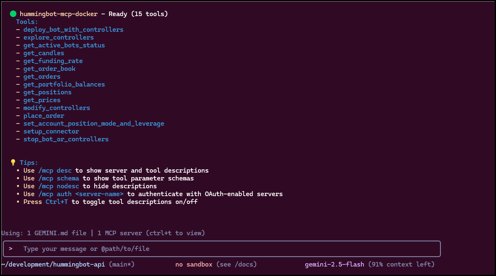
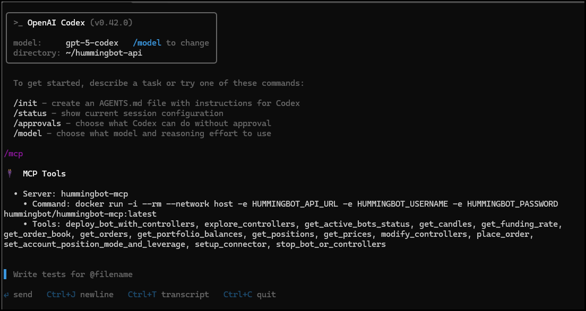

# Hummingbot MCP Server Installation Guide

This guide will walk you through installing and configuring the **Hummingbot MCP Server**, connecting it with AI assistants such as **Claude CLI, Gemini CLI, or Codex CLI**, and troubleshooting common issues.

<iframe style="width:100%; min-height:400px;" src="https://www.youtube.com/embed/Ex27d6vtjVQ?si=rL331015e1ICXd0W" frameborder="0" allow="accelerometer; autoplay; encrypted-media; gyroscope; picture-in-picture" allowfullscreen></iframe>


## 📋 Prerequisites

Before starting, make sure you have:

1. **Python 3.11+** installed  
2. **Hummingbot API Server** running ([Installation Guide](/hummingbot-api/installation/))  
3. **Valid API credentials** for your Hummingbot API server  
4. **An MCP-compatible AI Assistant** (e.g., Claude CLI, Gemini CLI, Codex CLI)  
5. **Docker Desktop** installed and running  

> 💡 *Tip:* Ensure Docker Desktop has the **MCP Toolkit** feature enabled.


## ⚙️ Installing via Docker MCP Catalog

 Open **Docker Desktop** → navigate to **MCP Toolkit → Catalog**.  
 Search for the **Hummingbot MCP Server** and click **➕ Install**.  
   

Go to the **Configuration** tab for the installed server.  
   

Set the following environment variables:

| Variable | Description | Example |
|----------|-------------|---------|
| `HUMMINGBOT_API_URL` | Hummingbot API endpoint | `http://localhost:8000` |
| `HUMMINGBOT_API_USERNAME` | API username | `admin` |
| `HUMMINGBOT_API_PASSWORD` | API password | `password` |

!!! Important
    If your Hummingbot API is running **locally**, use:  
    `http://host.docker.internal:8000` instead of `http://localhost:8000` 

After entering your values, **click the checkbox** on the right to save.  
   


## 🔗 Connecting an MCP Client

Once the server is configured, connect it with your MCP clients:

 In Docker Desktop → **MCP Toolkit → Clients**  
     
 Choose your AI client (e.g., Claude Desktop, Cursor, VS Code).  
 Click **Connect** to establish a link.  

For clients not listed, you can:

- Run MCP Gateway manually:
  ```bash
  docker mcp gateway run
  ```

* Or add the server manually in your client configuration:

  ```json
  "mcp": {
    "servers": {
      "MCP_DOCKER": {
        "command": "docker",
        "args": ["mcp", "gateway", "run"],
        "type": "stdio"
      }
    }
  }
  ```


## 🛠️ JSON MCP Integration

### Gemini CLI


**Gemini CLI** is Google’s open-source AI agent that integrates Gemini models into your terminal.

#### Installation

👉 [Gemini CLI Installation Guide](https://github.com/google-gemini/gemini-cli?tab=readme-ov-file#-installation)

#### Configuration

Navigate to the config folder:

   ```bash
   cd ~/.gemini
   ```

Edit the `settings.json` file

   ```bash
   nano settings.json
   ```

Add MCP server configuration:

```json

{
  "mcpServers": {
    "hummingbot-mcp-docker": {
      "command": "docker",
      "args": [
        "run",
        "--rm",
        "-i",
        "--network", "host",
        "-v", "hummingbot_mcp:/root/.hummingbot_mcp",
        "hummingbot/hummingbot-mcp:latest"
      ]
    }
  }
}

```

Open Gemini and verify the connection by running:

   ```bash
   /mcp list
   ```

   ✅ You should see `hummingbot-mcp` in the output.
   


### Codex CLI


**Codex CLI** is OpenAI’s local coding agent designed for developer workflows.

#### Installation

👉 [Codex CLI Installation Guide](https://github.com/openai/codex)

!!! Note
    The MCP instructions below will also work with the IDE version of Codex for VSCode / Cursor etc.
    If you want Codex in your code editor see the - [IDE installation guide](https://developers.openai.com/codex/ide)

#### Configuration

Navigate to the config folder:

   ```bash
   cd ~/.codex
   ```

Edit `config.toml`:

   ```bash
   nano config.toml
   ```

Add the MCP server configuration:

```toml

  [mcp_servers.hummingbot-mcp-docker]
  command = "docker"
  args = [
    "run",
    "--rm",
    "-i",
    "--network", "host",
    "-v", "hummingbot_mcp:/root/.hummingbot_mcp",
    "hummingbot/hummingbot-mcp:latest"
  ]

```

Run Codex and and verify the connection by running:

   ```bash
   /mcp
   ```

   ✅ Codex should now detect and connect to the Hummingbot MCP server.
   


## 🤖 Testing with AI Assistant

Once configured, try commands like:

- "Show me my portfolio balances"

- "List all active trading bots"

- "Get the current BTC-USDT price on Binance"


## 🐛 Troubleshooting

### Connection Issues

* Ensure the **Hummingbot API server** is running.
* Double-check the `HUMMINGBOT_API_URL`.
* If running Hummingbot in Docker, use `host.docker.internal` instead of `localhost` on Mac/Windows
* Check that `--network host` is supported on your Docker setup
* Verify the port number matches your Hummingbot API configuration

### Authentication Errors

* Verify API credentials (username/password).
* Check your `.env` file if applicable.
* Make sure credentials are saved in Docker Desktop.


## 🚀 Next Steps

After installation:

1. Explore [MCP Tools](/mcp/tools/)
2. Review [Example Workflows](/mcp/#example-workflows)
3. Check [Security Guidelines](/mcp/#security-considerations)


📢 *Need help?*
Join our [Discord community](https://discord.gg/hummingbot) or visit the [GitHub repository](https://github.com/hummingbot/mcp) for the latest updates.
