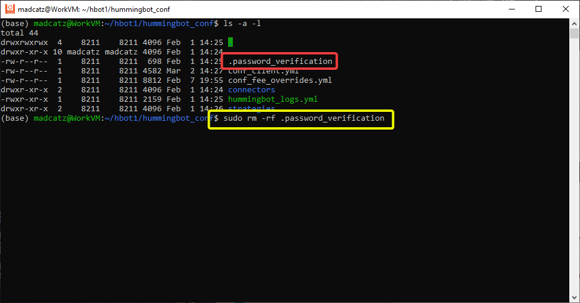

# Create and Delete Password

The password in Hummingbot encrypts sensitive data such as API keys, secret keys, and wallet private keys. For security reasons, the password is only stored locally in encrypted form, and we do not have access to it.

## Creating a password

If you are using Hummingbot for the first time, the system will prompt you to create a password. There are no character requirements, although we recommend using a strong password for additional security.

You can click the **OK** button on the welcome screen or you can press **TAB** to navigate the selection and **ENTER** to confirm.

**Passwords are stored locally in your computer. No passwords are uploaded to any server.**


## Deleting a password

The password is stored as an encrypted `.password_verification` file in `hummingbot_conf` (via Docker and binary) or `/conf` directory (installed from source).

Delete the `.password_verification` file under the `hummingbot_conf` folder to reset the password. Note that the .password_verification file is hidden so you won't be able to see it by default unless you set your system to show all hidden files. In the terminal use the `ls -a` command to list all files

Use the command ```sudo rm -rf .password_verification``` to delete the file



!!! tip
    In older versions the passwords and private keys are saved as encrypted files in `hummingbot_conf` (via Docker and binary) or `/conf` directory (installed from source). To reset your password, delete all files starting with `encrypted_` prefix.
    

!!! warning
    This will disconnect your API keys from Hummingbot. You will have to re-connect your API keys.
