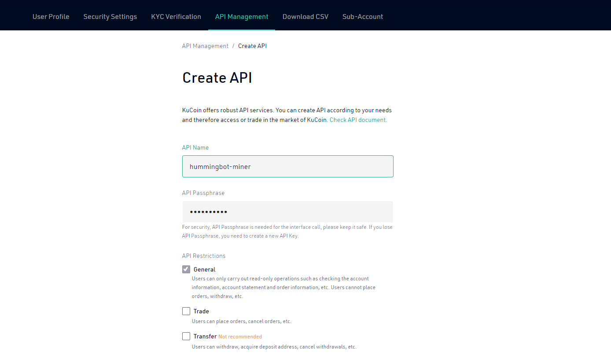
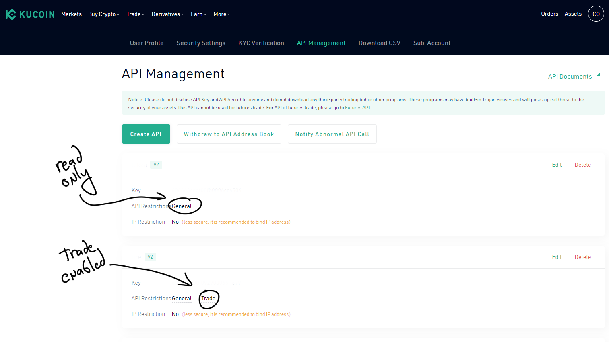

This is **part 1** of the Hummingbot Liquidity Mining Quickstart Guide:

1. **Create API Keys**
2. [Configure Hummingbot Miner]
3. [Install Hummingbot]
4. [Create Bot]
5. [Earn Rewards]

## Quickly get started trading with Hummingbot

In this guide, you'll learn how to set up a market making bot using Hummingbot that earns liquidity rewards on Hummingbot Miner, a **liquidity mining** platform that provides a decentralized, community-powered approach to market making across various exchanges.

First, you'll create API keys and add them to Hummingbot Miner. Next, you will install the open source Hummingbot algorithmic trading software and run the `liquidity_mining` strategy in Hummingbot, which we recommend for new users. Finally, we'll show you how to collect your rewards and assess your bot's performance in the Miner app.

Let's get started!

> **Disclaimer** Neither this nor any other Hummingbot documentation constitutes financial advice. Hummingbot does not guarantee rewards, but provides the general public access to the same market making and liquidity mining roles previously reserved for large hedge funds.

## Create API keys

First, create an account at one of the following exchanges where Miner offers liquidity mining:

* [Binance.com](https://binance.com) (not [Binance.US](https://binance.us))
* [KuCoin](https://kucoin.com)

Afterwards, go to the API management section of the exchange website. Here's where it resides in KuCoin:
![][kucoin-home]

Then, find the **Create API** command to create two API keys:

* **Read-only key**: used by Hummingbot Miner to track and verify your order data in order to allocate rewards to you
* **Trade key**: used by the Hummingbot software to run an automated bot that automatically creates and cancels orders

### Read-only key

The first API key should have `Enable Reading` checked in setup. This will be used to create the snapshots that hummingbot miner will read to calculate rewards. In the next section, you will add this key to the Hummingbot Miner app, which allows it to verify your bot’s activity and allocate your rewards.

Additional verification steps may be needed, including two-factor authentication (2FA) or verification by SMS/email.

In KuCoin, you can create a read-only API by only checking the **General** option and leaving **Trade** unchecked:

### Trade key

The second key should be trade enabled. Later, you will use this API key with the Hummingbot client to allow it to place and fill orders on a connected exchange.

For each API key, make sure to save the API key, secret key, and passphrase (if required), since the exchange only shows them to you upon creation. You will need the public and secret keys for both APIs in the following steps!

Afterwards, you should have two keys, a read-only key and a trade-enabled key:

Next, [add a read-only API key to Miner][Configure Hummingbot Miner]

[kucoin-home]: ./1-a-kucoin-home.png
[kucoin-create-api]: ./1-b-kucoin-create-api.png
[kucoin-api-management]: ./1-c-kucoin-api-management.png

[Create API Keys]: ../1-create-keys
[Configure Hummingbot Miner]: ../2-configure-miner
[Install Hummingbot]: ../3-install-hummingbot
[Create Bot]: ../4-create-bot
[Earn Rewards]: ../5-earn-rewards
