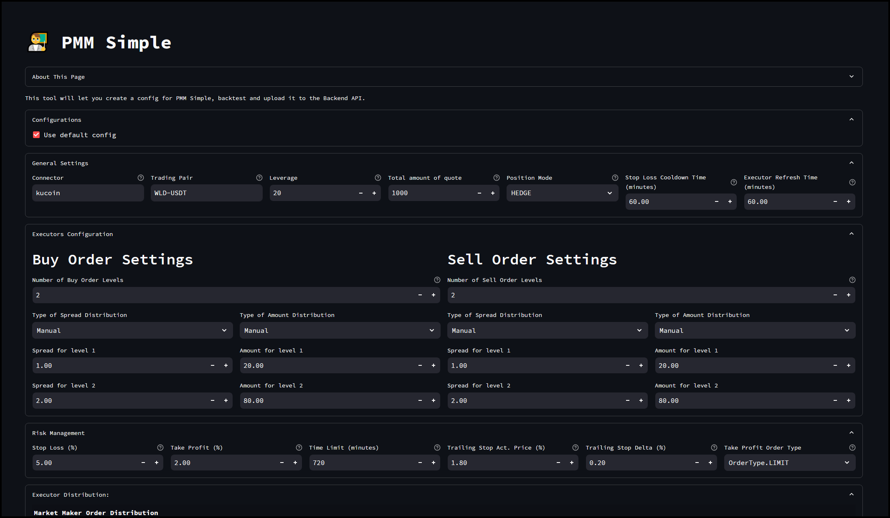
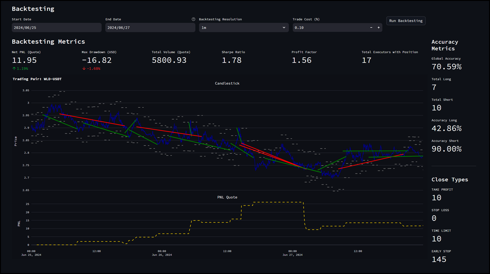
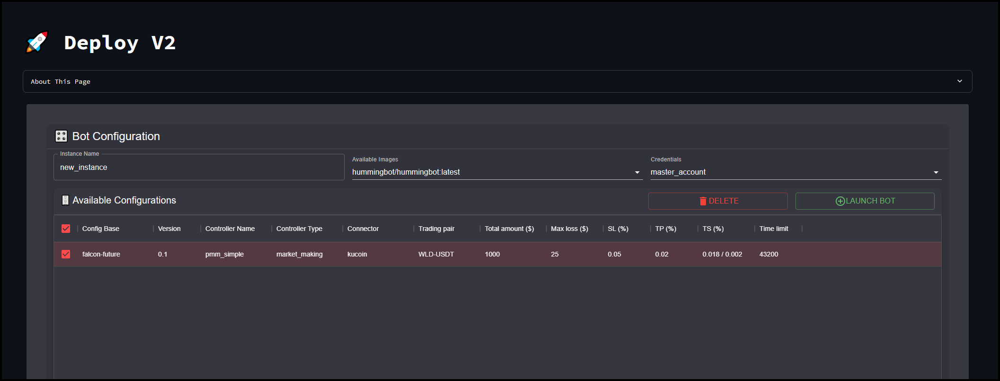
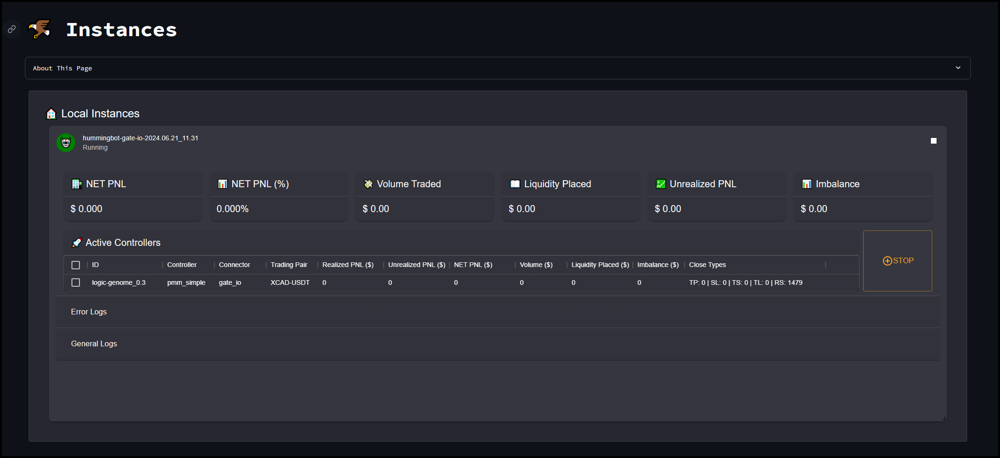

# Hummingbot v2.0.0 Release Notes

*Released on July 3, 2024*

## Introduction

Hummingbot 2.0 introduces a major update that revolutionizes the bot trading experience with the new Dashboard GUI. This upgrade transitions away from the traditional Hummingbot command-line interface (CLI), offering a more intuitive and visually appealing interface. Now, you can generate and backtest strategies before deploying them as Hummingbot instances, making Hummingbot 2.0 a powerful tool for both novice and experienced Hummingbot users.

| Repository | Description | GitHub Release | DockerHub Release |
|------------|-------------|----------------|-------------------|
| [Hummingbot](https://github.com/hummingbot/hummingbot) | Core Client | [`v2.0.0`](https://github.com/hummingbot/hummingbot/releases/tag/v2.0.0) | [`version-2.0.0`](https://hub.docker.com/r/hummingbot/hummingbot/tags?name=version-2.0.0) |
| [Dashboard](https://github.com/hummingbot/dashboard) | Hummingbot Frontend  | [`v2.0.0`](https://github.com/hummingbot/dashboard/releases/tag/v2.0.0) | [`version-2.0.0`](https://hub.docker.com/r/hummingbot/dashboard/tags?name=version-2.0.0) |
| [Backend-API](https://github.com/hummingbot/backend-api) | Hummingbot Backend | [`v2.0.0`](https://github.com/hummingbot/backend-api/releases/tag/v2.0.0) | [`version-2.0.0`](https://hub.docker.com/r/hummingbot/backend-api/tags?name=version-2.0.0) |
| [Gateway](https://github.com/hummingbot/gateway) | DEX Middleware | [`v2.0.0`](https://github.com/hummingbot/gateway/releases/tag/v2.0.0) | [`version-2.0.0`](https://hub.docker.com/r/hummingbot/gateway/tags?name=version-2.0.0) |
| [Deploy](https://github.com/hummingbot/deploy) | Deployment Repo |


## How to Update

### Docker

Re-run the [Deploy](https://github.com/hummingbot/deploy) setup script:
```bash
git clone https://github.com/hummingbot/deploy.git
cd deploy
bash setup.sh
```

For individual images, exit running containers, pull the latest images, and restart:
```bash
docker compose down
docker pull hummingbot/hummingbot:latest
docker compose up -d
```

### Source

Update the branches of each repo to this release by running:
```bash
git pull origin master
```

## Hummingbot 2.0 Highlights

### Deploy Repo

[Hummingbot Deploy](https://github.com/hummingbot/deploy) is a dedicated repo that allows users to quickly deploy Hummingbot using the Dashboard as the front end UI. The compose file spins up containers for the [Dashboard](https://github.com/hummingbot/dashboard), [Backend-API](https://github.com/hummingbot/backend-api) as well as the **Hummingbot Broker**.

### Dashboard

<iframe style="width:100%; min-height:400px;" src="https://www.youtube.com/embed/7eHiMPRBQLQ?si=S500sdA9ImhLxHhu" frameborder="0" allow="accelerometer; autoplay; encrypted-media; gyroscope; picture-in-picture" allowfullscreen></iframe>

For more info check out the [Hummingbot 2.0 Quickstart Guide](../installation/hummingbot-deploy/quickstart.md). Some highlights:

- Configure Strategy V2 controllers with a visual editor:

[](../assets/img/pmm_simple.png)

- Backtest your configurations before saving them to Backend-API

[](../assets/img/backtesting.png)

- Deploy your strategy configurations using a few clicks:

[](../assets/img/deploy.png)

- View real-time status of all instances and their logs:

[](../assets/img/instances.png)


## New XRPL Connector (Python)

This PR enhances the current **XRPL** API connector by transitioning it to a fully Python-based implementation, eliminating the need for the **Hummingbot Gateway**. Users can now utilize the XRPL connector similarly to a standard CEX connector by executing the `connect XRPL` command. This upgrade significantly boosts the connector's performance and enhances stability for user trading activities.

**Pull Request:**  [#7051](https://github.com/hummingbot/hummingbot/pull/7051) 

**Thanks to [mlguys](https://github.com/mlguys) for this contribution! 🙏**


## New Balancer Connector

**Pull Request:**  [#280](https://github.com/hummingbot/gateway/pull/280) - Added [Balancer](../exchanges/balancer.md) connector

**Thanks to [vic-en](https://github.com/vic-en) for this contribution! 🙏**


## Other Updates

### Hummingbot
- [#6949](https://github.com/hummingbot/hummingbot/pull/6949) - Updated the Simple VWAP script example
- [#6992](https://github.com/hummingbot/hummingbot/pull/6992) - Fixed `get_connector_spec` naming **Thanks to [isreallee82](https://github.com/isreallee82) for this fix! 🙏**
- [#7018](https://github.com/hummingbot/hummingbot/pull/7018) - Added `pool_id` to `amm_arb strategy` **Thanks to [vic-en](https://github.com/vic-en) for this contribution! 🙏**
- [#7069](https://github.com/hummingbot/hummingbot/pull/7069) - Fixed conversion of staking rewards to normal token (ex. ETH.F -> ETH) **Thanks to [yancong001](https://github.com/yancong001) for this fix! 🙏**
- [#7081](https://github.com/hummingbot/hummingbot/pull/7081) - Added [PR#7069](https://github.com/hummingbot/hummingbot/pull/7069) to development branch
- [#7088](https://github.com/hummingbot/hummingbot/pull/7088) - Fixed issue with `pyjwt` library preventing Coinbase API from working **Thanks to [MementoRC](https://github.com/MementoRC) for this fix! 🙏**

### Gateway
- [#280](https://github.com/hummingbot/gateway/pull/280) - Added Balancer connector **Thanks to [vic-en](https://github.com/vic-en) for this contribution! 🙏**

### Dashboard
- [#152](https://github.com/hummingbot/dashboard/pull/152) - Fixed minor bugs with Dashboard