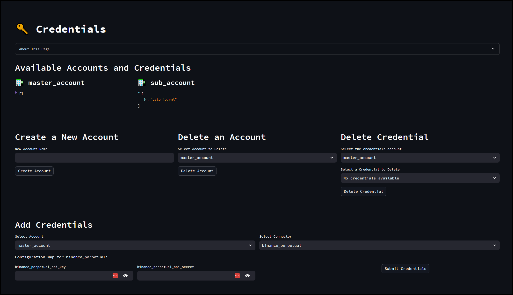
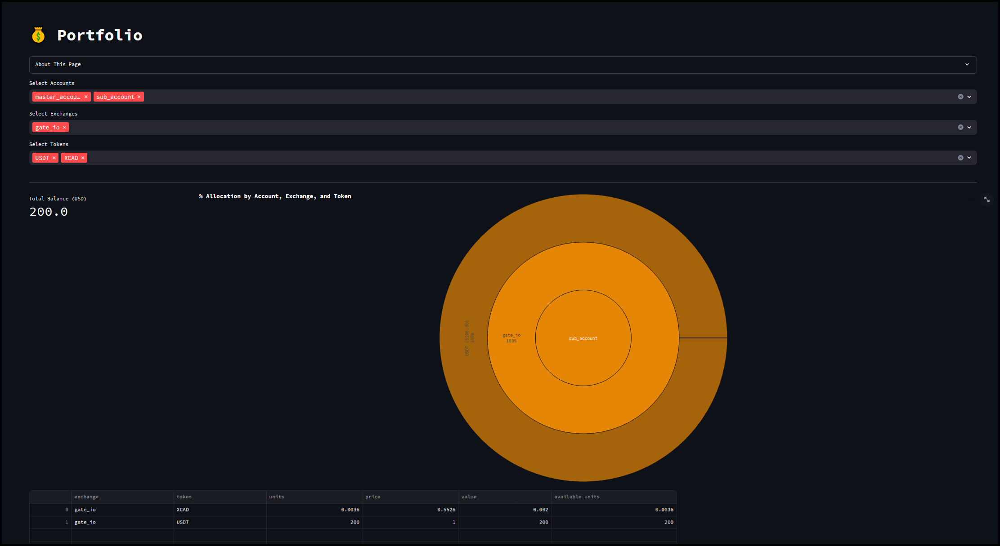

# Hummingbot v2.0.0 Release Notes

*Released on June 27, 2024*

## Introduction

Hummingbot 2.0 is here, introducing a major update that revolutionizes the user experience with its new dashboard deployment method and front-end UI. This upgrade transitions away from the traditional command-line interface (CLI), offering a more intuitive and visually appealing interface. Key highlights of Hummingbot 2.0 include streamlined deployment processes, enhanced user interaction with real-time data visualization, credential management and advanced trading bot customization. 

The new dashboard allows users to easily generate configurations and backtest those configurations before deploying a bot or instance. This ensures optimal performance and strategy effectiveness, making Hummingbot 2.0 a powerful tool for both novice and experienced traders.


In this release, we have:

* XRPL Python Connector
* New Balancer Connector
* Hummingbot Deploy Repo
* New and Improved Dashboard 

| Repository | Description | GitHub Release | DockerHub Release |
|------------|-------------|----------------|-------------------|
| [Hummingbot](https://github.com/hummingbot/hummingbot) | Core Trading Engine | [`v2.0.0`](https://github.com/hummingbot/hummingbot/releases/tag/v2.0.0) | [`version-2.0.0`](https://hub.docker.com/r/hummingbot/hummingbot/tags?name=version-2.0.0) |
| [Gateway](https://github.com/hummingbot/gateway) | DEX Connector Middleware | [`v2.0.0`](https://github.com/hummingbot/gateway/releases/tag/v2.0.0) | [`version-2.00.0`](https://hub.docker.com/r/hummingbot/gateway/tags?name=version-2.0.0) |
| [Dashboard](https://github.com/hummingbot/dashboard) | Hummingbot Front End  | [`v2.0.0`](https://github.com/hummingbot/dashboard/releases/tag/v2.0.0) | [`version-2.0.0`](https://hub.docker.com/r/hummingbot/dashboard/tags?name=version-2.0.0) |
| [Backend-API](https://github.com/hummingbot/backend-api) | API to orchestrate multiple bots | [`v2.0.0`](https://github.com/hummingbot/backend-api/releases/tag/v2.0.0) | [`version-2.0.0`](https://hub.docker.com/r/hummingbot/backend-api/tags?name=version-2.0.0) |


## How to Update

### Docker

Make sure to exit all running containers using **docker compose down**

```
docker compose down
```

Run the following command to pull the latest Docker image:

```
docker pull hummingbot/hummingbot:latest
```

Restart containers

```
docker compose up -d
```

### Source

Update your Hummingbot branch to this release by running:

```
git pull origin master
```

## XRPL Python Connector

This PR enhances the current **XRPL** API connector by transitioning it to a fully Python-based implementation, eliminating the need for the **Hummingbot Gateway**. Users can now utilize the XRPL connector similarly to a standard CEX connector by executing the `connect XRPL` command. This upgrade significantly boosts the connector's performance and enhances stability for user trading activities.

**Pull Request:**  [#7051](https://github.com/hummingbot/hummingbot/pull/7051) 

**Thanks to [mlguys](https://github.com/mlguys) for this contribution! 🙏**


## Added Balancer Connector

**Pull Request:**  [#280](https://github.com/hummingbot/gateway/pull/280) - Added [Balancer](../exchanges/balancer.md) connector

**Thanks to [vic-en](https://github.com/vic-en) for this contribution! 🙏**


## Hummingbot Deploy Repo

[Hummingbot Deploy](https://github.com/hummingbot/deploy) is a dedicated repo that allows users to quickly deploy Hummingbot using the Dashboard as the front end UI. The compose file spins up containers for the [Dashboard](https://github.com/hummingbot/dashboard), [Backend-API](https://github.com/hummingbot/backend-api) as well as the **Hummingbot Broker**.

**How to use:**

Run the following commands below to deploy the Dashboard

```
git clone https://github.com/hummingbot/deploy
cd deploy
bash setup.sh

```

Go to `localhost:8501` in a browser to see the Dashboard UI


## Dashboard Highlights

<iframe style="width:100%; min-height:400px;" src="https://www.youtube.com/embed/7eHiMPRBQLQ?si=S500sdA9ImhLxHhu" frameborder="0" allow="accelerometer; autoplay; encrypted-media; gyroscope; picture-in-picture" allowfullscreen></iframe>

### Credential Management

[](../assets/img/credentials.png)

Easily manage your API credentials! 

### Porfolio

[](../assets/img/portfolio.png)

View your current assets and their values! 

### Config Generator

[](../assets/img/pmm_simple.png)

Highly customizable Strategy V2 controllers!

### Backtesting

[](../assets/img/backtesting.png)

Test your strategy configurations by running a backtest before deploying them to your bots.

### Deploy V2 

[](../assets/img/deploy.png)

Deploy your strategy configurations using a few simple clicks!


### Instances 

[](../assets/img/instances.png)


View all currently running / stopped instances and their status including any error logs!


**For more info check out the [Dashboard Quickstart Guide!](../installation/hummingbot-deploy/index.md)**

## Other Updates

### hummingbot
- [#6949](https://github.com/hummingbot/hummingbot/pull/6949) - Updated the Simple VWAP script example
- [#6992](https://github.com/hummingbot/hummingbot/pull/6992) - Fixed `get_connector_spec` naming **Thanks to [isreallee82](https://github.com/isreallee82) for this fix! 🙏**
- [#7018](https://github.com/hummingbot/hummingbot/pull/7018) - Added `pool_id` to `amm_arb strategy` **Thanks to [vic-en](https://github.com/vic-en) for this contribution! 🙏**
- [#7069](https://github.com/hummingbot/hummingbot/pull/7069) - Fixed conversion of staking rewards to normal token (ex. ETH.F -> ETH) **Thanks to [yancong001](https://github.com/yancong001) for this fix! 🙏**
- [#7081](https://github.com/hummingbot/hummingbot/pull/7081) - Added [PR#7069](ttps://github.com/hummingbot/hummingbot/pull/7069) to development branch
- [#7088](https://github.com/hummingbot/hummingbot/pull/7088) - Fixed issue with `pyjwt` library preventing Coinbase API from working **Thanks to [MementoRC](https://github.com/MementoRC) for this fix! 🙏**

### gateway
- [#280](https://github.com/hummingbot/gateway/pull/280) - Added Balancer connector **Thanks to [vic-en](https://github.com/vic-en) for this contribution! 🙏**

### dashboard
- [#152](https://github.com/hummingbot/dashboard/pull/152) - Fixed minor bugs with Dashboard