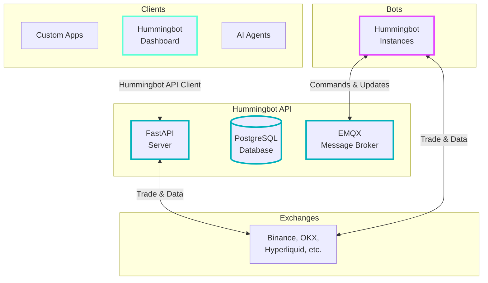

# Hummingbot v2.7.0 Release Notes

*Released on July 16, 2025*

| Repository | Description | GitHub Release | DockerHub Release |
|------------|-------------|----------------|-------------------|
| [Hummingbot](https://github.com/hummingbot/hummingbot) | Core Client | [`v2.7.0`](https://github.com/hummingbot/hummingbot/releases/tag/v2.7.0) | [`version-2.7.0`](https://hub.docker.com/r/hummingbot/hummingbot/tags?name=version-2.7.0) |
| [Gateway](https://github.com/hummingbot/gateway) | DEX Middleware | [`v2.7.0`](https://github.com/hummingbot/gateway/releases/tag/v2.7.0) | [`version-2.7.0`](https://hub.docker.com/r/hummingbot/gateway/tags?name=version-2.7.0) |

!!! note
    Other Hummingbot repositories such as [Dashboard](https://github.com/hummingbot/dashboard), [Hummingbot-API (formerly backend-api)](https://github.com/hummingbot/hummingbot-api), [Hummingbot API Client](https://github.com/hummingbot/hummingbot-api-client), [Quants-Lab](https://github.com/hummingbot/quant-lab), and [Deploy](https://github.com/hummingbot/deploy) follow a continuous deployment model without fixed version releases. Use the `main` branch for these repositories.

See the full changelogs on GitHub:

- [Hummingbot v2.7.0 Changelog](https://github.com/hummingbot/hummingbot/releases/tag/v2.7.0)
- [Gateway v2.7.0 Changelog](https://github.com/hummingbot/gateway/releases/tag/v2.7.0)

## How to Update

### Docker

Re-run the [Deploy](https://github.com/hummingbot/deploy) setup script:
```bash
git clone https://github.com/hummingbot/deploy.git
cd deploy
bash setup.sh
```

For individual images, exit running containers, pull the latest images, and restart:
```bash
docker compose down
docker pull hummingbot/hummingbot:latest
docker compose up -d
```

### Source

Update the branches of each repo to this release by running:
```bash
git pull origin master # Hummingbot
git pull origin main # Gateway
```

Afterwards, follow the instructions to re-install dependencies and compile the codebase for each repository. See [Install Hummingbot from Source](/installation/linux/) and [Install Gateway from Source](/gateway/installation).

## Release Highlights

### 🔌 Hummingbot API

The `backend-api` has been renamed to `hummingbot-api`, marking a major revamp of the codebase with improvements in architecture, modularity, and developer experience.

* ⚙️ **Standardized and production-ready** API for managing bots, executing trades, and monitoring multi-exchange portfolios.

* 🔄 **Expanded capabilities** now include direct trading, portfolio rebalancing, and account management — all via API.

* 🤖 **AI-ready design**, enabling agentic trading workflows and seamless integration with LLMs like Claude.



📦 New repository: [github.com/hummingbot/hummingbot-api](https://github.com/hummingbot/hummingbot-api)

📚 Documentation: [Hummingbot API Overview](/hummingbot-api/) | [Quickstart Guide](/hummingbot-api/quickstart/)


### 🧰 Hummingbot API Client

We introduce a modern, asynchronous Python client for interacting with the new Hummingbot API. Designed with modular router support to simplify integration with trading, portfolio, and bot management endpoints.

- Built for developers creating custom tools, dashboards, and automation workflows.

- Used as the interface layer in Hummingbot Dashboard v2.7.0.

🔗 GitHub: [hummingbot-api-client](https://github.com/hummingbot/hummingbot-api-client)

📦 PyPI: [pypi.org/project/hummingbot-api-client](https://pypi.org/project/hummingbot-api-client/)

📚 Documentation: See examples in the [API Quickstart Guide](/hummingbot-api/quickstart/)


### 📊 Dashboard Update

Hummingbot Dashboard has been completely rebuilt to use the new Hummingbot API using the API Client, providing:

* **Enhanced Performance**: Faster load times and more responsive UI through the new API architecture

* **Improved Reliability**: Better error handling and connection management

* **Unified Backend**: All operations now go through the standardized Hummingbot API

* **Future-Ready**: Foundation for upcoming features like multi-user support and advanced portfolio analytics

All dashboard pages have been updated to work with the new architecture. Documentation updates for each page coming soon.

📚 Documentation: [Dashboard Overview](/dashboard/)


### 🧠 Headless Mode

Run Hummingbot without the graphical user interface (GUI), reducing memory usage by up to **40%**. This lightweight mode enables you to deploy and manage more bots on resource-constrained environments, such as VPS or cloud instances.

To run in headless mode, use the quickstart script with the `--headless` flag:
```bash
bin/hummingbot_quickstart.py --headless -p PASSWORD -f CONFIG_FILE_NAME [-c SCRIPT_CONFIG]
```

Where:

- `--headless`: Enables headless mode
- `-p PASSWORD`: Your Hummingbot password
- `-f CONFIG_FILE_NAME`: Strategy config file (.yml) or script file (.py)
- `-c SCRIPT_CONFIG`: (Optional) Configuration file for scripts

🔗 Pull Request: [#7673](https://github.com/hummingbot/hummingbot/pull/7673)

📚 Documentation: [Headless Mode](/client/start-stop/#headless-mode)

### Other Updates

#### **Hummingbot**

* [#7664](https://github.com/hummingbot/hummingbot/pull/7664) - Added fix to potential memory leak issues for `XRPL` web socket connections by [@mlguys](https://github.com/mlguys)
* [#7667](https://github.com/hummingbot/hummingbot/pull/7667) - Fixed potential memory leaks and implemented proper cleanup of asynchronous tasks to improve system stability.
* [#7690](https://github.com/hummingbot/hummingbot/pull/7690) - Fixed approve-tokens command by correctly retrieving the transaction hash and added validation to ensure a hash is present before polling.
* [#7693](https://github.com/hummingbot/hummingbot/pull/7693) - Fixed missing `perpMarginRejected` state handling in the `Hyperliquid Perpetual` connector for insufficient margin errors.


#### **Gateway**

* [#465](https://github.com/hummingbot/gateway/pull/465) - Fixed `Uniswap` connector error handling, WETH allowances, and NFT approval checks
* [#471](https://github.com/hummingbot/gateway/pull/471) - Fixed `Uniswap` router BUY orders and improved gas handling
* [#474](https://github.com/hummingbot/gateway/pull/474) - Added support for `#src` and `#test` path aliases to simplify imports and reduce confusion, especially when file names overlap by [@WuonParticle](https://github.com/WuonParticle)
* [#475](https://github.com/hummingbot/gateway/pull/475) - Added auto-linting via setup:hooks, fixed bigint-buffer warning, and applied linter fixes across the codebase by [@WuonParticle](https://github.com/WuonParticle)
* [#477](https://github.com/hummingbot/gateway/pull/477) - Fixed incorrect Jupiter quote-swap estimateAmountIn for BUY orders
* [#478](https://github.com/hummingbot/gateway/pull/478) - Replaced heuristic example address retrieval with a static method to reduce unrelated logs during tests involving `app.ts` by [@WuonParticle](https://github.com/WuonParticle)