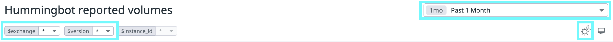

## Real-time dashboard

[](/assets/img/fork-volumes.png)

See below for a real-time dashboard of the aggregated, anonymized trade volumes that Hummingbot clients report.

<a href="https://p.datadoghq.com/sb/a96a744f5-a15479d77992ccba0d23aecfd4c87a52" target="_blank" class="md-button md-button--primary">:fontawesome-solid-chart-line: Hummingbot Reported Volumes</a>

Use the **exchange** and **version** toggles to filter the data. In addition, you can also change the timespan, as well as activate dark mode!

[](./toggles.png)

## FAQ

### How does data reporting work?

Unless users turn it off, instances of the Hummingbot software send the following metrics to a Hummingbot Foundation server every 15 minutes:

* Aggregated trade volume
* Exchange where the trades occurred
* Version of Hummingbot software used
* Device and system information
* InstanceID (an anonymous, randomly-generated unique identifier)

All data collected will be used exclusively by Hummingbot Foundation for reporting purposes only, and we will never sell this data to any third party.

### Why do you collect this data?

To sustain development of the Hummingbot client, Hummingbot Foundation enters into fee share partnerships with exchanges. These partners need actionable data to convince their stakeholders and community members that a Hummingbot partnership is worthwhile. Their most common requests include total volume traded and number of users.

After a partnership has been established, we rely upon the exchange to remit fees honestly back to us. In the past, we have entered into agreements that were not honored by the exchange, which diverts scarce resources away from the Hummingbot community. By openly publishing both reported volumes as well as fees shared for each exchange (see [Monthly Reports](./index.md#monthly-reports)), we hope to use the power of transparency to incentivize exchanges to honor their agreements.

### How do I configure or turn off this feature?

In `conf/conf_client.yml`, find the following section:

```yaml
# Whether to enable aggregated order and trade data collection
anonymized_metrics_mode:
  anonymized_metrics_interval_min: 15.0
```

Changing the parameter above to `anonymized_metrics_interval_min: 0.0` disables data reporting. You may also adjust the interval if you would rather send data on a slower or faster interval. 15 minutes was chosen and tested as a reasonable interval for an active trading Hummingbot instance.

### How can I be sure that this is the only data Hummingbot collects?

The Hummingbot codebase is 100% open source and publicly auditable on Github. Feel free to review the code for yourself and post publicly on our [Discord](https://discord.gg/hummingbot) or [official forum](https://hummingbot.discourse.group) what you found. We’ve always been open and honest with our community members and you’ll find that this case is no different.
