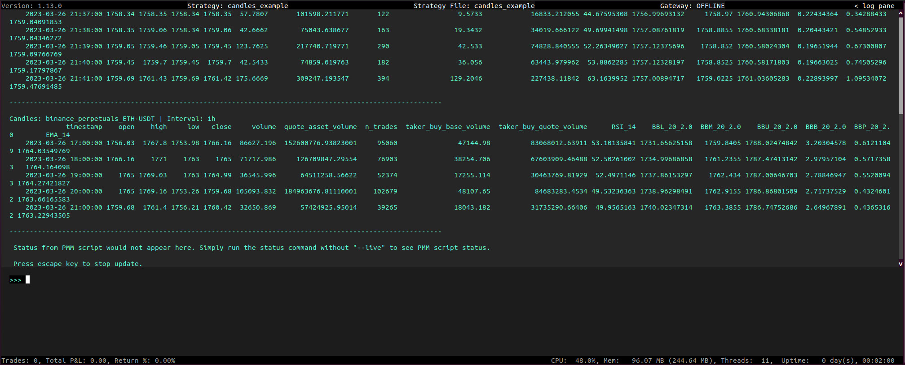
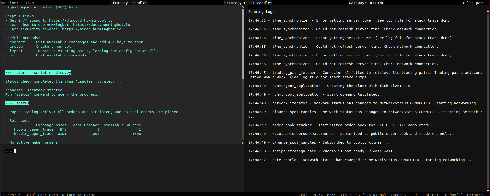
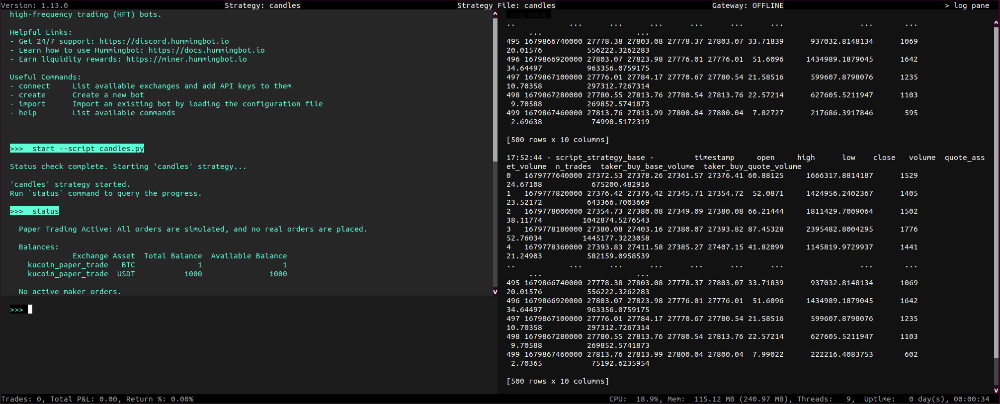

The Candles Feed component, introduced in version [1.13.0](/release-notes/1.13.0/#custom-ohlcv-candles), helps users to generate custom OHLCV candles using both historical and live Websocket data, allowing traders to create real-time custom technical indicators using [pandas_ta](https://github.com/twopirllc/pandas-ta) that can be used in a variety of ways.

You will likely want to add technical indicators to the candle data, and we recommend using [pandas_ta](https://github.com/twopirllc/pandas-ta).

Watch a recent "How To" community call that explains how to customize a market making strategy using this component:

<iframe style="width:100%; min-height:400px;" src="https://www.youtube.com/embed/xCEvYbdsbvY" frameborder="0" allow="accelerometer; autoplay; encrypted-media; gyroscope; picture-in-picture" allowfullscreen></iframe>

## Description

The [`CandlesBase`](https://github.com/hummingbot/hummingbot/blob/master/hummingbot/data_feed/candles_feed/candles_base.py) class is a subclass of [`NetworkBase`](https://github.com/hummingbot/hummingbot/blob/master/hummingbot/core/network_base.py) and serves as a base class for fetching and storing candle data from a cryptocurrency exchange. 

This class provides a common interface and uses Rest and WS Assistants for all IO operations, along with a double-ended queue to store candles. Additionally, it implements the Throttler module for API rate limiting, although it's not necessary since real-time data should primarily be updated via WebSockets.

## Data sources

All the data sources for candles inherit CandlesBase to implement the specific endpoints. As of version 1.14, the available sources available are:

- `binance`: See [`BinanceSpotCandles`](https://github.com/hummingbot/hummingbot/tree/master/hummingbot/data_feed/candles_feed/binance_spot_candles) for the implementation.
- `binance_perpetual`: See [`BinancePerpetualCandles`](https://github.com/hummingbot/hummingbot/tree/master/hummingbot/data_feed/candles_feed/binance_perpetual_candles) for the implementation.

To create a new instance of this component, it is recommended to use the `get_candle` method of the `CandlesFactory` (which will be demonstrated later in an example).

## Relevant scripts

 You can find examples of usage in the following scripts:

- [candles_example](https://github.com/hummingbot/hummingbot/blob/master/scripts/candles_example.py)
- [simple_directional_strategy_example](https://github.com/hummingbot/hummingbot/blob/master/scripts/simple_directional_strategy_example.py)
- [advanced_directional_strategy_example](https://github.com/hummingbot/hummingbot/blob/master/scripts/advanced_directional_strategy_example.py)

You can also initialize as many candles as you need. For each combination of `[connector_name, trading_pair, interval]`, you should create a new instance using the `CandlesFactory`.

## Key methods and properties

- `CandlesFactory.get_candle(connector_name: str, trading_pair: str, interval:str = "1m", max_records:int = 500)`
    - `connector_name`: name of the data source, e.g. [`binance`, `binance_perpetual`]
    - `trading_pair`: hb_trading_pair, e.g. `BASE-QUOTE`
    - `interval`: time interval between candles (check the intervals available for each source)
    - `max_records`: the maximum size of the dequeue that will store the candles. When the component starts, it will collect the first WebSocket message and create a task to fill the dequeue via REST while the WebSocket messages continue arriving

- `start()`: it is essential to start this component after initialization as it will begin streaming and collecting the candles. It is recommended to call this method in the `init` of the strategy. An example will be provided later.

- `stop()`: it is necessary to stop the candle when the strategy or script ends. For scripts, it is recommended to use the `on_stop()` method of `ScriptStrategyBase` since it allows you to execute code when you call the stop command.

- `is_ready`: this boolean property checks if the quantity of collected candles is equal to the maximum records needed.

- `candles_df`: this property returns a DataFrame with the most updated information of the candles. Binance sends updates every second, so you will have all this information available in real-time: `["timestamp", "open", "high", "low", "close", "volume", "quote_asset_volume", "n_trades", "taker_buy_base_volume", "taker_buy_quote_volume"]`

If you want to see it in action, run the [candles_example.py](https://github.com/hummingbot/hummingbot/blob/master/scripts/candles_example.py) script and use the command `status --live` to see the candles in real-time.

[](candles-a.jpg)

Remember that you need to create an instance for each candle you want to use, start and stop them, and access information by using the `candles_df` property only when the candle `is_ready` property is True.

Also, it's best to access candle information when it's full because `max_records` should be determined based on the maximum number of records needed to compute technical indicators. For example, if the largest indicator is a moving average of the last 400 periods, then `max_records` should be greater than 400.

## Code samples

The following code examples demonstrate how to use candles in Hummingbot to gather historical data and use it to inform trades.

### Initializing candles

This fetches a single candle of `BTC-USDT` of `BinanceSpot`:

```python
from typing import Dict

from hummingbot.connector.connector_base import ConnectorBase

from hummingbot.data_feed.candles_feed.candles_factory import CandlesFactory
from hummingbot.strategy.script_strategy_base import ScriptStrategyBase


class InitializingCandlesExample(ScriptStrategyBase):
    candles = CandlesFactory.get_candle("binance", "BTC-USDT", "3m")

    markets = {"kucoin_paper_trade": {"BTC-USDT"}}

    def __init__(self, connectors: Dict[str, ConnectorBase]):
        # Is necessary to start the Candles Feed.
        super().__init__(connectors)
        self.candles.start()

    def on_stop(self):
        self.candles.stop()
```

Note that the candles are independent from the Hummingbot connector that is used to trade. In this example it shows how to initialize a single candle for a specific trading pair, using `Binance` candles to trade on `KuCoin`. This opens up a lot of possibilities like, trading in an illiquid market with information of a liquid one, or use information of perpetuals and spot candles to trade in another market.

[](candles-b.jpg)

If you run the code example above in Hummingbot you won't see any output but in the next example we can see how we can output the data every tick

### Logging candles every tick

To log the dataframe of the candles every tick, you can use the `on_tick` method by adding this code:

```python
def on_tick(self):
    self.logger().info(self.candles.candles_df)
```

Our script should now look like this:

```python hl_lines="22 23"
from typing import Dict

from hummingbot.connector.connector_base import ConnectorBase

from hummingbot.data_feed.candles_feed.candles_factory import CandlesFactory
from hummingbot.strategy.script_strategy_base import ScriptStrategyBase


class InitializingCandlesExample(ScriptStrategyBase):
    candles = CandlesFactory.get_candle("binance", "BTC-USDT", "3m")

    markets = {"kucoin_paper_trade": {"BTC-USDT"}}

    def __init__(self, connectors: Dict[str, ConnectorBase]):
        # Is necessary to start the Candles Feed.
        super().__init__(connectors)
        self.candles.start()

    def on_stop(self):
        self.candles.stop()

  def on_tick(self):
    self.logger().info(self.candles.candles_df)
```

Note that this may not be a good idea because you are going to have a lot of logs, but this shows you how to access the information of the candles every tick.

If you want to see how to show the candles in the `format_status` method, check the script [candles_example](https://github.com/hummingbot/hummingbot/blob/master/scripts/candles_example.py) of the codebase or the screenshot posted above.

In the screenshot below we can see the output in the log pane which is updated every tick:

[](candles-c.jpg)

### Multiple candles

```python
from typing import Dict

from hummingbot.connector.connector_base import ConnectorBase

from hummingbot.data_feed.candles_feed.candles_factory import CandlesFactory
from hummingbot.strategy.script_strategy_base import ScriptStrategyBase


class InitializingCandlesExample(ScriptStrategyBase):
    candles_1 = CandlesFactory.get_candle("binance", "BTC-USDT", "3m")
    candles_3 = CandlesFactory.get_candle("binance", "BTC-USDT", "1m")
    candles_2 = CandlesFactory.get_candle("binance_perpetual", "ETH-USDT", "1m")

    markets = {"kucoin_paper_trade": {"BTC-USDT"}}

    def __init__(self, connectors: Dict[str, ConnectorBase]):
        # Is necessary to start the Candles Feed.
        super().__init__(connectors)
        self.candles_1.start()
        self.candles_2.start()
        self.candles_3.start()

    def on_stop(self):
        self.candles_1.stop()
        self.candles_2.stop()
        self.candles_3.stop()
```

This code example shows how to initialize multiple candles for different trading pairs, intervals, and connectors. The `CandlesFactory` class is used again to create multiple instances of candles, which can be started and stopped using the `start` and `stop` methods. By storing the candles in a dictionary, it's possible to create strategies combining indicators of different sources. The [advanced_directional_strategy_example](https://github.com/hummingbot/hummingbot/blob/master/scripts/advanced_directional_strategy_example.py) script in the codebase demonstrates how to do this.

### Downloading historical data

You can also use Hummingbot to download historical candles. To do so, check out the `download_candles` (link TBC) example that shows how to collect all the candles selected and store them in a CSV inside the data folder.
