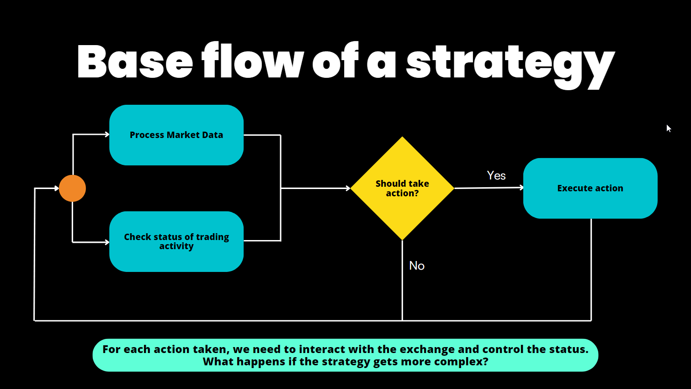

## What is a Hummingbot Strategy?

Like a computer program, an algorithmic trading strategy is a set of automated processes that executes repeatedly:

- **Data Collection**: Gathering real-time data from various sources
- **Data Processing**: Analyzing data to identify patterns and make decisions
- **Order Execution**: Placing and cancelling orders based on processed data

A Hummingbot strategy loads market data directly from centralized and decentralized exchanges, adaptable to the unique features of each trading venue's WebSocket/REST APIs and nodes.

Each [clock tick](../client/global-configs/clock-tick.md), a strategy loads real-time order book snapshots, user balances, order status and other real-time data from trading pairs on these venues and executes the logic defined in the strategy, parametrized by a pre-defined user configuration.

To run a strategy, a user selects a strategy template, defines its input parameters in a [Config File](../client/config-files.md), and starts it with the `start` command in the Hummingbot client or via the command line with [Strategy Autostart](../client/global-configs/strategy-autostart.md).

## Recommended Strategies: V2 Framework

Starting in 2023, Hummingbot Foundation began to iteratively introduce a new framework, called **Strategy V2**. The new framework allows you to build powerful, dynamic strategies using Lego-like components. **We highly recommend using the V2 Framework for all new strategies due to its enhanced modularity, flexibility, and scalability.** To learn more, check out [Architecture](../strategies/v2-strategies/index.md).

There are three core V2 components. Understanding how they differ helps you choose the right one:

**[Executors](../strategies/v2-strategies/executors/index.md)** automate a discrete trading workflow — they manage orders for a specific task (e.g., open a position, execute a grid, provide liquidity) and are designed to **start and finish**. Executors can be created directly via the Hummingbot API without a running script. They are the building blocks that controllers orchestrate.

**[Scripts](../strategies/scripts/index.md)** are simple Python files that contain all strategy logic in one place. All scripts now inherit from `StrategyV2Base`, giving them access to Executors and the Market Data Provider. Scripts are **ideal for learning, testing, and prototyping** simple strategies. Started with `start --script <file>` in the Hummingbot client.

**[Controllers](../strategies/v2-strategies/controllers/index.md)** are **production-grade**, modular sub-strategies loaded by the `v2_with_controllers.py` script. A single bot instance can run multiple controllers simultaneously — each trading different pairs or using different logic. Controllers are more configurable, reusable, and suited for advanced long-running deployments.

This table may help you decide which component to use:

| Use case | Component |
|----------|-----------|
| One-time trading task (entry, DCA, hedge) | **Executor** (via API) |
| Learning the framework or prototyping | **Script** |
| Simple single-pair production strategy | **Script** |
| Complex strategy with multiple pairs or configs | **Controller** |
| Multiple independent strategies in one bot | **Multiple Controllers** |
| Automated LP with auto-rebalancing | **LP Executor** + `lp_rebalancer` controller |

## Legacy Strategies: V1 Framework

When it launched in 2019, Hummingbot pioneered the concept of configurable templates for algo trading strategies, such as market making strategies based on the Avellaneda & Stoikov paper.

These V1 strategies are still supported for users who prefer them or need to maintain older bots. However, new development and features are primarily focused on the V2 framework.

Users can access these legacy strategy templates at the [Strategies V1](../strategies/v1-strategies/index.md) page.

## Learn Algo Trading and Market Making

To gain a deeper understanding of Hummingbot strategies along with access to the latest Hummingbot framework updates, check out [Botcamp](https://www.botcamp.xyz), the official training and [certification](../community/certification.md) for Hummingbot.

Operated by the people behind Hummingbot Foundation, Botcamp offers bootcamps and courses that teach you how to design and deploy advanced algo trading and market making strategies using Hummingbot's Strategy V2 framework.