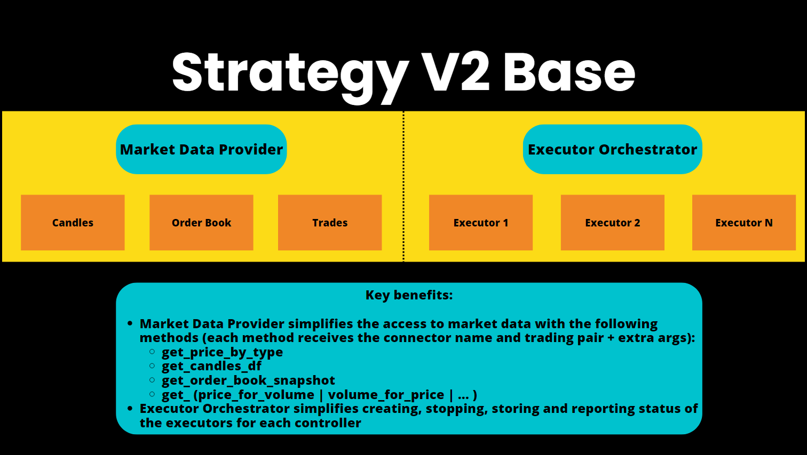

Scripts are Python files that serve as the entry point for Hummingbot strategies. They are ideal for **learning, testing, and simple strategies** — all logic lives in one file and is easy to understand and modify.

All scripts now inherit from [StrategyV2Base](https://github.com/hummingbot/hummingbot/blob/development/hummingbot/strategy/strategy_v2_base.py), giving them full access to Executors, the Market Data Provider, and candle feeds. After you create a YAML config with `create --v2-config <script_name>`, start the script with `start --v2 <config_file_name.yml>` (config files live in `conf/scripts`).

For **production-grade, multi-pair, or long-running strategies**, consider using [Controllers](../v2-strategies/controllers/index.md) via the `v2_with_controllers.py` script instead.

!!! tip "Scripts vs Controllers"
    - **Scripts** → simple, self-contained, great for prototyping and learning
    - **Controllers** → modular, configurable, suited for production deployments with multiple strategies running in parallel

!!! note Restart Hummingbot
     Should your script run into an error, it's crucial that you exit Hummingbot entirely, correct or debug the faulty script, and then restart Hummingbot. The stop command won't rectify the issue in case of an error. To get back on track, a complete shutdown and subsequent relaunch of Hummingbot is required.

For more info, see the [Script Walkthrough](../v2-strategies/walkthrough.md). This detailed walkthrough shows you how to run a simple directional algo trading strategy.

## Script Examples

See [Script Examples](examples.md) for a list of the current sample scripts in the Hummingbot codebase. These examples show you how to:

- Execute V2 strategies
- Download order book data
- Download historical candles data
- Place orders
- Use the rate oracle
- Call exchange APIs
- And much more!

We welcome new sample script contributions from users! To submit a contribution, please follow the [Contribution Guidelines](../../community/contributions.md).

## Configuration Files

Scripts can be created both with and without [config files](../../client/config-files.md).

To create a configuration file for your script, execute:

```shell
create --v2-config [SCRIPT_NAME]
```

This command auto-completes with scripts from the local `/scripts` directory that are configurable. You'll be prompted to specify strategy parameters, which are then saved in a YAML file within the `conf/scripts` directory. To run the script, use:

```shell
start --v2 [SCRIPT_CONFIG_FILE]
```

Use the YAML file name under `conf/scripts` (for example, `conf_simple_pmm_1.yml`). Auto-complete will suggest config files from that directory.

## Base Classes

All V2 scripts inherit from [StrategyV2Base](https://github.com/hummingbot/hummingbot/blob/development/hummingbot/strategy/strategy_v2_base.py). This gives scripts access to Executors, the Market Data Provider, and configurable parameters via YAML config files.

Older scripts may inherit from [ScriptStrategyBase](https://github.com/hummingbot/hummingbot/blob/development/hummingbot/strategy/script_strategy_base.py), which defines parameters in code rather than config files. These are still supported but not recommended for new development — use `StrategyV2Base` instead.

## Script Architecture

[](../v2-strategies/diagrams/14.png)

The entry point for StrategyV2 is a Hummingbot script that inherits from the [StrategyV2Base](https://github.com/hummingbot/hummingbot/blob/development/hummingbot/strategy/strategy_v2_base.py) class. 

This script fetches data from the Market Data Provider and manages how each Executor behaves. Optionally, it can load a Controller to manage the stategy logic instead of defining it in within the script. Go through the [Walkthrough](../v2-strategies/walkthrough.md) to learn how it works. 

See [Sample Scripts](../v2-strategies/examples/index.md) for more examples of StrategyV2-compatible scripts.

### Adding Config Parameters

To add user-defined parameters to a StategyV2 script, add a configuration class that extends the `StrategyV2ConfigBase` class in [StrategyV2Base](https://github.com/hummingbot/hummingbot/blob/development/hummingbot/strategy/strategy_v2_base.py) class.  

This defines a set of configuration parameters that are prompted to the user when they run `create` to generate the config file. Only questions marked `prompt_on_new` are displayed.

Afterwards, these parameters are stored in a config file. The script checks this config file every `config_update_interval` (default: 60 seconds) and updates the parameters that it uses in-flight.

```python
class StrategyV2ConfigBase(BaseClientModel):
    """
    Base class for version 2 strategy configurations.
    """
    markets: Dict[str, Set[str]] = Field(
        default="binance_perpetual.JASMY-USDT,RLC-USDT",
        client_data=ClientFieldData(
            prompt_on_new=True,
            prompt=lambda mi: (
                "Enter markets in format 'exchange1.tp1,tp2:exchange2.tp1,tp2':"
            )
        )
    )
    candles_config: List[CandlesConfig] = Field(
        default="binance_perpetual.JASMY-USDT.1m.500:binance_perpetual.RLC-USDT.1m.500",
        client_data=ClientFieldData(
            prompt_on_new=True,
            prompt=lambda mi: (
                "Enter candle configs in format 'exchange1.tp1.interval1.max_records:"
                "exchange2.tp2.interval2.max_records':"
            )
        )
    )
    controllers_config: List[str] = Field(
        default=None,
        client_data=ClientFieldData(
            is_updatable=True,
            prompt_on_new=True,
            prompt=lambda mi: "Enter controller configurations (comma-separated file paths), leave it empty if none: "
        ))
    config_update_interval: int = Field(
        default=60,
        gt=0,
        client_data=ClientFieldData(
            prompt_on_new=False,
            prompt=lambda mi: "Enter the config update interval in seconds (e.g. 60): ",
        )
    )
```

### `on_tick` Method

This method acts as the strategy's heartbeat, is called regularly, and allows the strategy to adapt to new market conditions in real time.

```python
def on_tick(self):
    for executor_handler in self.executor_handlers.values():
        if executor_handler.status == ExecutorHandlerStatus.NOT_STARTED:
            executor_handler.start()
```

### `format_status` Method

This overrides the standard `status` function and provides a formatted string representing the current status of the strategy, including the name, trading pair, and status of each executor.

Users can customize this function to display their custom strategy variables.

```python
def format_status(self) -> str:
        if not self.ready_to_trade:
            return "Market connectors are not ready."
        lines = []
        for trading_pair, executor_handler in self.executor_handlers.items():
            lines.extend(
                [f"Strategy: {executor_handler.controller.config.strategy_name} | Trading Pair: {trading_pair}",
                 executor_handler.to_format_status()])
        return "\n".join(lines)
```

