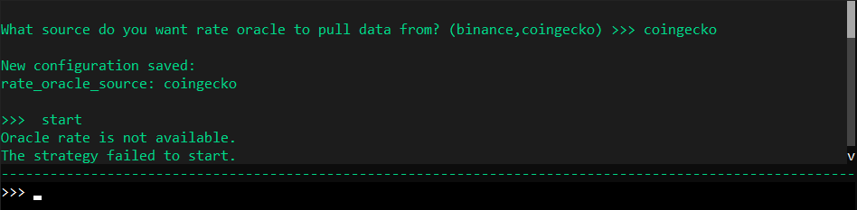
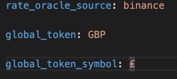
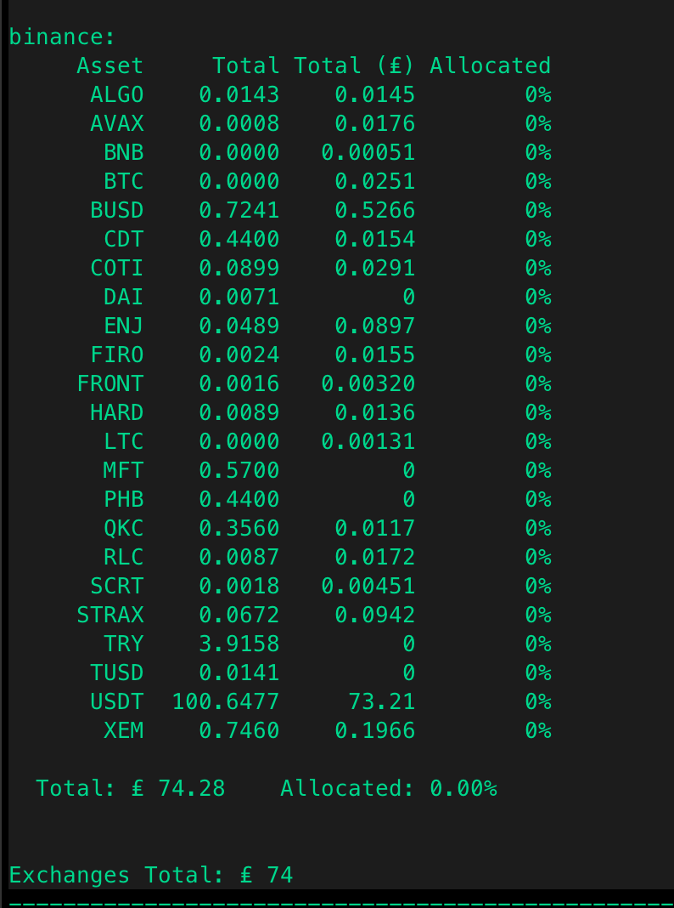
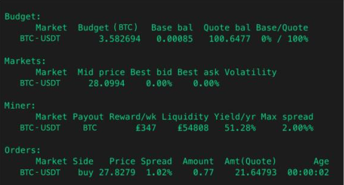
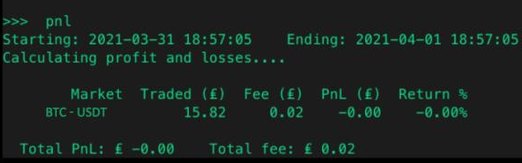
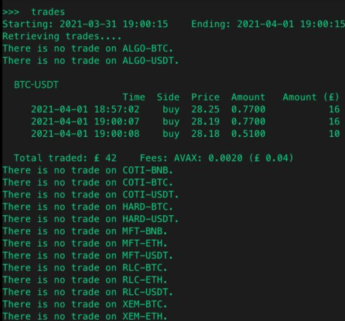
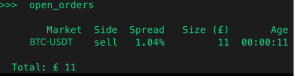

This new feature provides real time, most up-to-date exchange rate on any given token or currency from a reliable and trustworthy data source.

!!! note "Hummingbot API"
    If you are using Hummingbot API, use the `/market-data/rates` and `/market-data/tickers` endpoints for programmatic rate queries. See [API Routers](../../../hummingbot-api/routers.md).

!!! note
    Use rate oracle with the [cross exchange market making](../cross-exchange-market-making.md) and arbitrage strategies.

## Parameters

### `rate_oracle_source`

The source where you want to pull data from. Available sources include Binance, CoinGecko, CoinCap, Gate.io, KuCoin, Backpack, Coinbase Advanced Trade, Hyperliquid, Derive, MEXC, Dexalot, and others supported by your Hummingbot version. Using CoinGecko may introduce a short delay due to API rate limits.

```
What source do you want rate oracle to pull data from? (binance, coingecko, gate_io, kucoin, ...)"
>>>
```

Run `config rate_oracle_source` in the client to see the full list for your install.

### `global_token.global_token_name`

This is a token which you can display other tokens' value in. Set the `global_token.global_token_name` according to your preferred token value.

```
What is your default display token? (e.g. USDT,USD,EUR)
>>>
```

### `global_token.global_token.global_token_symbol`

The symbol for the global token.

```
What is your default display token symbol? (e.g. $, €)
>>>
```

!!! tip Changing oracle sources
    If you happen to `start` the bot and produce the error `Oracle rate is not available`, or if the `rate_oracle_source` fails to show any price reference on your pair, you may change the source by running `config rate_oracle_source` and selecting another supported exchange (for example Gate.io, Binance, or CoinGecko).



## How it works

If you need to view the rate oracle conversion after the `balance`, `pnl`, `open_orders`, `trades`, and `status` command, set it manually in the `conf_client.yml`.

!!! Note
    In past versions of Hummingbot (1.5.0 and below), the `conf_client.yml` file is named `conf_global.yml`

To set the parameters for `rate_oracle_source`, `global_token.global_token_name` and `global_token.global_token_symbol`, run the `config` command.

Refer to the example below:

Change the default setting in `conf_client.yml` to GBP (Great Britain Pound). The conversion will show up when you run `balance` command.





The conversion also shows up during the `status` command for the `liquidity_mining` strategy. Under the `Miner` section.



The conversion shows up when using the `pnl` command.



The conversion also shows up when running the `trades` command.



The conversion also works with the `open_orders` command.


