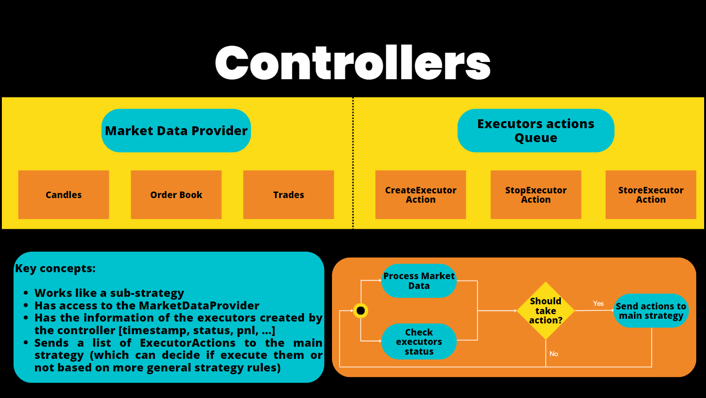

**Controllers** are the production-grade building block of the Strategy V2 framework. They define reusable, modular sub-strategies that are more configurable and robust than standalone scripts — ideal for long-running deployments and multi-strategy setups.

A controller interfaces with the `MarketDataProvider` (OrderBook, Trades, Candles) and emits `ExecutorActions` that instruct the parent script to create or stop executors. Controllers are **not started directly** — they are loaded by the special [`v2_with_controllers.py`](https://github.com/hummingbot/hummingbot/blob/master/scripts/v2_with_controllers.py) script, which can run multiple controllers simultaneously in a single bot instance.

!!! tip "Controllers vs Scripts"
    Use **controllers** when you need:
    - Multiple strategies running in parallel (e.g., market making on 5 pairs)
    - Production-grade, config-driven deployments
    - Strategy logic that's reusable and independently testable

    Use **scripts** for simpler, single-pair strategies or when learning the framework. 

## Base Classes

Controller base classes live under [`hummingbot/strategy_v2/controllers/`](https://github.com/hummingbot/hummingbot/tree/master/hummingbot/strategy_v2/controllers):

* [controller_base.py](https://github.com/hummingbot/hummingbot/blob/master/hummingbot/strategy_v2/controllers/controller_base.py): Defines `ControllerBase`
* [directional_trading_controller_base.py](https://github.com/hummingbot/hummingbot/blob/master/hummingbot/strategy_v2/controllers/directional_trading_controller_base.py): Indicator-based directional strategies, inherits from `ControllerBase`
* [market_making_controller_base.py](https://github.com/hummingbot/hummingbot/blob/master/hummingbot/strategy_v2/controllers/market_making_controller_base.py): Two-sided market making, inherits from `ControllerBase`

Implementations live under the top-level [`/controllers`](https://github.com/hummingbot/hummingbot/tree/master/controllers) directory in the repo. The CLI name is the path with `/` replaced by `.` (for example `market_making.pmm_simple`, `generic.lp_rebalancer.lp_rebalancer`).

## Directional Trading Controllers

These strategies aim to profit from predicting the market direction and take positions based on signals.

- [bollinger_v1](https://github.com/hummingbot/hummingbot/blob/master/controllers/directional_trading/bollinger_v1.py)
- [bollinger_v2](https://github.com/hummingbot/hummingbot/blob/master/controllers/directional_trading/bollinger_v2.py)
- [bollingrid](https://github.com/hummingbot/hummingbot/blob/master/controllers/directional_trading/bollingrid.py)
- [macd_bb_v1](https://github.com/hummingbot/hummingbot/blob/master/controllers/directional_trading/macd_bb_v1.py)
- [supertrend_v1](https://github.com/hummingbot/hummingbot/blob/master/controllers/directional_trading/supertrend_v1.py)
- [ai_livestream](https://github.com/hummingbot/hummingbot/blob/master/controllers/directional_trading/ai_livestream.py)
- [dman_v3](https://github.com/hummingbot/hummingbot/blob/master/controllers/directional_trading/dman_v3.py)

## Market Making Controllers

- [pmm_simple](https://github.com/hummingbot/hummingbot/blob/master/controllers/market_making/pmm_simple.py)
- [pmm_dynamic](https://github.com/hummingbot/hummingbot/blob/master/controllers/market_making/pmm_dynamic.py)
- [dman_maker_v2](https://github.com/hummingbot/hummingbot/blob/master/controllers/market_making/dman_maker_v2.py)

## Other Controllers

- [xemm_multiple_levels](https://github.com/hummingbot/hummingbot/blob/master/controllers/generic/xemm_multiple_levels.py)
- [arbitrage_controller](https://github.com/hummingbot/hummingbot/blob/master/controllers/generic/arbitrage_controller.py)
- [grid_strike](https://github.com/hummingbot/hummingbot/blob/master/controllers/generic/grid_strike.py)
- [multi_grid_strike](https://github.com/hummingbot/hummingbot/blob/master/controllers/generic/multi_grid_strike.py)
- [stat_arb](https://github.com/hummingbot/hummingbot/blob/master/controllers/generic/stat_arb.py)
- [hedge_asset](https://github.com/hummingbot/hummingbot/blob/master/controllers/generic/hedge_asset.py)
- [pmm_v1](https://github.com/hummingbot/hummingbot/blob/master/controllers/generic/pmm_v1.py)
- [pmm_mister](https://github.com/hummingbot/hummingbot/blob/master/controllers/generic/pmm_mister.py)
- [quantum_grid_allocator](https://github.com/hummingbot/hummingbot/blob/master/controllers/generic/quantum_grid_allocator.py)
- [lp_rebalancer](https://github.com/hummingbot/hummingbot/blob/master/controllers/generic/lp_rebalancer/lp_rebalancer.py) *(new in v2.13.0)* — Automated liquidity provision on CLMM DEXs. The Python package is `controllers/generic/lp_rebalancer/`; the CLI name is `generic.lp_rebalancer.lp_rebalancer`.
