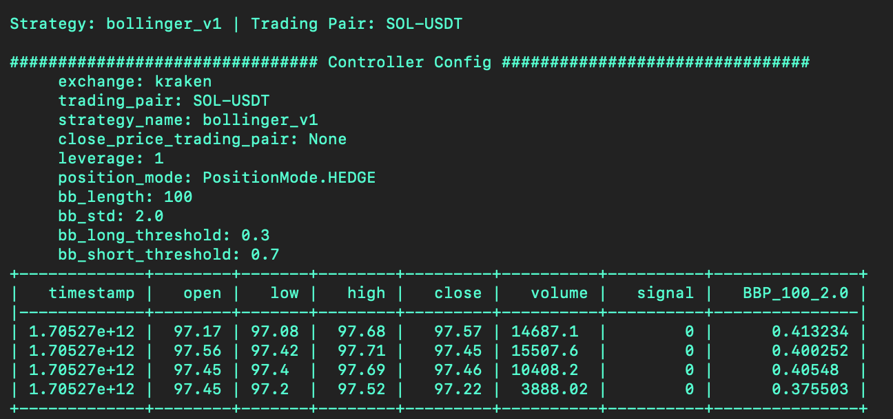
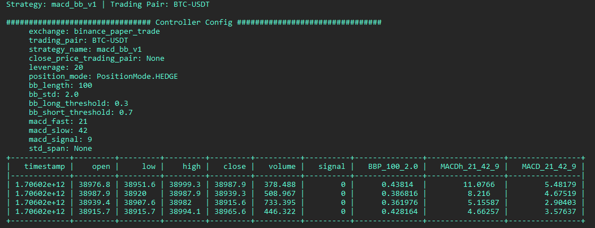
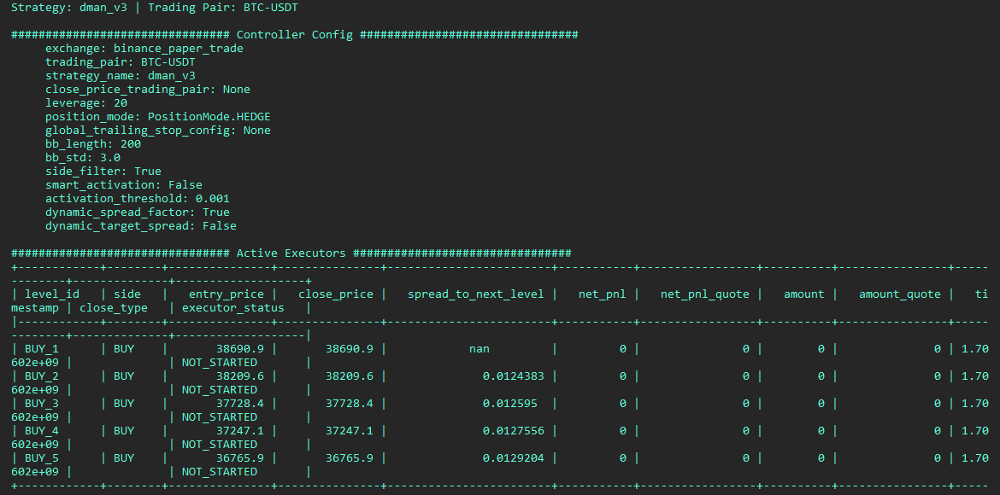

<!-- Legacy per-strategy loader scripts under /scripts were removed; V2 controller strategies run through v2_with_controllers. -->

## Running V2 Strategies

The main logic in a V2 strategy is contained in the [Controller](../controllers/index.md), which inherits from a base class in [`hummingbot/strategy_v2/controllers/`](https://github.com/hummingbot/hummingbot/tree/master/hummingbot/strategy_v2/controllers). Controllers orchestrate [Candles](../candles/index.md) and [Executors](../executors/index.md).

**Configurable scripts** (files in `/scripts` that define a config class): create a YAML file with `create --v2-config [SCRIPT_NAME]`, then start with:

```
start --v2 [CONFIG_FILE_NAME.yml]
```

The file must live in `conf/scripts/` and include `script_file_name` (the quickstart and CLI resolve the script from that field).

**Controllers** are not started alone. Create controller YAML with `create --controller-config [CONTROLLER_NAME]`, then use the [`v2_with_controllers`](https://github.com/hummingbot/hummingbot/blob/master/scripts/v2_with_controllers.py) loader (`create --v2-config v2_with_controllers`) so the YAML lists one or more controller configs. See the [Controller Walkthrough](../walkthrough-controller.md) for screenshots and the full flow.

Controller names use the path under [`/controllers`](https://github.com/hummingbot/hummingbot/tree/master/controllers) with `.` instead of slashes (for example `directional_trading.bollinger_v1`, `market_making.pmm_simple`).


## Directional Strategies

Directional strategies inherit from the [DirectionalTradingControllerBase](https://github.com/hummingbot/hummingbot/blob/master/hummingbot/strategy_v2/controllers/directional_trading_controller_base.py) class.

In the controller's signal logic, a directional strategy uses indicators (often from [Candles](../data/index.md)) so that:

* `1`: Long [Position Executor](../executors/positionexecutor.md) is created  
* `-1`: Short [Position Executor](../executors/positionexecutor.md) is created  

For each controller below: run `create --controller-config …`, add the generated YAML to a `v2_with_controllers` script config, then `start --v2` that loader config.


### Bollinger V1

A simple directional strategy using [Bollinger Band Percent (BBP)](../../../glossary/index.md).

**Code:** [bollinger_v1.py](https://github.com/hummingbot/hummingbot/blob/master/controllers/directional_trading/bollinger_v1.py)

**Controller config**

```
create --controller-config directional_trading.bollinger_v1
```

**User-defined parameters** (when you run `create`):

| Parameter      | Type | Prompt |
|----------------|------|--------|
| exchange       | trading     | Enter the name of the exchange where the bot will operate (e.g., binance_perpetual) |
| trading_pairs  | trading     | List the trading pairs for the bot to trade on, separated by commas (e.g., BTC-USDT,ETH-USDT) |
| leverage       | trading     | Set the leverage to use for trading (e.g., 20 for 20x leverage) |
| stop_loss      | PositionExecutor     | Set the stop loss percentage (e.g., 0.01 for 1% loss): |
| take_profit    | PositionExecutor     | Enter the take profit percentage (e.g., 0.03 for 3% gain): |
| time_limit     | PositionExecutor     | Set the time limit in seconds for the triple barrier (e.g., 21600 for 6 hours): |
| trailing_stop_activation_price_delta | PositionExecutor     | Enter the activation price delta for the trailing stop (e.g., 0.008 for 0.8%): |
| trailing_stop_trailing_delta | PositionExecutor     | Set the trailing delta for the trailing stop (e.g., 0.004 for 0.4%): |
| order_amount_usd | orders     | Enter the order amount in USD (e.g., 15): |
| cooldown_time  |   orders   | Specify the cooldown time in seconds between order placements (e.g., 15): |
| candles_exchange | candles     | Enter the exchange name to fetch candle data from (e.g., binance_perpetual): |
| candles_interval | candles     | Set the time interval for candles (e.g., 1m, 5m, 1h): |
| bb_length      | strategy     | Enter the Bollinger Bands length (e.g., 100): |
| bb_std         | strategy     | Set the standard deviation for the Bollinger Bands (e.g., 2.0): |
| bb_long_threshold | strategy     | Specify the long threshold for Bollinger Bands (e.g., 0.3): |
| bb_short_threshold | strategy     | Define the short threshold for Bollinger Bands (e.g., 0.7): |

**Status**

[](./status-bollinger.png)


### MACD-BB

Combines **MACD** and Bollinger Bands for long/short signals.

**Code:** [macd_bb_v1.py](https://github.com/hummingbot/hummingbot/blob/master/controllers/directional_trading/macd_bb_v1.py)

**Controller config**

```
create --controller-config directional_trading.macd_bb_v1
```

**User-defined parameters**

| Parameter      | Type  | Prompt |
|----------------|-------|--------|
| exchange       | trading | Enter the name of the exchange where the bot will operate (e.g., binance_perpetual) |
| trading_pairs  |  trading | List the trading pairs for the bot to trade on, separated by commas (e.g., BTC-USDT,ETH-USDT) |
| leverage       |  trading | Set the leverage to use for trading (e.g., 20 for 20x leverage) |
| stop_loss      | PositionExecutor | Set the stop loss percentage (e.g., 0.01 for 1% loss) |
| take_profit    | PositionExecutor| Enter the take profit percentage (e.g., 0.06 for 6% gain) |
| time_limit     | PositionExecutor| Set the time limit in seconds for the triple barrier (e.g., 86400 for 24 hours) |
| trailing_stop_activation_price_delta | PositionExecutor| Enter the activation price delta for the trailing stop (e.g., 0.01 for 1%) |
| trailing_stop_trailing_delta | PositionExecutor | Set the trailing delta for the trailing stop (e.g., 0.004 for 0.4%) |
| order_amount_usd | orders | Enter the order amount in USD (e.g., 15) |
| cooldown_time | orders | Specify the cooldown time in seconds between order placements (e.g., 15) |
| candles_exchange | candles | Enter the exchange name to fetch candle data from (e.g., binance_perpetual) |
| candles_interval | candles | Set the time interval for candles (e.g., 3m) |
| macd_fast | strategy | Set the MACD fast length (e.g., 21) |
| macd_slow | strategy | Specify the MACD slow length (e.g., 42) |
| macd_signal | strategy | Define the MACD signal length (e.g., 9) |
| bb_length | strategy | Enter the Bollinger Bands length (e.g., 100) |
| bb_std | strategy | Set the standard deviation for the Bollinger Bands (e.g., 2.0) |
| bb_long_threshold | strategy | Specify the long threshold for Bollinger Bands (e.g., 0.3) |
| bb_short_threshold | strategy | Define the short threshold for Bollinger Bands (e.g., 0.7) |

**Status**

[](./status-macdbb.png)


## Market Making Strategies

Market-making controllers inherit from [MarketMakingControllerBase](https://github.com/hummingbot/hummingbot/blob/master/hummingbot/strategy_v2/controllers/market_making_controller_base.py). Use the same `v2_with_controllers` workflow as above. Additional controllers in the tree (for example `market_making.dman_maker_v2`, `market_making.pmm_dynamic`) appear in the `create --controller-config` autocomplete.


### Dman V3

Mean reversion with grid-style execution and Bollinger-based dynamics.

**Code:** [dman_v3.py](https://github.com/hummingbot/hummingbot/blob/master/controllers/directional_trading/dman_v3.py)

**Controller config**

```
create --controller-config directional_trading.dman_v3
```

**User-defined parameters**

| Parameter                            | Type | Prompt |
|--------------------------------------|------|--------|
| exchange                             | trading     | Enter the name of the exchange where the bot will operate (e.g., binance_perpetual) |
| trading_pairs                        | trading     | List the trading pairs for the bot to trade on, separated by commas (e.g., BTC-USDT,ETH-USDT) |
| leverage                             | trading     | Set the leverage to use for trading (e.g., 20 for 20x leverage) |
| candles_exchange                     | candles     | Enter the exchange name to fetch candle data from (e.g., binance_perpetual) |
| candles_interval                     | candles     | Set the time interval for candles (e.g., 30m) |
| bollinger_band_length                | strategy     | Enter the length of the Bollinger Bands (e.g., 200) |
| bollinger_band_std                   | strategy     | Set the standard deviation for the Bollinger Bands (e.g., 3.0) |
| order_amount                         | orders     | Enter the base order amount in quote asset (e.g., 20 USDT) |
| n_levels                             | orders     | Specify the number of order levels (e.g., 5) |
| start_spread                         | orders     | Set the spread of the first order as a ratio of the Bollinger Band value (e.g., 1.0) |
| step_between_orders                  | orders     | Define the step between orders as a ratio of the Bollinger Band value (e.g., 0.2) |
| stop_loss                            | PositionExecutor     | Set the stop loss percentage (e.g., 0.2 for 20% loss) |
| take_profit                          | PositionExecutor     | Enter the take profit percentage (e.g., 0.06 for 6% gain) |
| time_limit                           | PositionExecutor     | Set the time limit in seconds for the triple barrier (e.g., 259200 for 3 days) |
| trailing_stop_activation_price_delta | PositionExecutor     | Enter the activation price delta for the trailing stop (e.g., 0.01 for 1%) |
| trailing_stop_trailing_delta         | PositionExecutor     | Set the trailing delta for the trailing stop (e.g., 0.003 for 0.3%) |

**Status**

[](./status-dmanv3.png)
