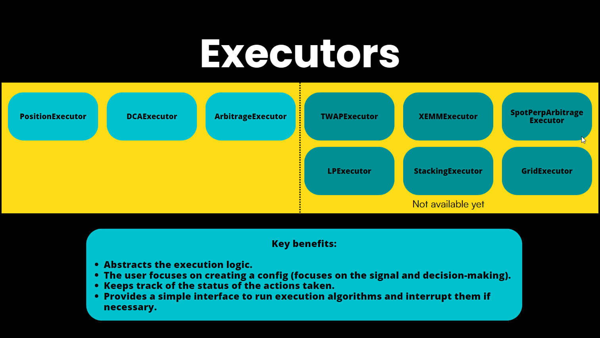

**Executors** in Hummingbot are self-managing components that handle the execution of orders according to predefined conditions set by **Controllers**, which, in turn, utilize data from the **MarketDataProvider** (Candles, Orderbook, Trades). Executors are tasked with managing the state of orders — initiating, refreshing, and canceling orders, as well as halting their own operation when certain conditions are met.

## **Types of Executors**

* [Position Executor](positionexecutor.md)
* [DCA Executor](dcaexecutor.md)
* [Arbitrage Executor](arbitrage-executor.md)
* [TWAP Executor](twapexecutor.md)

## **Benefits of Executors**

* Autonomy: Executors independently manage order states, offloading complex logic from the user.
* Simplicity: They simplify strategy code, enabling users to create powerful strategies with ease.
* Flexibility: By dynamically adjusting to market data, Executors can set spreads and shift prices, offering greater strategy adaptability.

## **Executor Orchestrator**

The **ExecutorOrchestrator** serves as a utility class that enables trading strategies to dynamically create, stop, and manage executors, which are specialized units responsible for executing trading activities such as placing and managing orders. 

### Key Features and Operations

- **Initialization**: The `ExecutorOrchestrator` is initialized with a reference to the trading strategy (`strategy`) and an update interval (`executors_update_interval`). This setup allows it to periodically update and manage executors based on the strategy's requirements.

- **Executor Management**: It maintains a dictionary of executors, where each executor is associated with a controller ID. This structure facilitates the organization and retrieval of executors for management purposes.

- **Action Execution**: The orchestrator can execute various actions (`ExecutorAction`) such as creating, stopping, and storing executors. Actions are processed either individually or in batches, allowing for flexible execution management.

    * **Creating Executors**: Based on the `CreateExecutorAction`, it can instantiate different types of executors (e.g., `PositionExecutor`, `DCAExecutor`, `ArbitrageExecutor`) with specific configurations. This allows strategies to deploy diverse trading tactics dynamically.

    * **Stopping Executors**: Using the `StopExecutorAction`, it can gracefully stop executors, ensuring that any ongoing operations are properly concluded before termination.

    * **Storing Executors**: The `StoreExecutorAction` enables the orchestrator to store executor data, facilitating persistence and analysis of executor performance over time.

- **Performance Reporting**: The orchestrator can generate detailed performance reports for individual controllers or globally across all controllers. These reports include metrics such as realized and unrealized P&L (Profit and Loss), trading volume, and the distribution of close types, providing insights into the effectiveness of the trading strategy and its executors.
