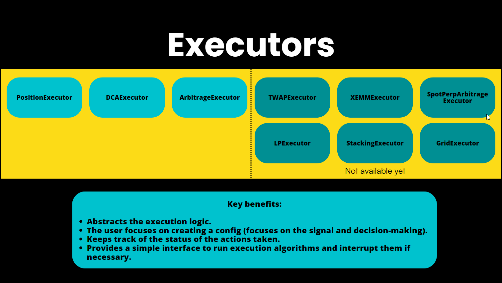

**Executors** in Hummingbot are self-managing components that handle the execution of orders according to predefined conditions set by **Controllers**, which, in turn, utilize data from the **MarketDataProvider** (Candles, Orderbook, Trades). Executors are tasked with managing the state of orders — initiating, refreshing, and canceling orders, as well as halting their own operation when certain conditions are met.

## **Types of Executors**

* [Position Executor](positionexecutor.md)
* [DCA Executor](dcaexecutor.md)
* [Grid Executor](gridexecutor.md)
* [Arbitrage Executor](arbitrage-executor.md)
* [TWAP Executor](twapexecutor.md)
* [XEMM Executor](xemm-executor.md)
* [LP Executor](#lp-executor) *(new in v2.13.0)*

## **LP Executor**

The **LP Executor** (`lp_executor`) is a new executor type introduced in v2.13.0 that automates liquidity provision on Concentrated Liquidity Market Maker (CLMM) DEXs such as Meteora and Raydium on Solana.

### How It Works

The LP Executor manages the full lifecycle of an LP position:

1. **Open**: Deploys liquidity into a CLMM pool at the configured price range
2. **Monitor**: Tracks position health and whether the current price is within range
3. **Rebalance**: When price moves out of range, closes and reopens the position at the new price center (controlled by `lp_rebalancer` controller)
4. **Close**: Removes liquidity and returns tokens to the wallet

### Key Configuration Parameters

| Parameter | Description |
|-----------|-------------|
| `connector_name` | DEX connector (e.g., `meteora`, `raydium`) |
| `trading_pair` | Token pair (e.g., `Percolator-SOL`) |
| `pool_id` | On-chain pool address |
| `total_amount_quote` | Total position size in quote token |
| `side` | `0` = both sides, `1` = buy only, `2` = sell only |
| `width_percent` | Price range width as % of current price |
| `price_offset` | Center offset from current price (%) |
| `rebalance_threshold` | % price move that triggers rebalance |
| `rebalance_seconds` | Minimum seconds between rebalances |

### Tracking LP Performance

The `lphistory` command in the Hummingbot client shows a summary of all closed LP positions, including fees earned, P&L, and rebalance events:

```
>>> lphistory
```

This is useful for evaluating the performance of `lp_rebalancer` strategies over time.

### Usage via Hummingbot API

Use the [`lp-agent`](../../../mcp/skills.md) skill or call the API directly:

```bash
# Via lp-agent skill
python scripts/run_strategy.py --pair Percolator-SOL --amount 0.30 --side 2
```

Or via API:
```bash
POST /executors/create
{
  "type": "lp_executor",
  "connector_name": "meteora",
  "trading_pair": "Percolator-SOL",
  "total_amount_quote": 0.30,
  "side": 2,
  "width_percent": 0.4
}
```

## **Benefits of Executors**

* Autonomy: Executors independently manage order states, offloading complex logic from the user.
* Simplicity: They simplify strategy code, enabling users to create powerful strategies with ease.
* Flexibility: By dynamically adjusting to market data, Executors can set spreads and shift prices, offering greater strategy adaptability.


## **Executor Orchestrator**

The **ExecutorOrchestrator** serves as a utility class that enables trading strategies to dynamically create, stop, and manage executors, which are specialized units responsible for executing trading activities such as placing and managing orders. 

### Key Features and Operations

- **Initialization**: The `ExecutorOrchestrator` is initialized with a reference to the trading strategy (`strategy`) and an update interval (`executors_update_interval`). This setup allows it to periodically update and manage executors based on the strategy's requirements.

- **Executor Management**: It maintains a dictionary of executors, where each executor is associated with a controller ID. This structure facilitates the organization and retrieval of executors for management purposes.

- **Action Execution**: The orchestrator can execute various actions (`ExecutorAction`) such as creating, stopping, and storing executors. Actions are processed either individually or in batches, allowing for flexible execution management.

    * **Creating Executors**: Based on the `CreateExecutorAction`, it can instantiate different types of executors (e.g., `PositionExecutor`, `DCAExecutor`, `ArbitrageExecutor`) with specific configurations. This allows strategies to deploy diverse trading tactics dynamically.

    * **Stopping Executors**: Using the `StopExecutorAction`, it can gracefully stop executors, ensuring that any ongoing operations are properly concluded before termination.

    * **Storing Executors**: The `StoreExecutorAction` enables the orchestrator to store executor data, facilitating persistence and analysis of executor performance over time.

- **Performance Reporting**: The orchestrator can generate detailed performance reports for individual controllers or globally across all controllers. These reports include metrics such as realized and unrealized P&L (Profit and Loss), trading volume, and the distribution of close types, providing insights into the effectiveness of the trading strategy and its executors.
