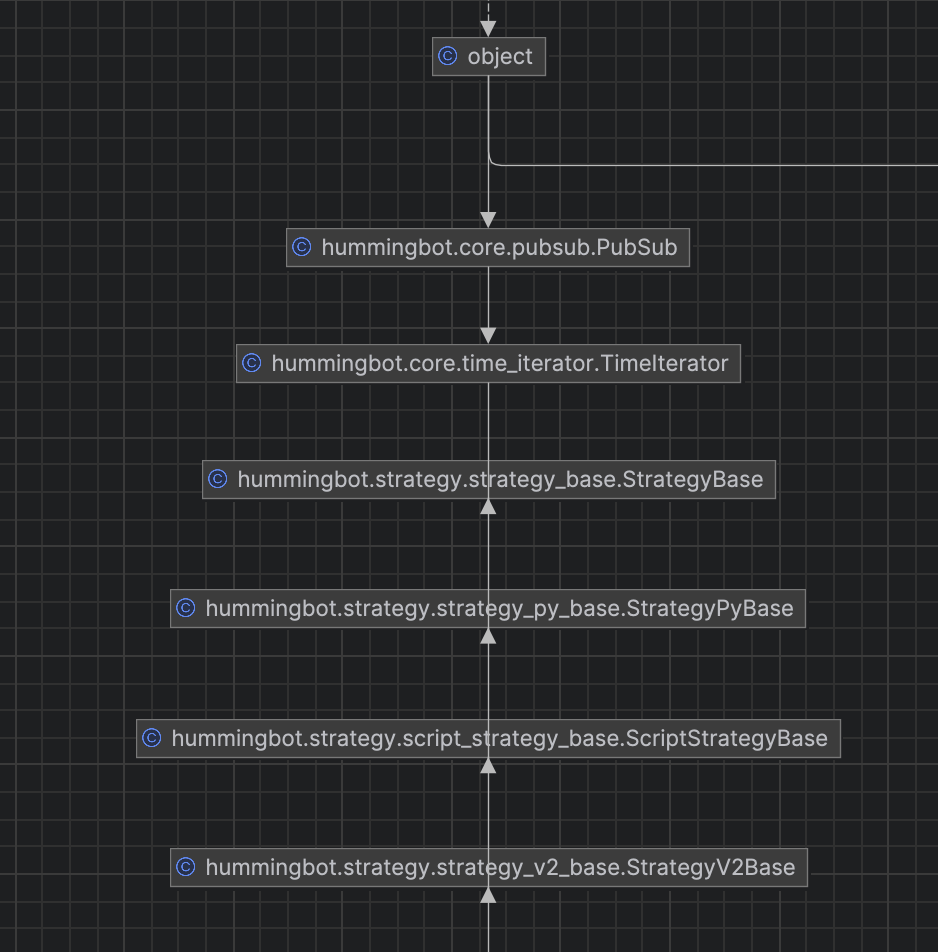

## Components

Understanding the three core components and how they relate is key to building effective strategies:

### Executors

[**Executors**](executors/index.md) automate a discrete trading workflow — placing, managing, and closing orders according to predefined logic. They are designed to **start and finish**: each executor has a lifecycle (active → closed/failed) and handles its own order management internally.

Key properties:
- Self-contained: manages order placement, refresh, and cancellation autonomously
- Finite: designed to complete a task, not run indefinitely
- **Can be created directly via the Hummingbot API** without a running bot or script
- Building blocks for controllers — a controller orchestrates one or more executors

Examples: `PositionExecutor`, `DCAExecutor`, `GridExecutor`, `TWAPExecutor`, `XEMMExecutor`, `LPExecutor`

### Scripts and Controllers

[**Scripts**](../scripts/index.md) and [**Controllers**](controllers/index.md) are **long-running processes** inside the Hummingbot client that run continuously until stopped. They are suited for strategies that need to monitor markets, adapt over time, or manage multiple executors in parallel.

- **Scripts** (inheriting from `StrategyV2Base`) are the entry point for simple, self-contained strategies. Create a config with `create --v2-config`, then start via `start --v2 <config_file_name.yml>`. Scripts are ideal for **testing, learning, and prototyping** — all logic lives in one file and is easy to read and modify. All V2 scripts now inherit from `StrategyV2Base`.
- **Controllers** are production-grade, modular sub-strategies designed for **advanced and long-running deployments**. They are not started directly — a special launcher script (`v2_with_controllers.py`) loads one or more controllers into a single bot instance, enabling multiple independent strategies to run in parallel. Controllers are more configurable, testable, and reusable than scripts.

!!! tip "When to use each"
    | Use case | Component |
    |----------|-----------|
    | One-time order workflow (entry, exit, hedge) | **Executor** (via API) |
    | Learning, testing, or simple one-off strategy | **Script** |
    | Production deployment with advanced logic | **Controller** via `v2_with_controllers` script |
    | Multiple strategies running simultaneously | **Multiple Controllers** in one container |
    | LP position with auto-rebalancing | **LP Executor** + `lp_rebalancer` controller |

### Market Data Provider

[**Market Data Provider**](data/index.md): Single point of access to exchange market data — historical OHLCV [Candles](./candles/index.md), order book data, and trades. Used by both scripts and controllers to make trading decisions.

## Inheritance

All V2 components are built on the same base class hierarchy:

* **V1 Strategies**: `StrategyBase` is the Cython base class for all strategies, while `StrategyPyBase` extends it for Python-based strategies.
* **V2 Scripts**: All scripts now inherit from `StrategyV2Base` (which itself extends `ScriptStrategyBase`). Use `StrategyV2Base` for all new script implementations — it uses Executors for order management instead of raw `buy()` / `sell()` calls.
* **Controllers**: Extend `StrategyV2Base` further as loosely-coupled components that communicate via an event queue. Controllers are loaded and managed by a V2 script (`v2_with_controllers.py`).

## Strategy Guides

Check out [Walkthrough - Script](./walkthrough.md) and [Walkthrough - Controller](./walkthrough-controller.md) to learn how to create strategies.

