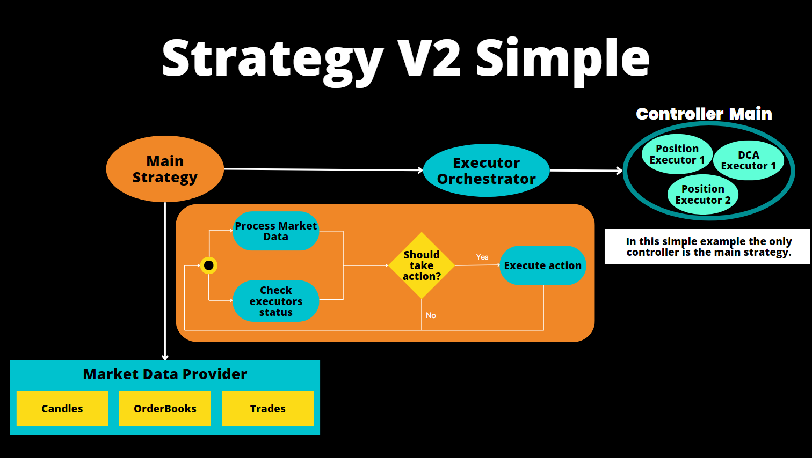
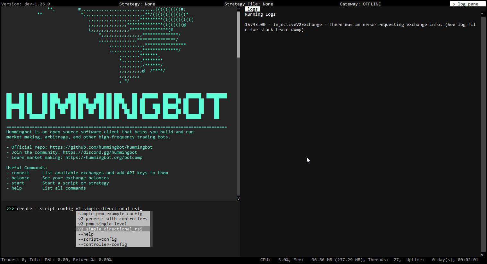
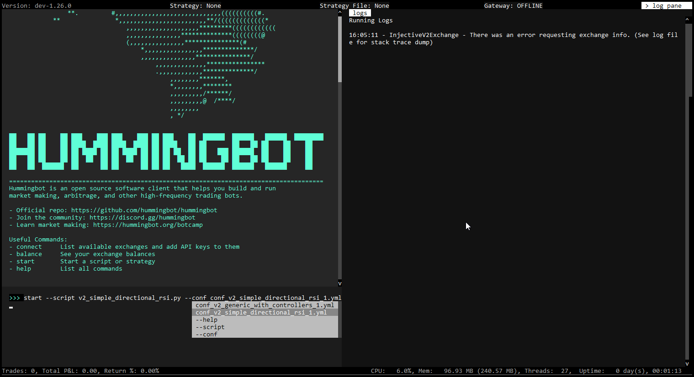
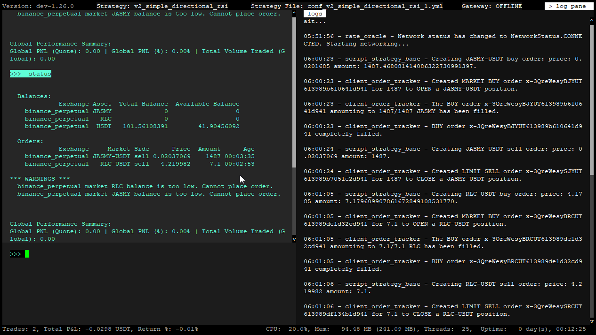

Below, we provide a walkthrough to illustrate the StrategyV2 framework, which we recommend for new users who want to understand how the framework works.



## What we'll cover

In this example, we'll show you how to configure and run a simple market-making script using [`simple_pmm.py`](https://github.com/hummingbot/hummingbot/blob/master/scripts/simple_pmm.py).

This strategy places bid and ask limit orders around the mid (or last trade) price on a single trading pair. Every `order_refresh_time` seconds it cancels and replaces those orders using parameters you set in the script config.

## Create script config

[](diagrams/21.png)

First, let's create a script config file that defines the key strategy parameters.

Launch Hummingbot and execute the command below to generate your script configuration:

```shell
create --v2-config simple_pmm
```

This command auto-completes with the subset of configurable scripts from the local `/scripts` directory.

You'll be prompted to specify the strategy parameters, which are then saved in a YAML file within the `conf/scripts` directory. The exact prompts depend on how the script defines its config class; typical values include exchange, trading pair, spreads, and order size.

```python
Enter a new file name for your configuration >> conf_simple_pmm_1.yml
```

## Run the script 

[](diagrams/22.png)

Execute the command below to start the script:

```shell
start --v2 conf_simple_pmm_1.yml
```

Hummingbot loads the YAML from `conf/scripts`, reads `script_file_name` inside it to find the script, and starts the strategy. You should see the bot begin placing and refreshing orders according to your parameters.

## Check status and performance

Run the [Status](../../client/status.md) command to see the status (asset balances, active orders and positions) of the running strategy:

[](diagrams/23.png)

After there have been trades, you can use the [History](../../client/history.md) to see your bot's performance.

## Next steps

We encourage you check out [Dashboard](../../dashboard/index.md), the new entry point for Hummingbot users that will be officially launched at the [Hummingbot 2.0 launch event](https://lu.ma/ieyvhcft).

Also, see [Walkthrough - Controller](./walkthrough-controller.md) to learn how to run scripts that deploy strategies as [Controllers](controllers/index.md).
