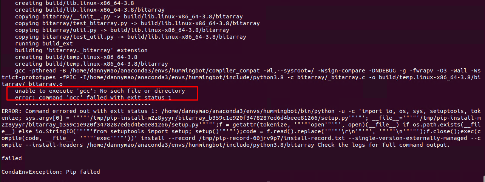
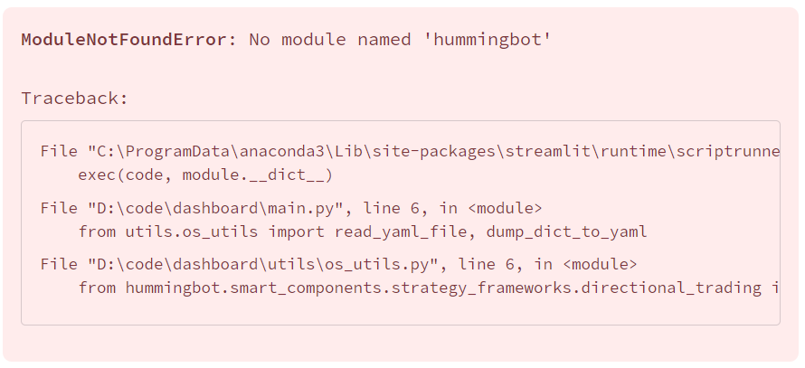
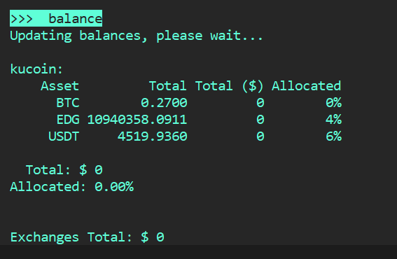

## Installation

### Docker: Permission denied after Docker installation

```bash
docker: Got permission denied while trying to connect to the Docker daemon socket at
unix:///var/run/docker.sock: Post
http://%2Fvar%2Frun%2Fdocker.sock/v1.39/containers/create?name=hummingbot_instance:
dial unix /var/run/docker.sock: connect: permission denied.
```

Run `sudo usermod -aG docker $USER` then restart your terminal, if that didn't work then do `sudo chmod 666 /var/run/docker.sock`


### Source: conda command not found

```
$ conda
-bash: conda: command not found
```

Make sure you have Anaconda / Miniconda (or Miniforge if on arm64) installed. If you have just installed, close your terminal and reopen a new one to update the command line's program registry.

### Source: ./install: line 40 ... Killed

```
Collecting package metadata (repodata.json): / ./install: line 40: 14981 Killed                  ${CONDA_EXE} env create -f $ENV_FILE
Could not find conda environment: hummingbot
You can list all discoverable environments with conda info --envs.
```

This error usually occurs if you are installing on an instance with 2GB RAM or less, if you are running on an instance with only 2GB of RAM consider upgrading to at least 4GB or maybe adding a swap file. 

### Source: Could not find conda environment: hummingbot


This is related to the issue above. Check if there are any errors after running the `./install` script. If there are, you'll need to solve those first otherwise creating the hummingbot conda environment will fail. 

### Source: unable to execute `gcc`: No such file or directory



If getting this error you'll need to install the `build-essential` package. Run the command below to install - 

```bash
sudo apt update && sudo apt upgrade -y && sudo apt install -y build-essential
```

## Dashboard

### No module named hummingbot




### Authentication page is not showing in Dashboard

By default the authentication system is disabled. 

Find the variable `AUTH_SYSTEM_ENABLED` in the `CONFIG.py` file and set it to `True` to enable the authentication page.

## V1 Strategies

## V2 Strategies

## Connectors

## Gateway

## Misc

### How to exit a config


Press <kbd>CTRL</kbd> + <kbd>X</kbd> if you want to cancel out of the configuration 

### Balance showing $0 



If balance is showing 0, use the `config rate_oracle_source` command to change your rate oracle source. By default, the `rate_oracle_source` is set to `Binance` and if the token is not available in Binance then the value will show 0. 


