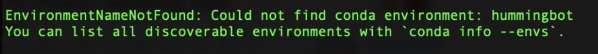
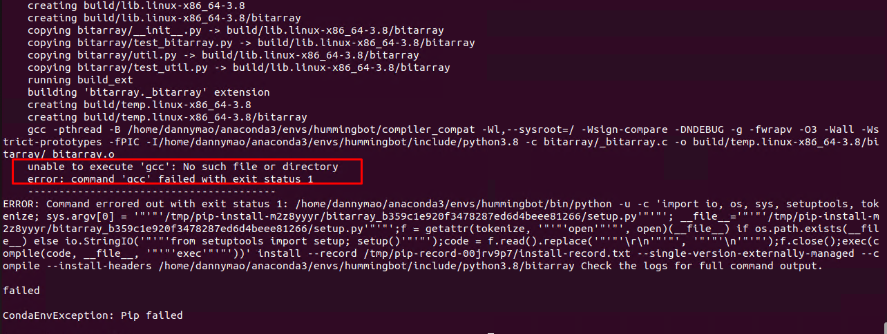
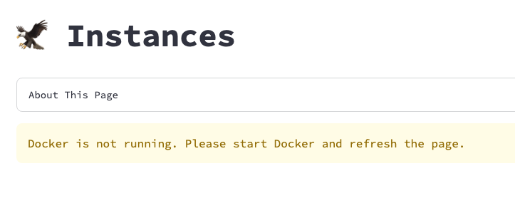
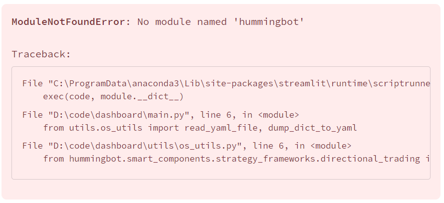
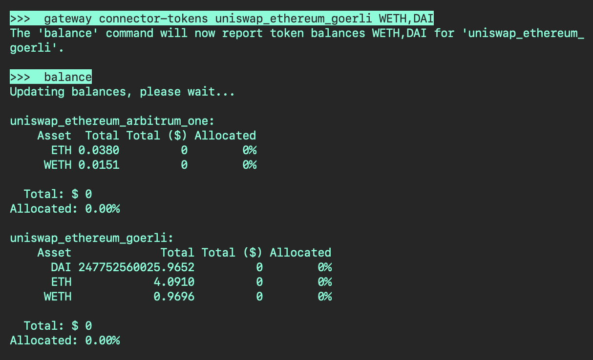
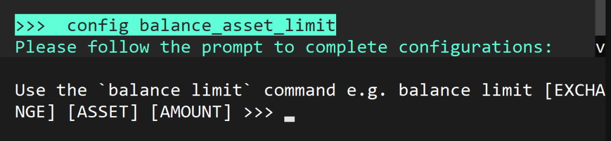
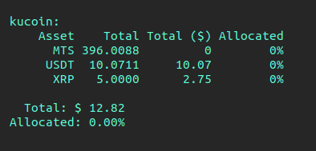

## Installation

### Docker: Permission denied error

```plaintext
docker: Got permission denied while trying to connect to the Docker daemon socket at
unix:///var/run/docker.sock...

```

The error message above indicates a permission issue while trying to access the Docker daemon socket. This is a common problem when trying to run Docker commands as a non-root user. To add your user to the docker group, use the following command:

```bash
sudo usermod -aG docker $USER

# Restart the terminal after running the command above, if it still doesn't work try the command below

sudo chmod 666 /var/run/docker.sock

```


### Source: conda command not found

```
$ conda
-bash: conda: command not found
```

Ensure Anaconda, Miniconda, or Miniforge (for arm64 systems) is installed. If you've just installed it, restart your terminal to refresh the command line environment.

### Source: ./install: line 40 ... Killed

```plaintext
Collecting package metadata (repodata.json): / ./install: line 40: 14981 Killed...

```
This error shows up during installation, typically on systems with 2GB RAM or less. Increase your system's RAM to at least 4GB, or consider adding a swap file if upgrading hardware is not feasible.

### Source: Could not find conda environment: hummingbot



This is related to the issue above. Check if there are any errors after running the `./install` script. If there are, you'll need to solve those first otherwise creating the hummingbot conda environment will fail. 

### Source: unable to execute `gcc`: No such file or directory



If getting this error you'll need to install the `build-essential` package. Run the command below to install - 

```bash
sudo apt update && sudo apt upgrade -y && sudo apt install -y build-essential
```

## Dashboard

### Failed to connect MQTT Bridge:

```bash
00:21:16 - hummingbot_application - Failed to connect MQTT Bridge: 
[Errno 111] Connection refused. Retrying in 10.0 seconds.
```

If you get this error, this usually means the Hummingbot Broker is not running, start the Broker from the Instances page and then restart all Hummingbot client instances. 


### Docker is not running. Please start Docker and refresh the page.



Make sure you have Docker installed. On Windows and MacOS machines make sure you have Docker Desktop running in the background. 

### No module named hummingbot



Note: The name of the missing module could be something else like `st_pages` etc. If you get this message this means the environment wasn't installed properly. Run the following steps in a terminal to reinstall - 

```bash
conda deactivate
make env_remove
make env_create
conda activate dashboard
make run
```

### Authentication page is not showing in Dashboard

By default the authentication system is disabled. 

Find the variable `AUTH_SYSTEM_ENABLED` in the `CONFIG.py` file and set it to `True` to enable the authentication page.

## V1 Strategies

## V2 Strategies

### AttributeError: 'hummingbot.connector.exchange.kraken.kraken_exchan' object has no attribute '_order_tracker'

```bash
Traceback (most recent call last):
  File "hummingbot/core/pubsub.pyx", line 165, in hummingbot.core.pubsub.PubSub.c_trigger_event
    typed_listener.c_call(arg)
  File "hummingbot/core/event/event_listener.pyx", line 25, in hummingbot.core.event.event_listener.EventListener.c_call
    self(arg)
  File "/home/hummingbot/hummingbot/core/event/event_forwarder.py", line 24, in __call__
    self._to_function(self.current_event_tag, self.current_event_caller, arg)
  File "/home/hummingbot/hummingbot/smart_components/executors/position_executor/position_executor.py", line 338, in process_order_created_event
    self.open_order.order = self.get_in_flight_order(self.exchange, event.order_id)
  File "/home/hummingbot/hummingbot/smart_components/smart_component_base.py", line 65, in get_in_flight_order
    order = connector._order_tracker.fetch_order(client_order_id=order_id)
AttributeError: 'hummingbot.connector.exchange.kraken.kraken_exchan' object has no attribute '_order_tracker'
2023-12-02 12:56:07,012 - 15 - hummingbot.core.event.event_reporter - EVENT_LOG - {"timestamp": 1701521767.0, "type": "OrderType.LIMIT", "trading_pair": "ETH-USDT", "amount": "0.01192817", "price": "2095.87", "order_id": "buy-ETH-USDT-1701521766935688", "creation_timestamp": 1701521766.0, "exchange_order_id": null, "leverage": 1, "position": "NIL", "event_name": "BuyOrderCreatedEvent", "event_source": "kraken"}

```

If you are getting this error on Kraken, or a similar error on a different exchange this is because the exchange connector doesn't currently support market orders which the PositionExecutor needs to close the position. 

## Connectors

### ValueError: No order book exists for 'BTC-USD'.

```
     2024-01-25 21:19:12,916 - 111864 - hummingbot.connector.exchange.kraken.kraken_api_user_stream_data_source - ERROR - Unexpected error with Kraken WebSocket connection. Retrying after 30 seconds...
Traceback (most recent call last):
  File "/home/martin_kou/Development/hummingbot/hummingbot/connector/exchange/kraken/kraken_api_user_stream_data_source.py", line 100, in listen_for_user_stream
    self._current_auth_token = await self.get_auth_token()
  File "/home/martin_kou/Development/hummingbot/hummingbot/connector/exchange/kraken/kraken_api_user_stream_data_source.py", line 89, in get_auth_token
    return response_json["result"]["token"]
KeyError: 'result'

  File "hummingbot/connector/exchange_base.pyx", line 158, in hummingbot.connector.exchange_base.ExchangeBase.c_get_price
    OrderBook order_book = self.c_get_order_book(trading_pair)
  File "hummingbot/connector/exchange/kraken/kraken_exchange.pyx", line 1050, in hummingbot.connector.exchange.kraken.kraken_exchange.KrakenExchange.c_get_order_book
    raise ValueError(f"No order book exists for '{trading_pair}'.")
ValueError: No order book exists for 'BTC-USD'.


```

If you get this error make sure that when you created the API keys you also checked the **Access Websockets API** option.


## Gateway

### Client is stuck on `"script_strategy_base - uniswap_ethereum_mainnet is not ready. Please wait..."`

You'll need to approve tokens that you are trading. See below for an example if you are trading WETH on Ethereum mainnet

```bash
gateway approve-tokens uniswap_ethereum_mainnet WETH
```

!!! note
    When approving tokens, if you get a "Token not Supported" error, please make sure to add the token address in the tokenlist manually. The token list can be found in the `./conf/list` folder

### Tokens not showing in `balance` command



Use the following command to display token balances for different networks. 

```bash
>>> gateway connector-tokens uniswap_ethereum_goerli WETH,DAI
```


## Misc


### Unable to paste, getting an error message

```bash
 Pyperclip could not find a copy/paste mechanism for your system.
    For more information, please visit https://pyperclip.readthedocs.io/en/latest/introduction.html#not-implemented-error
```

This error comes up because <kbd>CTRL</kbd> + <kbd>V</kbd> doesn't work in Hummingbot. Try any of the following shortcuts below to paste. 

```
Shift + Insert 
CTRL + SHIFT + Right Click  
CTRL + SHIFT + V
```

### How to exit a config



Press <kbd>CTRL</kbd> + <kbd>X</kbd> if you want to cancel out of the configuration 

### Balance showing but it's not showing Total in ($)



If one or more tokens is showing 0 `Total in ($)`, use the command below to change your rate oracle source. By default, the `rate_oracle_source` is set to `Binance` and if the token is not available in Binance then the `Total in ($)` will show 0. 

```bash
config rate_oracle_source
```
