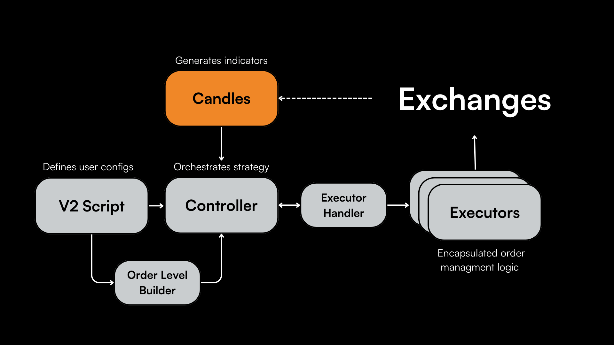

## Overview

The Candles component allows users to maintains a moving window of data and indicators that can be used in their strategy. It is a vital feature for traders to generate custom OHLCV (Open, High, Low, Close, Volume) candles. It combines historical and real-time data, allowing the creation of real-time custom technical indicators with the use of [pandas_ta](https://github.com/twopirllc/pandas-ta).

## Usage Examples

### Initializing Candles

Create an instance of a candle for `BTC-USDT` from Binance Spot:

```python
class InitializingCandlesExample(ScriptStrategyBase):
    candles = CandlesFactory.get_candle("binance", "BTC-USDT", "3m")
    ...
```

### Logging Candles on Tick

To log candle data periodically, you can use the `on_tick` method:

```python
def on_tick(self):
    self.logger().info(self.candles.candles_df)
```

### Multiple Candles Initialization

For strategies that require multiple candle intervals or trading pairs, initialize separate instances:

```python
class InitializingCandlesExample(ScriptStrategyBase):
    candles_1 = CandlesFactory.get_candle("binance", "BTC-USDT", "3m")
    candles_2 = CandlesFactory.get_candle("binance_perpetual", "ETH-USDT", "1m")
    ...
```

### Relevant Scripts

For practical examples of the Candles component in action, visit the following scripts in the Hummingbot codebase:

- [download_candles.py](https://github.com/hummingbot/hummingbot/blob/master/scripts/download_candles.py)
- [candles_example](https://github.com/hummingbot/hummingbot/blob/master/scripts/archived_scripts/examples_using_data_feeds/candles_example.py)
- [simple_directional_strategy_example](https://github.com/hummingbot/hummingbot/blob/master/scripts/archived_scripts/examples_using_smart_components/directional_strategy_rsi_spot.py)
- [advanced_directional_strategy_example](https://github.com/hummingbot/hummingbot/blob/master/scripts/archived_scripts/examples_using_smart_components/directional_strategy_trend_follower.py)

These scripts show how to effectively use the Candles component within trading strategies and data analysis tasks.


## Available Exchanges

Currently, the following exchanges support the Candles component:

#### Spot Exchanges
- Binance (`binance_spot`)
- KuCoin (`kucoin`)
- Gate.io (`gate_io`)
- AscendEX (`ascendex`)

#### Perpetual Exchanges
- Binance (`binance_perpetual`)
- KuCoin (`kucoin_perpetual`)
- Gate.io (`gate_io_perpetual`)


To fetch candles from one of these exchanges, apply the `connector_name` above in the `get_candle` method of `CandlesFactory`:

```python
CandlesFactory.get_candle(connector_name: str, trading_pair: str, interval:str = "1m", max_records:int = 500)
```


## Key Methods and Properties

### Candles Factory

The [CandlesFactory](https://github.com/hummingbot/hummingbot/blob/13aab912ea297a70e52f560cc7239400a1204aa6/hummingbot/data_feed/candles_feed/candles_factory.py) class creates and returns a Candle object  based on the specified connector and trading pair. It has a class method `get_candle` which takes in a connector, trading pair, interval, and max_records as parameters.

The `CandlesBase` class is the cornerstone for fetching and storing candle data from exchanges. It ensures compatibility across different connectors by utilizing REST and WebSocket connections for data retrieval.

**Key Features:**

- Inherits from `NetworkBase`, ensuring network reliability and consistency.
- Utilizes Rest and WS Assistants for all I/O operations.
- Incorporates a double-ended queue to store candles efficiently.
- Implements the Throttler module for API rate limiting.

Below are the key methods and properties available in a Candles object. See [BinancePerpetualsCandles](https://github.com/hummingbot/hummingbot/blob/13aab912ea297a70e52f560cc7239400a1204aa6/hummingbot/data_feed/candles_feed/binance_perpetual_candles/binance_perpetual_candles.py) or [BinanceSpotCandles](https://github.com/hummingbot/hummingbot/tree/13aab912ea297a70e52f560cc7239400a1204aa6/hummingbot/data_feed/candles_feed/binance_spot_candles) for examples.

### `get_candle` Method

A static method from the `CandlesFactory` class to obtain candle data:

```python
CandlesFactory.get_candle(connector_name: str, trading_pair: str, interval:str = "1m", max_records:int = 500)
```

Parameters:

- `connector_name`: Identifies the data source, like `binance` or `binance_perpetual`.
- `trading_pair`: The trading pair in 'BASE-QUOTE' format, e.g., `BTC-USDT`.
- `interval`: The time interval between candles.
- `max_records`: Maximum number of candles to store.

### `start` and `stop` Methods

Essential for initializing and terminating the candle data stream:

```python
def start(self):
    ...
def stop(self):
    ...
```

- `start()`: Begin streaming and collecting candle data.
- `stop()`: Terminate the candle data stream.

### `is_ready` Property

Confirms if the candle data set is complete:

```python
@property
def is_ready(self):
    ...
```

### `candles_df` Property

Accesses the latest DataFrame of candle data:

```python
@property
def candles_df(self):
    ...
```
