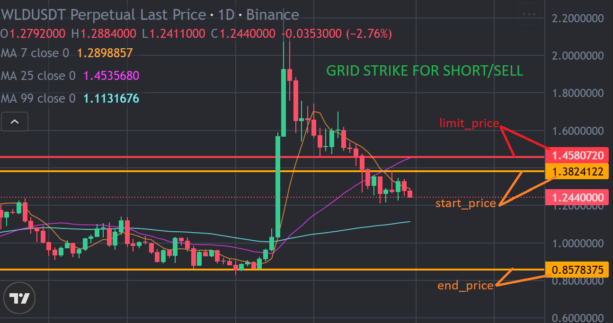
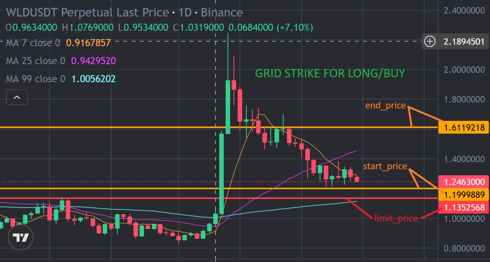
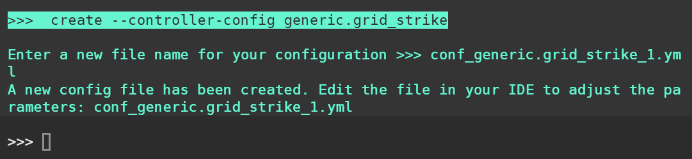

# Grid Strike Quickstart Guide

The **Grid Strike** strategy is a trading method in Hummingbot's V2 framework that automatically places a series of buy or sell orders within a set price range, creating what’s called a “grid.” Unlike traditional grid trading that works best in sideways markets, Grid Strike is designed to move with the market trend—either up or down.

This guide breaks the concept down into simple terms so that even non-technical users can follow along.

## Prerequisites

Before you can use Grid Strike, make sure you:

- Have Hummingbot CLI installed via Docker or Source: [Docker Installation](/installation/docker) | [Source Installation](/installation/source)

- Optionally, you can also use the [Hummingbot Dashboard Quickstart Guide](../../blog/posts/quickstart-dashboard/index.md) for a simpler setup.


## How Grid Strike Works

Think of Grid Strike as a way to “ride the wave” of a trend:

**Going Short (Betting on Price Going Down)**

If you expect the price to fall, Grid Strike places sell (short) orders at gradually lower prices. As the market moves downward, these orders are triggered one by one, building up your short position and letting you profit from the downtrend.

- If you are anticipating for continuing downtrend movement, you can setup the Grid Strike with `start_price` above the `end_price` as shown below.
        

        

**Going Long (Betting on Price Going Up)**

If you think the price will rise, Grid Strike places buy (long) orders at gradually higher prices. As the price climbs, your orders are triggered, adding to your long position and helping you profit from the uptrend.

- Conversely, if you are anticipating for price reversal at support level or continuing uptrend, you can setup the Grid Strike with `start_price` below the `end_price` as shown below.
        

        

This "averaging into a trend" approach is the key difference. A traditional grid buys low and sells high in a sideways range (fighting the momentum), whereas Grid Strike joins the momentum, adding to a winning long or short position as the trend develops in your favor.

**Key difference from a normal grid**: A regular grid tries to “fight the market” by buying low and selling high in sideways movement. Grid Strike instead follows the trend, adding more to your winning position as the market confirms your prediction.

## The Three Building Blocks of Grid Strike

To set up Grid Strike effectively, you need to balance three factors:

### Price Range

This is the zone where your orders will be placed.

- Narrow range: Best for calm markets with little movement.

- Wide range: Better for volatile assets but spreads orders out more thinly.

Example:

```
Price Range = end_price - start_price
Your case: $6.8 - $5.5 = $1.3
Price Range % = ($1.3 / $5.5) × 100 = 23.6%
```
    

### Capital Support (Your Budget)

How much money you set aside determines how many orders the bot can place.

- The bot divides your budget by the minimum allowed order size from the exchange.

- Each order level requires money reserved upfront. If you don’t have enough funds for all orders, the bot won’t place them.

Example:

```
# capital support
Max Orders by Budget = total_amount_quote ÷ min_order_amount_quote
Your case: $100 ÷ $7 = 14.28 ≈ 14 orders maximum
```
    
   

### Spread Support (Order Spacing) 📏

This is how far apart your orders are from each other, controlled by the **minimum spread**.

- **Small spread (e.g., 0.5%)** = more orders close together → captures small moves but needs more funds.

- **Large spread (e.g., 2%)** = fewer, wider orders → targets bigger moves and uses less capital.

Example:

```python
Max Levels = Price Range % ÷ min_spread_between_orders
Your case: 23.6% ÷ 0.7% = 33.7 levels (theoretical max)
```
    
Your final grid will be a balance of these three factors. The bot will create the maximum number of orders it can, respecting both your capital limit and the minimum spread you've set within your chosen price range.

## Running Grid Strike

### Create Controller and Script Config: 

- In Hummingbot client:

```
create --controller-config generic.grid_strike
```

- Example filename: `conf_generic.grid_strike_1.yml`
    

    
- Edit the `conf_generic.grid_strike_1.yml` file in `/hummingbot/conf/controllers` and set parameters like:

- Budget (`total_amount_quote`)

- Exchange (`connector_name`), 

- Trading Pair (e.g. BTC-USDT)

- Direction (`side` = buy or sell) 

- Start price and end price

Create Script Config 

```
create --script-config v2_with_controllers
```

- Enter the controller configuration you just made (e.g `conf_generic.grid_strike_1.yml`)

- Example filename: `conf_v2_with_controllers_1.yml`
    

    
Start the Strategy: 

```
start --script v2_with_controllers.py --conf conf_v2_with_controllers_1.yml
```

When you start the Grid Strike strategy, it first looks at your configuration to figure out how to set up your trading grid. Once the grid is set up, the strategy begins placing orders based on the set `side` (buy or sell) within your specified price range. It places order and waits for it to fill. Whenever `order_frequency` is reached, it checks if it needs to place a new order.


When an order gets filled and opens a position, the Triple Barrier system immediately takes over to manage that specific trade. This system acts like your personal risk manager - it will automatically close the position if it reaches the `take_profit` or if it moves from the set `stop_loss` against you. This happens automatically without you having to watch the screen. The strategy then continues this cycle: place a sell order, wait for it to fill, let the Triple Barrier manage the position until it closes, then place another sell order. This creates a continuous trading loop that tries to capture small profits repeatedly while keeping your risk controlled.

## Key Configuration Parameters

Here are some of the most important settings:

| Parameter | Meaning |
| --- | --- |
| **total_amount_quote** | Your budget for the bot (e.g., 1000 USDT) |
| **connector_name** | The exchange to trade on (e.g., `binance_perpetual`) |
| **trading_pair** | Market you want to trade (e.g., `WLD-USDT`) |
| **side** | 1 = Buy (long), 2 = Sell (short) |
| **start_price / end_price** | The price range where your orders will be placed |
| **limit_price** | If price crosses this, the bot stops trading |
| **min_spread_between_orders** | Minimum spacing between orders (e.g., 0.001 = 0.1%) |
| **min_order_amount_quote** | Smallest order size allowed by exchange |
| **order_frequency** | How often the bot checks for new orders (in seconds) |

## Triple Barrier Risk Control

| Setting | Meaning |
| --- | --- |
| **stop_loss** | Automatically close the trade if it moves against you |
| **take_profit** | Close the trade once profit target is reached |
| **time_limit** | Close the trade after a set time, win or lose |
| **order_type** | Choose between Market, Limit, or Limit-Maker orders |

## Summary
- **Grid Strike is trend-following.** It helps you profit by adding to positions as the market moves in your predicted direction.
- **Balance is key.** Your success depends on setting the right range, budget, and spacing.
- **Risk is managed.** The Triple Barrier system ensures trades close safely.

In short: Grid Strike is like setting a smart autopilot for your trading—joining the market’s trend while protecting your account from unexpected moves.