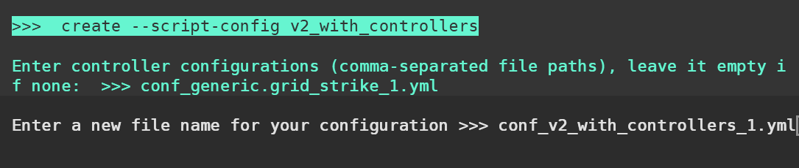

# Grid Strike – Quickstart Guide

## Description

- What are capital and spread support?
    - Capital support answers "How many orders can I afford?"
    - Spread support answers "How many orders fit my strategy?"
    - The grid executor evaluates both constraints and generates the price levels:

```python
n_level = min(max_possible_levels, max_levels_by_step)
```

### Configuration Parameters

| Parameter | Example | Description |
| --- | --- | --- |
| id | `Bq7FZj...` | Unique identifier for this controller configuration (string). |
| controller_name | `grid_strike` | Logical name of the controller strategy used by the system. |
| controller_type | `generic` | Category used by orchestration (for example, generic or specialized). |
| total_amount_quote | `1000` | Total amount in quote currency allocated to this controller (stored as a string to preserve precision). |
| manual_kill_switch | `true` / `false` | When `true`, the operator must manually start and stop the controller. |
| candles_config | `[]` | List of candle/timeframe configurations used for indicators (`[]` means none). |
| initial_positions | `[]` | Any pre-seeded positions the controller assumes on start (`[]` means none). |
| leverage | `20` | Leverage used for margin or perpetual connectors (integer). |
| position_mode | `HEDGE` / `ONEWAY` | How the exchange represents long and short positions. |
| connector_name | `binance_perpetual` | Exchange connector used by the controller. |
| trading_pair | `WLD-USDT` | Market pair in BASE-QUOTE format. |
| side | `1` | Trading bias: `1` opens long positions, `-1` opens short positions. |
| start_price | `0.58` | Lower bound of the grid range. |
| end_price | `0.95` | Upper bound of the grid range. |
| limit_price | `0.55` | Safety price that stops the grid and cancels open orders. |
| min_spread_between_orders | `0.001` | Minimum fractional spacing between adjacent grid orders (0.001 = 0.1%). |
| min_order_amount_quote | `5` | Minimum order size in quote currency (prevents dust orders). |
| max_open_orders | `2` | Maximum number of open orders maintained at any time. |
| max_orders_per_batch | `1` | Maximum number of orders created or canceled in one cycle. |
| order_frequency | `3` | Controller evaluation interval in seconds. |
| activation_bounds | `null` | Optional `[low, high]` activation range; `null` disables bounds. |
| keep_position | `true` / `false` | When `true`, the controller keeps existing positions instead of closing them. |

### Triple Barrier Configuration

| Parameter | Example | Description |
| --- | --- | --- |
| open_order_type | `3` | Numeric enum for the order type used to open grid orders (connector-specific mapping). |
| stop_loss | `null` | Stop-loss threshold; `null` disables the stop loss. |
| stop_loss_order_type | `1` | Order type used when triggering the stop loss. |
| take_profit | `0.001` | Take-profit threshold expressed as a fraction or price delta. |
| take_profit_order_type | `3` | Order type used when taking profit. |
| time_limit | `null` | Duration in seconds before a time-limit exit triggers; `null` disables the timer. |
| time_limit_order_type | `1` | Order type used after the time limit expires. |
| trailing_stop | `null` | Trailing stop configuration; `null` disables trailing stops. |

### How does the strategy work?

💡 The grid strategy does not adjust parameters automatically. Prepare your configuration in advance:

1. **Price range** — how wide your grid spans.
2. **Spread between orders** — how tightly the grid is packed.
3. **Budget allocation** — total capital divided by order size.

#### Pre-planning the grid

- Calculate the total price range.

```python
price_range = end_price - start_price
# Example:
# $6.8 - $5.5 = $1.3
price_range_pct = (price_range / start_price) * 100
# 23.6%
```

- Determine the theoretical maximum levels.

```python
max_levels = price_range_pct / min_spread_between_orders
# 23.6% / 0.7% ≈ 33.7 levels
```

- Check the capital constraint.

```python
max_orders_by_budget = total_amount_quote / min_order_amount_quote
# $100 / $7 ≈ 14 orders
```

In this scenario you have $100 in total and $7 per order. To respect both constraints, adjust `min_spread_between_orders` until the number of levels fits within the budget. Using AI assistance, you might compute:

```
levels = price_range_pct / 1.7% ≈ 13.9 levels
```

#### Pricing each level

```python
step = (end_price - start_price) / (number_of_levels - 1)
# (6.8 - 5.5) / (13 - 1) = 0.1083333333
```

The resulting prices are:

```
Level 1:  5.5000 (start_price)
Level 2:  5.6083
Level 3:  5.7167
...
Level 13: 6.8000 (end_price)
```



When you start the Grid Strike strategy it reads the configuration and builds the grid. It then places orders based on the `side` within the defined price range. The strategy places an order and waits for it to fill. Each time `order_frequency` elapses, it evaluates whether to place the next order.

When an order fills and opens a position, the Triple Barrier system immediately manages that trade. It closes the position automatically if price reaches `take_profit` or moves against you to the `stop_loss`. The process repeats: place the next order, wait for a fill, let Triple Barrier manage the position, and continue cycling for incremental gains while controlling risk.

If any position hits the stop loss, the controller terminates the entire grid and stops trading. Keep the current market price and your stop levels in sync to avoid an unwanted shutdown.

### How do the start, end, and limit prices work?

- `start_price` and `end_price` define the active trading band. The controller only runs when the market price stays within this range.
- `limit_price` is the safety trigger. If price crosses it, the bot cancels open orders and may close positions depending on `keep_position`.

Examples:

- **Buy grid**: `side = 1`, `start_price = 0.9`, `end_price = 1.0`, `limit_price = 0.8`. The bot buys between 0.9 and 1.0 and stops if price falls to 0.8.
- **Sell grid**: `side = -1`, `start_price = 0.9`, `end_price = 1.0`, `limit_price = 1.5`. The bot sells between 0.9 and 1.0 and stops if price rises to 1.5.

### How are orders placed, canceled, and filled?

When the controller has the opportunity to place orders, it checks these parameters:

- `max_open_orders = 3`
- `max_orders_per_batch = 2`
- `order_frequency = 30`
- `activation_bounds = 0.01`
- `min_order_amount_quote = 7`

Assume the market price is $6. The controller first counts its active orders and ensures the total stays below `max_open_orders`. With no active orders, it can place up to `max_orders_per_batch`, creating two orders at $6.06 and $6.20. Orders that remain within the `activation_bounds` (±1%) stay active and can be filled.

If price drops to $5.80, the 1% activation band becomes $5.74 to $5.85. Orders outside the band are canceled. The controller waits for the next `order_frequency` interval before attempting new orders. Once the timer elapses, it repeats the `max_open_orders` check and places replacements as needed. Each order uses the `min_order_amount_quote`, which is $7 in this example.


### When does a grid stop and restart?

`grid_strike` stops in these situations:

- You manually stop the strategy.
- Price moves beyond `limit_price`.
- The Triple Barrier `stop_loss` triggers.
- `time_limit` expires, if enabled.
- Price travels entirely through the profitable side of the grid.

The `generic.grid_strike` controller keeps the range defined in `controller-config.yml`; it does not redraw the grid. Whether it restarts automatically depends on why it stopped:

- **Stopped outside the range (limit_price)**: The controller waits until price re-enters the grid band, then places orders near the next grid level.
- **Stopped inside the range (stop_loss or time_limit)**: Because price remains inside the original band, the controller restarts immediately and resumes placing orders near the grid levels.
