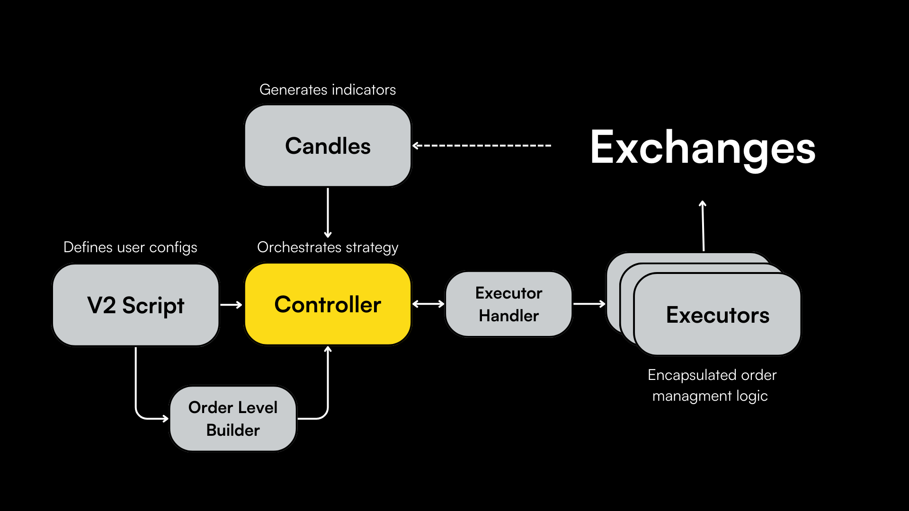
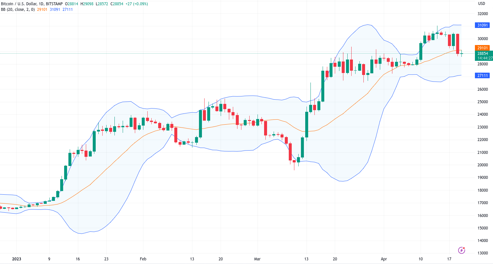

The **Controller** is a pivotal component in Hummingbot's V2 strategy framework, orchestrating the overall strategy behavior. It is responsible for fetching and processing data from [Candles](../candles), computing signals, and instructing [Executors](../executors/) to respond to these signals appropriately.

## Sample Controllers

The sample controllers in the codebase, which are paired with scripts that define how they are used, allow users to create directional and market making strategies:

- [`MACD_BB V1`](https://github.com/hummingbot/hummingbot/blob/master/hummingbot/smart_components/controllers/macd_bb_v1.py) introduces a simple directional strategy that uses MACD and Bollinger Bands indicators
- [`DMan-V1`](https://github.com/hummingbot/hummingbot/blob/master/hummingbot/smart_components/controllers/dman_v1.py) introduces a market making strategy that utilizes Candles indicators to dynamically set spreads
- [`DMan-V2`](https://github.com/hummingbot/hummingbot/blob/master/hummingbot/smart_components/controllers/dman_v2.py) utilizes additional indicators to dynamically shift the mid price
- [`DMan-V3`](https://github.com/hummingbot/hummingbot/blob/master/hummingbot/smart_components/controllers/dman_v3.py) utilizes Bollinger Band-based indicators and introduces new parameters like `side_filter` and `smart_activation`, allowing it be used in more flexible ways


## Controller in Detail

Below, we walk through the [`DMan-V3 controller`](https://github.com/hummingbot/hummingbot/blob/master/hummingbot/smart_components/controllers/dman_v3.py) in greater detail.

The DManV3 controller implements a mean reversion-style market making strategy that utilizes Bollinger Bands to dynamically set spreads and prices, enabling you to trade on multiple pairs with the same configuration.



Bollinger Bands consist of three lines: a simple moving average (SMA) line, an upper band, and a lower band. The upper and lower bands are calculated by adding and subtracting a multiple of the standard deviation of the asset's price from the SMA line.

### Configuration

The key variables are the assumptions used to set the bands:

- `strategy_name`: Identifier for the strategy.
- `bb_length`: Number of periods used for Bollinger Bands calculation.
- `bb_std`: Number of standard deviations away from the moving average.

Here, `bb_length` is the number of Candle intervals used to calculate the SMA, or the Bollinger Band midline, while `bb_std` is the number of standard deviations defined by the upper and lower bands.

```python
class DManV3Config(MarketMakingControllerConfigBase):
    strategy_name: str = "dman_v3"
    bb_length: int = 100
    bb_std: float = 2.0
    ...
```

### `get_processed_data` Method

The `get_processed_data` method is central to a Controller's functionality, since it defines how the data collected from Candles is used. 

Below, the DmanV3 implementation fetches the latest candlestick data and calculates price and spread multipliers using Bollinger Bands which dynamically adjust the mid price and order spreads utilized by Executors.

```python
def get_processed_data(self):
    candles_df = self.candles[0].candles_df
    bbp = ta.bbands(candles_df["close"], length=self.config.bb_length, std=self.config.bb_std)

    candles_df["price_multiplier"] = bbp[f"BBM_{self.config.bb_length}_{self.config.bb_std}"]
    candles_df["spread_multiplier"] = bbp[f"BBB_{self.config.bb_length}_{self.config.bb_std}"] / 200
    return candles_df
```

For each pair defined in the [V2 Script](../v2-scripts/), `spread_multiplier` is used to determine spreads for a particular [Order Level](../order-levels/). Thus, each set of orders are based on the Bollinger Band data generated from the Candles for that particular pair.

### `side_filter` Feature

The `side_filter` is a configuration setting in the DmanV3 controller that, when enabled (`true`), restricts order placement to only one side of the order book. This feature is particularly useful in strategies where the trader has a directional bias or wishes to avoid taking positions that contradict a predicted market movement.

Here's how the `side_filter` works within the `get_position_config` method:

```python
# Avoid placing the order from the opposite side
side_filter_condition = self.config.side_filter and (
    (bollinger_mid_price > close_price and side_multiplier == 1) or
    (bollinger_mid_price < close_price and side_multiplier == -1))
if side_filter_condition:
    return
```

When `side_filter` is active, and the condition is met—either the mid-price from Bollinger Bands is greater than the close price for buys, or less for sells—the method returns without creating a `PositionConfig`. This behavior ensures that orders are only placed in alignment with the prevailing market trend or strategy's directional bias.


### `smart_activation` Feature

The `smart_activation` setting allows the DmanV3 controller to place orders conditionally rather than immediately, based on specific market conditions. This feature enables a strategy to be more responsive to market movements, avoiding premature or undesired entry.

In the `get_position_config` method, `smart_activation` works as follows:

```python
# Smart activation of orders
smart_activation_condition = self.config.smart_activation and (
    side_multiplier == 1 and (close_price < order_price * (1 + self.config.activation_threshold)) or
    (side_multiplier == -1 and (close_price > order_price * (1 - self.config.activation_threshold))))
if smart_activation_condition:
    return
```

With `smart_activation` enabled, the method checks if the market price is within a threshold relative to the desired order price—adjusted for the activation threshold. If the price is outside this range, indicating that the market conditions are not favorable for order placement, the method exits without creating a `PositionConfig`. This ensures that orders are only activated when the market price meets the strategy's specific conditions, thus implementing a form of conditional execution.


### Conditional Methods

These methods allow users to control the set of deployed Executors based on Candles data:

```python
def refresh_order_condition(self, executor: PositionExecutor, order_level: OrderLevel) -> bool:
        """
        Checks if the order needs to be refreshed.
        You can reimplement this method to add more conditions.
        """
        if executor.position_config.timestamp + order_level.order_refresh_time > time.time():
            return False
        return True

def early_stop_condition(self, executor: PositionExecutor, order_level: OrderLevel) -> bool:
    """
    If an executor has an active position, should we close it based on a condition.
    """
    return False

def cooldown_condition(self, executor: PositionExecutor, order_level: OrderLevel) -> bool:
    """
    After finishing an order, the executor will be in cooldown for a certain amount of time.
    This prevents the executor from creating a new order immediately after finishing one and execute a lot
    of orders in a short period of time from the same side.
    """
    if executor.close_timestamp and executor.close_timestamp + order_level.cooldown_time > time.time():
        return True
    return False
```