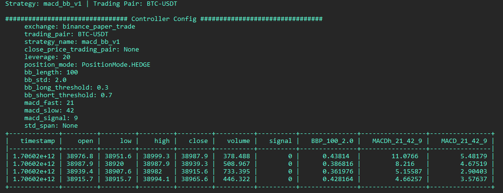
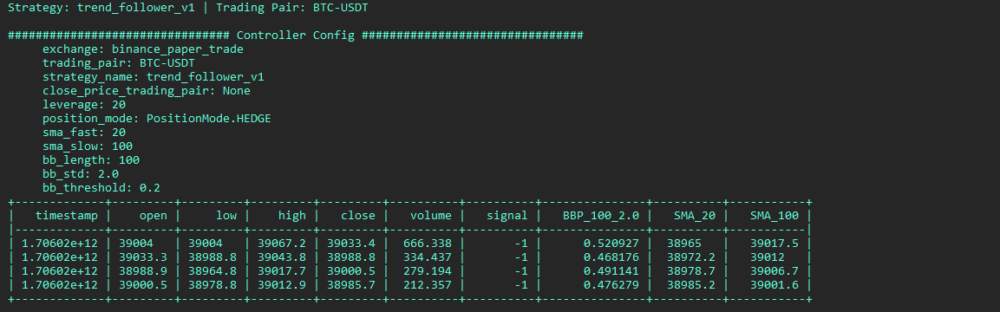
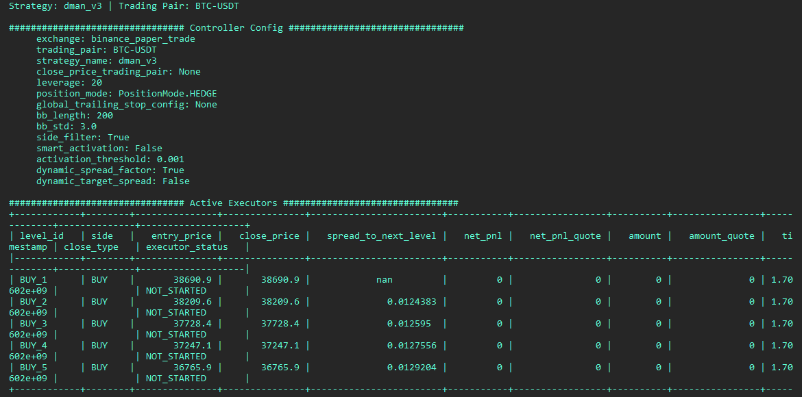

<!-- - [`MACD_BB V1`](https://github.com/hummingbot/hummingbot/blob/master/hummingbot/smart_components/controllers/macd_bb_v1.py) introduces a simple directional strategy that uses MACD and Bollinger Bands indicators
- [`DMan-V1`](https://github.com/hummingbot/hummingbot/blob/master/hummingbot/smart_components/controllers/dman_v1.py) introduces a market making strategy that utilizes Candles indicators to dynamically set spreads
- [`DMan-V2`](https://github.com/hummingbot/hummingbot/blob/master/hummingbot/smart_components/controllers/dman_v2.py) utilizes additional indicators to dynamically shift the mid price
- [`DMan-V3`](https://github.com/hummingbot/hummingbot/blob/master/hummingbot/smart_components/controllers/dman_v3.py) utilizes Bollinger Band-based indicators and introduces new parameters like `side_filter` and `smart_activation`, allowing it be used in more flexible ways -->

## Running V2 Strategies

The main logic in a V2 strategy is contained in the [Controller](../controllers), which inherits from a base class like Directional or Market Making, that orchestrates various smart components like [Candles](../candles) and [Executors](../executors/) to implement the strategy logic.

For users, their primary interface is the [V2 Script](../index.md), a file that defines the configuration parameters and serves as the bridge between the user and the strategy.

To generate a configuration file for a script, run:

```
create --script-config [SCRIPT_FILE]
```

The auto-complete for `[SCRIPT_FILE]` will only display the scripts in the local `/scripts` directory that are configurable.

You will be prompted to define the strategy parameters, which are saved in a YAML file in the `conf/scripts` directory. Afterwards, you can run the script by specifying this config file:

```
start --script [SCRIPT_FILE] --conf [SCRIPT_CONFIG_FILE]
```

The auto-complete for `[SCRIPT_CONFIG_FILE]` will display config files in the local `/conf/scripts` directory.


## Directional Strategies

Directional strategies inherit from the [DirectionalTrading](https://github.com/hummingbot/hummingbot/blob/e30406a2d41f1f9c741c29f449f477ab9ad7e4e5/hummingbot/smart_components/strategy_frameworks/directional_trading/directional_trading_controller_base.py) strategy base class.

In their controller's `get_processed_data` function, a directional strategy uses technical indicators derived from [Candles](/v2-strategies/data/) to define thresholds which trigger long and short conditions using the `signal` parameter:

* `1`: Long [Position Executor](/v2-strategies/executors/#positionexecutor) is created
* `-1`: Short [Position Executor](/v2-strategies/executors/#positionexecutor) is created

Here are the current V2 directional strategies:

### Bollinger V1

A simple directional strategy using [Bollinger Band Percent (BBP)](/glossary/#bollinger-bands). BBP measures an asset's price relative to its upper and lower Bollinger Bands, and this strategy uses the current BBP to construct long/short signals.

**Code:**

* Controller: [bollinger_v1.py](https://github.com/hummingbot/hummingbot/blob/development/hummingbot/smart_components/controllers/bollinger_v1.py)
* Script: [v2_bollinger_config.py](https://github.com/hummingbot/hummingbot/blob/development/scripts/v2_bollinger_v1_config.py)

**Creating a Config File**:

```
create --script-config v2_bollinger_v1_config
```

**User Defined Parameters**

Below are the user-defined parameters when the `create` command is run: 

| Parameter      | Type | Prompt |
|----------------|------|--------|
| exchange       | trading     | Enter the name of the exchange where the bot will operate (e.g., binance_perpetual) |
| trading_pairs  | trading     | List the trading pairs for the bot to trade on, separated by commas (e.g., BTC-USDT,ETH-USDT) |
| leverage       | trading     | Set the leverage to use for trading (e.g., 20 for 20x leverage) |
| stop_loss      | PositionExecutor     | Set the stop loss percentage (e.g., 0.01 for 1% loss): |
| take_profit    | PositionExecutor     | Enter the take profit percentage (e.g., 0.03 for 3% gain): |
| time_limit     | PositionExecutor     | Set the time limit in seconds for the triple barrier (e.g., 21600 for 6 hours): |
| trailing_stop_activation_price_delta | PositionExecutor     | Enter the activation price delta for the trailing stop (e.g., 0.008 for 0.8%): |
| trailing_stop_trailing_delta | PositionExecutor     | Set the trailing delta for the trailing stop (e.g., 0.004 for 0.4%): |
| order_amount_usd | orders     | Enter the order amount in USD (e.g., 15): |
| cooldown_time  |   orders   | Specify the cooldown time in seconds between order placements (e.g., 15): |
| candles_exchange | candles     | Enter the exchange name to fetch candle data from (e.g., binance_perpetual): |
| candles_interval | candles     | Set the time interval for candles (e.g., 1m, 5m, 1h): |
| bb_length      | strategy     | Enter the Bollinger Bands length (e.g., 100): |
| bb_std         | strategy     | Set the standard deviation for the Bollinger Bands (e.g., 2.0): |
| bb_long_threshold | strategy     | Specify the long threshold for Bollinger Bands (e.g., 0.3): |
| bb_short_threshold | strategy     | Define the short threshold for Bollinger Bands (e.g., 0.7): |


In addition, the script may define other parameters that don't have the `prompt_on_new` flag.

**Starting the Script**:

```
start --script v2_bollinger_v1_config.py --conf [SCRIPT_CONFIG_FILE]
```


**Status**

The screenshot below show what is displayed when the `status` command is run:

[](./status-bollinger.png)


### MACD-BB

A directional strategy that combines **MACD** and Bollinger Bands to generate long/short signals. This strategy uses MACD for trend identification and Bollinger Bands for volatility and price level analysis.

**Code:**

* Controller: [macd_bb_v1.py](https://github.com/hummingbot/hummingbot/blob/development/hummingbot/smart_components/controllers/macd_bb_v1.py)
* Script: [v2_macd_bb_v1_config.py](https://github.com/hummingbot/hummingbot/blob/development/scripts/v2_macd_bb_v1_config.py)

**Creating a Config File**:

```
create --script-config v2_macd_bb_v1_config
```

**User Defined Parameters**

Below are the user-defined parameters when the `create` command is run: 

| Parameter      | Type  | Prompt |
|----------------|-------|--------|
| exchange       | trading | Enter the name of the exchange where the bot will operate (e.g., binance_perpetual) |
| trading_pairs  |  trading | List the trading pairs for the bot to trade on, separated by commas (e.g., BTC-USDT,ETH-USDT) |
| leverage       |  trading | Set the leverage to use for trading (e.g., 20 for 20x leverage) |
| stop_loss      | PositionExecutor | Set the stop loss percentage (e.g., 0.01 for 1% loss) |
| take_profit    | PositionExecutor| Enter the take profit percentage (e.g., 0.06 for 6% gain) |
| time_limit     | PositionExecutor| Set the time limit in seconds for the triple barrier (e.g., 86400 for 24 hours) |
| trailing_stop_activation_price_delta | PositionExecutor| Enter the activation price delta for the trailing stop (e.g., 0.01 for 1%) |
| trailing_stop_trailing_delta | PositionExecutor | Set the trailing delta for the trailing stop (e.g., 0.004 for 0.4%) |
| order_amount_usd | orders | Enter the order amount in USD (e.g., 15) |
| cooldown_time | orders | Specify the cooldown time in seconds between order placements (e.g., 15) |
| candles_exchange | candles | Enter the exchange name to fetch candle data from (e.g., binance_perpetual) |
| candles_interval | candles | Set the time interval for candles (e.g., 3m) |
| macd_fast | strategy | Set the MACD fast length (e.g., 21) |
| macd_slow | strategy | Specify the MACD slow length (e.g., 42) |
| macd_signal | strategy | Define the MACD signal length (e.g., 9) |
| bb_length | strategy | Enter the Bollinger Bands length (e.g., 100) |
| bb_std | strategy | Set the standard deviation for the Bollinger Bands (e.g., 2.0) |
| bb_long_threshold | strategy | Specify the long threshold for Bollinger Bands (e.g., 0.3) |
| bb_short_threshold | strategy | Define the short threshold for Bollinger Bands (e.g., 0.7) |

In addition, the script may define other parameters that don't have the `prompt_on_new` flag.

**Starting the Script**:

```
start --script v2_macd_bb_v1_config.py --conf [SCRIPT_CONFIG_FILE]
```

**Status**

The screenshot below show what is displayed when the `status` command is run:

[](./status-macdbb.png)


### Trend Follower

A simple trend-following strategy that uses Simple Moving Average (SMA) and Bollinger Bands to construct long/short signals.

**Code:**

* Controller: [trend_follower_v1.py](https://github.com/hummingbot/hummingbot/blob/development/hummingbot/smart_components/controllers/trend_follower_v1.py)
* Script: [v2_trend_follower_v1_config.py](https://github.com/hummingbot/hummingbot/blob/development/scripts/v2_trend_follower_v1_config.py)

**Creating a Config File**:

```
create --script-config v2_trend_follower_v1_config
```

**User Defined Parameters**

Below are the user-defined parameters when the `create` command is run:

| Parameter                            | Type | Prompt |
|--------------------------------------|------|--------|
| exchange                             | trading     | Enter the name of the exchange where the bot will operate (e.g., binance_perpetual) |
| trading_pairs                        | trading     | List the trading pairs for the bot to trade on, separated by commas (e.g., BTC-USDT,ETH-USDT) |
| leverage                             | trading     | Set the leverage to use for trading (e.g., 20 for 20x leverage) |
| stop_loss                            | PositionExecutor     | Set the stop loss percentage (e.g., 0.01 for 1% loss) |
| take_profit                          | PositionExecutor     | Enter the take profit percentage (e.g., 0.06 for 6% gain) |
| time_limit                           | PositionExecutor     | Set the time limit in seconds for the triple barrier (e.g., 86400 for 24 hours) |
| trailing_stop_activation_price_delta | PositionExecutor     | Enter the activation price delta for the trailing stop (e.g., 0.01 for 1%) |
| trailing_stop_trailing_delta         | PositionExecutor     | Set the trailing delta for the trailing stop (e.g., 0.004 for 0.4%) |
| order_amount_usd                     | orders     | Enter the order amount in USD (e.g., 15) |
| cooldown_time                        | orders     | Specify the cooldown time in seconds between order placements (e.g., 15) |
| candles_exchange                     | candles     | Enter the exchange name to fetch candle data from (e.g., binance_perpetual) |
| candles_interval                     | candles     | Set the time interval for candles (e.g., 3m) |
| sma_fast                             | strategy     | Enter the SMA fast length (range 10-150, e.g., 20) |
| sma_slow                             | strategy     | Set the SMA slow length (range 50-400, e.g., 100) |
| bb_length                            | strategy     | Enter the Bollinger Bands length (range 50-200, e.g., 100) |
| bb_std                               | strategy     | Set the standard deviation for the Bollinger Bands (range 2.0-3.0, e.g., 2.0) |
| bb_threshold                         | strategy     | Specify the threshold for the Bollinger Bands (range 0.1-0.5, e.g., 0.2) |


**Starting the Script**:

```
start --script v2_trend_follower_v1_config.py --conf [SCRIPT_CONFIG_FILE]
```

**Status:**

[](./status-trend-follower.png)


## Market Making Strategies

Market making strategies create and manage a set of [Position Executors](/v2-strategies/executors/#positionexecutor) that place orders around a fixed mid price. They inherit from the [MarketMaking](https://github.com/hummingbot/hummingbot/blob/e30406a2d41f1f9c741c29f449f477ab9ad7e4e5/hummingbot/smart_components/strategy_frameworks/market_making/market_making_controller_base.py) strategy base class. 

### DmanV1

Customized market-making script which uses the DMAN v1 controller

**Code:**

* Controller: [dman_v1.py](https://github.com/hummingbot/hummingbot/blob/development/hummingbot/smart_components/controllers/dman_v1.py)
* Script: [v2_dman_v1_config.py](https://github.com/hummingbot/hummingbot/blob/development/scripts/v2_dman_v1_config.py)

**Creating a Config File**:

```
create --script-config v2_dman_v1_config
```

**User Defined Parameters**

Below are the user-defined parameters when the `create` command is run:

| Parameter                            | Type | Prompt |
|--------------------------------------|------|--------|
| exchange                             | trading     | Enter the name of the exchange where the bot will operate (e.g., binance_perpetual) |
| trading_pairs                        |  trading    | List the trading pairs for the bot to trade on, separated by commas (e.g., BTC-USDT,ETH-USDT) |
| leverage                             | trading     | Set the leverage to use for trading (e.g., 20 for 20x leverage) |
| candles_exchange                     | candles     | Enter the exchange name to fetch candle data from (e.g., binance_perpetual) |
| candles_interval                     | candles     | Set the time interval for candles (e.g., 3m) |
| order_amount                         | orders     | Enter the base order amount in quote asset (e.g., 25 USDT) |
| n_levels                             | orders     | Specify the number of order levels (e.g., 5) |
| start_spread                         | orders     | Set the start spread as a multiple of the NATR (e.g., 1.0 for 1x NATR) |
| step_between_orders                  | orders     | Define the step between orders as a multiple of the NATR (e.g., 0.8 for 0.8x NATR) |
| order_refresh_time                   | orders     | Enter the refresh time in seconds for orders (e.g., 900 for 15 minutes) |
| cooldown_time                        | orders     | Specify the cooldown time in seconds between order placements (e.g., 5) |
| stop_loss                            | PositionExecutor     | Set the stop loss percentage (e.g., 0.2 for 20% loss) |
| take_profit                          | PositionExecutor     | Enter the take profit percentage (e.g., 0.06 for 6% gain) |
| time_limit                           | PositionExecutor     | Set the time limit in seconds for the triple barrier (e.g., 43200 for 12 hours) |
| trailing_stop_activation_price_delta | PositionExecutor     | Enter the activation price delta for the trailing stop (e.g., 0.0045 for 0.45%) |
| trailing_stop_trailing_delta         | PositionExecutor     | Set the trailing delta for the trailing stop (e.g., 0.003 for 0.3%) |
| natr_length                          | strategy     | Enter the NATR (Normalized Average True Range) length (e.g., 100) |


**Starting the Script**:

```
start --script dman_v1_config.py --conf [SCRIPT_CONFIG_FILE]
```

**Status:**

[](./status-dmanv1.png)


### DmanV2

A simple market making strategy that uses Natural Average True Range (NATR) to set spreads dynamically.

**Code:**

* Controller: [dman_v2.py](https://github.com/hummingbot/hummingbot/blob/development/hummingbot/smart_components/controllers/dman_v2.py)
* Script: [v2_dman_v2_config.py](https://github.com/hummingbot/hummingbot/blob/development/scripts/v2_dman_v2_config.py)

**Creating a Config File**:

```
create --script-config v2_dman_v2_config
```

**User Defined Parameters**

Below are the user-defined parameters when the `create` command is run:

| Parameter                            | Type | Prompt |
|--------------------------------------|------|--------|
| exchange                             | trading     | Enter the name of the exchange where the bot will operate (e.g., binance_perpetual) |
| trading_pairs                        | trading     | List the trading pairs for the bot to trade on, separated by commas (e.g., BTC-USDT,ETH-USDT) |
| leverage                             | trading     | Set the leverage to use for trading (e.g., 20 for 20x leverage) |
| candles_exchange                     | candles     | Enter the exchange name to fetch candle data from (e.g., binance_perpetual) |
| candles_interval                     | candles     | Set the time interval for candles (e.g., 3m) |
| order_amount                         | orders    | Enter the base order amount in quote asset (e.g., 25 USDT) |
| n_levels                             | orders    | Specify the number of order levels (e.g., 5) |
| start_spread                         | orders     | Set the start spread as a multiple of the NATR (e.g., 1.0 for 1x NATR) |
| step_between_orders                  | orders     | Define the step between orders as a multiple of the NATR (e.g., 0.8 for 0.8x NATR) |
| cooldown_time                        | orders     | Specify the cooldown time in seconds between order placements (e.g., 5) |
| order_refresh_time                   | orders     | How often to cancel or replace orders (in seconds) |
| stop_loss                            | PositionExecutor     | Set the stop loss percentage (e.g., 0.2 for 20% loss) |
| take_profit                          | PositionExecutor     | Enter the take profit percentage (e.g., 0.06 for 6% gain) |
| time_limit                           | PositionExecutor     | Set the time limit in seconds for the triple barrier (e.g., 43200 for 12 hours) |
| trailing_stop_activation_price_delta | PositionExecutor     | Enter the activation price delta for the trailing stop (e.g., 0.0045 for 0.45%) |
| trailing_stop_trailing_delta         | PositionExecutor     | Set the trailing delta for the trailing stop (e.g., 0.003 for 0.3%) |
| natr_length                          | strategy     | Enter the NATR (Normalized Average True Range) length (e.g., 100) |
| macd_fast                            | strategy     | Set the MACD fast length (e.g., 12) |
| macd_slow                            | strategy     | Specify the MACD slow length (e.g., 26) |
| macd_signal                          | strategy     | Define the MACD signal length (e.g., 9) |

**Starting the Script**:

```
start --script dman_v2_config.py --conf [SCRIPT_CONFIG_FILE]
```


**Status:**

[](./status-dmanv2.png)


### DmanV3

Mean reversion strategy with Grid execution using Bollinger Bands indicator to make spreads dynamic and shift the mid-price.

**Code:**

* Controller: [dman_v3.py](https://github.com/hummingbot/hummingbot/blob/development/hummingbot/smart_components/controllers/dman_v3.py)
* Script: [v2_dman_v3_config.py](https://github.com/hummingbot/hummingbot/blob/development/scripts/v2_dman_v3_config.py)


**Creating a Config File**:

```
create --script-config v2_dman_v3_config
```

**User Defined Parameters**

Below are the user-defined parameters when the `create` command is run:

| Parameter                            | Type | Prompt |
|--------------------------------------|------|--------|
| exchange                             | trading     | Enter the name of the exchange where the bot will operate (e.g., binance_perpetual) |
| trading_pairs                        | trading     | List the trading pairs for the bot to trade on, separated by commas (e.g., BTC-USDT,ETH-USDT) |
| leverage                             | trading     | Set the leverage to use for trading (e.g., 20 for 20x leverage) |
| candles_exchange                     | candles     | Enter the exchange name to fetch candle data from (e.g., binance_perpetual) |
| candles_interval                     | candles     | Set the time interval for candles (e.g., 30m) |
| bollinger_band_length                | strategy     | Enter the length of the Bollinger Bands (e.g., 200) |
| bollinger_band_std                   | strategy     | Set the standard deviation for the Bollinger Bands (e.g., 3.0) |
| order_amount                         | orders     | Enter the base order amount in quote asset (e.g., 20 USDT) |
| n_levels                             | orders     | Specify the number of order levels (e.g., 5) |
| start_spread                         | orders     | Set the spread of the first order as a ratio of the Bollinger Band value (e.g., 1.0) |
| step_between_orders                  | orders     | Define the step between orders as a ratio of the Bollinger Band value (e.g., 0.2) |
| stop_loss                            | PositionExecutor     | Set the stop loss percentage (e.g., 0.2 for 20% loss) |
| take_profit                          | PositionExecutor     | Enter the take profit percentage (e.g., 0.06 for 6% gain) |
| time_limit                           | PositionExecutor     | Set the time limit in seconds for the triple barrier (e.g., 259200 for 3 days) |
| trailing_stop_activation_price_delta | PositionExecutor     | Enter the activation price delta for the trailing stop (e.g., 0.01 for 1%) |
| trailing_stop_trailing_delta         | PositionExecutor     | Set the trailing delta for the trailing stop (e.g., 0.003 for 0.3%) |


In addition, the script may define other advanced parameters that don't have the `prompt_on_new` flag.

**Starting the Script**:

```
start --script dman_v3.py --conf [SCRIPT_CONFIG_FILE]
```

**Status:**

[](./status-dmanv3.png)


### DmanV4

Directional Market Making Strategy utilizing the NATR indicator to dynamically set spreads and shift the mid-price, enhanced with various advanced configurations for more nuanced control.


**Code:**

* Controller: [dman_v4.py](https://github.com/hummingbot/hummingbot/blob/development/hummingbot/smart_components/controllers/dman_v4.py)
* Script: [v2_dman_v4_config.py](https://github.com/hummingbot/hummingbot/blob/development/scripts/v2_dman_v4_config.py)

**Creating a Config File**:

```
create --script-config v2_dman_v4_config
```

**User Defined Parameters**

Below are the user-defined parameters when the `create` command is run:

| Parameter                            | Type | Prompt |
|--------------------------------------|------|--------|
| exchange                             | trading     | Enter the name of the exchange where the bot will operate (e.g., binance_perpetual) |
| trading_pairs                        | trading     | List the trading pairs for the bot to trade on, separated by commas (e.g., BTC-USDT,ETH-USDT) |
| leverage                             | trading     | Set the leverage to use for trading (e.g., 20 for 20x leverage) |
| candles_exchange                     | candles     | Enter the exchange name to fetch candle data from (e.g., binance_perpetual) |
| candles_interval                     | candles     | Set the time interval for candles (e.g., 3m) |
| bollinger_band_length                | candles     | Enter the length of the Bollinger Bands (e.g., 200) |
| order_amount                         | orders     | Enter the base order amount in quote asset (e.g., 10 USDT) |
| amount_ratio_increase                | orders     | Set the ratio to increase the amount for each subsequent level (e.g., 1.5) |
| n_levels                             | orders     | Specify the number of order levels (e.g., 5) |
| start_spread                         | orders     | Enter the starting spread for orders (e.g., 0.03) |
| spread_ratio_increase                | orders     | Define the ratio to increase the spread for each subsequent level (e.g., 2.0) |
| stop_loss                            | PositionExecutor     | Set the stop loss percentage (e.g., 0.5) |
| global_trailing_stop_activation_price_delta | PositionExecutor     | Enter the activation price delta for the global trailing stop (e.g., 0.025) |
| global_trailing_stop_trailing_delta  | PositionExecutor     | Set the trailing delta for the global trailing stop (e.g., 0.005) |


In addition, the script may define other advanced parameters that don't have the `prompt_on_new` flag.

**Starting the Script**:

```
start --script dman_v4_config.py --conf [SCRIPT_CONFIG_FILE]
```

**Status:**

[](./status-dmanv4.png)